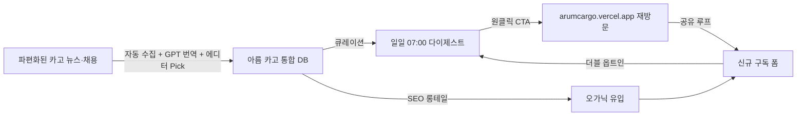

# PRD 00 — Overview (앵커 문서) — 아름 카고 (Arum Cargo)

> 이 문서는 **아름 카고 (Arum Cargo) Phase 5 MVP**의 최상위 PRD다. 다른 모든 PRD(01~07·99)는 이 문서를 기준점으로 한다.
> 변경이 생기면 여기부터 수정하고, 나머지 PRD에 교차 반영한다.

**버전**: v0.3 (Cargo-First Pivot) · **업데이트**: 2026-04-11

**피벗 근거**: [ADR-008](../adr/ADR-008-pivot-to-cargo-first.md) — 11년차 항공 화물 현직자의 강점 영역으로 전략 재정렬
**원천 소스**: [docs/references/16-vps.md](../references/16-vps.md) v0.3 (Value Proposition Sheet)
**의사결정 기록**: [docs/adr/](../adr/README.md) — ADR-001 ~ ADR-008
**레퍼런스 SSOT**: [docs/references/](../references/00-index.md) · **결정 유보**: [docs/open-questions.md](../open-questions.md) · **진입 플랜**: `~/.claude/plans/snuggly-humming-adleman.md`

---

## 1. 비전 한 줄

> **"항공 화물 업계 현직자가 매일 아침 정리해주는 업계 뉴스 + 채용 허브."**

- **Phase 5 MVP에서 증명할 것**: **11년차 현직자의 에디터 Pick + 통합 뉴스 다이제스트 + 카고 채용 큐레이션**만으로도 2~5년차 콘솔사·포워더 영업·오퍼(C1)가 "출근길 5분 안에 열어보는 첫 번째 이메일"이 될 수 있는가.
- **Phase 5.5 확장**: `/employers` 양면 시장(B1 HR) + 운항 대시보드 + 기종 capacity 피드백 폼
- **Phase 6~7 비전**: Remember 벤치마크 커뮤니티(승진·이직 타임라인 + 익명 라운지) + 모바일 앱 + "아름 (Arum)" 브랜드로 전체 항공 생태계 확장

### 브랜드

- **서비스명**: **아름 카고 (Arum Cargo)** — Phase 1~5 MVP. Phase 7 이후 **아름 (Arum)**으로 확장
- **의미**: 아름 = 한국어 "아름답다" = "나답다". 항공 화물 업계 안에서 **나답게** 일할 수 있는 공간
- **한 줄 포지셔닝**: "항공 화물 업계 현직자가 매일 아침 정리해주는 업계 뉴스 + 채용 허브"
- **브랜드 충돌 회피**: (주)한아름종합물류(hanaleum.com)와 구분하기 위해 "한" 접두어 제거 → "아름 카고"

근거: [ADR-008](../adr/ADR-008-pivot-to-cargo-first.md), [../references/16-vps.md](../references/16-vps.md) §0

---

## 2. 타겟 사용자 (v0.3 카고 페르소나)

[13-personas.md](../references/13-personas.md) v0.3 기준. 5명 (Core 3 + Adjacent 1 + B-side 1).

| ID | 이름 | 상태 | 핵심 JTBD | MVP 중요도 |
|---|---|---|---|---|
| **C1** ⭐ | **이지훈** | **3년차 콘솔사 영업·오퍼 (핀포인트)** | "출근길 5분, 11년차 현직자 시선으로 국내외 화물 뉴스 5건을 훑고 나답게 하루를 시작한다" | **★★★ Primary** |
| C2 | 박서연 | 1년차 화물 신입 | "입사 직후 회사 교육만으론 안 보이는 업계 흐름을 매일 한 통 이메일로 학습한다" | ★★ Secondary |
| C3 | 김태영 | 8년차 포워더 팀장 | "Loadstar 원서 대신 한글 3~4문장 요약으로 글로벌 운임·캐리어 동향을 받는다" | ★★ Secondary |
| A1 | 정하늘 | 한서대 항공물류 4학년 | "취업 준비 중 신입 화물 공고 + 업계 감을 한 번에" | ★ Adjacent |
| B1 | 최혜진 | 포워더 HR 6년차 | "지인 추천 외에 화물 직군 인재풀 채널을 확보한다" (Phase 5.5 `/employers`) | Phase 5.5 |

**디자인·카피 체크리스트**: 랜딩·각 주요 화면에서 **C1 이지훈**이 "출근길 5분 안에 가치를 체감"해야 한다. 모든 기능은 C1을 기준점으로 검증.

**Non-user (비스코프)**: 승무원 취준생·지상직·조종사·정비사·항공 마니아 일반인 → Phase 7 "아름" 확장 시 재검토

---

## 3. MVP 스코프 (포함 / 제외) — Phase 구분

### 3.1 Phase 5 MVP — 포함 (2026-04-11 기준)

1. **I-Side 카고 정보 대시보드**
   - 국내 카고 뉴스 통합 피드 (네이버 뉴스 "항공화물" 키워드 + 카고프레스·CargoNews·Forwarder KR RSS)
   - 해외 카고 뉴스 한글 요약 (Loadstar·Air Cargo News·FlightGlobal Cargo + LLM Provider-Agnostic 번역, MVP 기본 OpenAI GPT-4o-mini)
   - **에디터 Pick**: 각 뉴스 카드에 11년차 현직자 시각 1~2문장 (핵심 차별화)
   - 비중 원칙: **화물 70% + 큰 항공 뉴스 30%**
   - 항공·화물 용어 툴팁 컴포넌트 (`<AviationTerm term="AWB" />`)

2. **A-Side 카고 채용**
   - 통합 카고 채용 카드 (워크넷 primary + 사람인 secondary + 콘솔사·포워더·항공사 화물 부서 공식 딥링크)
   - 카고 직군 필터: 영업·오퍼·통관·수출입·국제물류·공항상주
   - 승무원·조종사·정비 자동 제외 필터
   - 하이브리드 큐레이션: 자동 수집 → `pending` → 관리자 승인 → `approved` ([ADR-004](../adr/ADR-004-hybrid-job-curation.md))
   - `source_trust_score` 1~5 (광고·학원 필터링)

3. **Email Growth Loop**
   - 더블 옵트인 구독 폼 → 직군 태그 선택 → 인증 메일 → 일일 다이제스트 07:00 KST
   - 이메일 엔진: **Loops.so 무료 티어** ([ADR-001](../adr/ADR-001-email-service-loops-over-resend.md)) — 2,000 contacts 무료, 도메인 불필요
   - 제목 `(광고) [아름 카고] ...` + 원클릭 수신거부 + 발신자 정보 (정보통신망법 §50 준수)

4. **관리자 대시보드 `/admin/dashboard`** (v0.3 신규)
   - shadcn/ui charts 기반 8 카드: WAU, MUV, 유입 경로, 신규 구독자, 4주 유지율, Open/CTR, 승인 공고, `/employers` 문의
   - 각 카드 `ⓘ` 툴팁: "이 지표가 뭔지 + 왜 중요한지 + 출처"
   - Supabase Auth Magic Link 화이트리스트(사용자 본인만)
   - URL: `/admin/dashboard` (로그인 없으면 404)

5. **법정 페이지**: `/privacy`, `/terms`, `/about` (About은 "11년차 현직자" 사실만 노출, 학교·이름·회사 비공개)

6. **도메인·인프라**
   - MVP 도메인: `arumcargo.vercel.app` (무료, Vercel 기본 서브도메인)
   - 커스텀 도메인은 구독자 500명 돌파 시 `arumcargo.com` 구매 검토

### 3.2 Phase 5.5 — 확장 (MVP 완료 후)

- `/employers` 페이지: B1 채용 담당자용 인재풀 안내 + 채용 공고 등록 문의 폼 → `employer_inquiries` 테이블
- 운항 대시보드 `/flights`: KAC + IIAC API, 공항 탭, 정기편 + 기종 뱃지(ICAO) + PAX/CGO 라벨 + **화물기 only 토글**
- 기종 capacity (2단계):
  - **초기**: 정적 `web/src/data/aircraft-types.ts` — 주요 30개 기종 ICAO 코드 + 이름 + PAX/CGO
  - **완성**: Supabase `aircraft_capacity` 테이블 — `max_payload_kg`, `belly_kg`, `main_deck_kg`, `uld_capacity_json`, source (Airbus/Boeing APM + IATA ULD Manual)
- 기종 정보 제보 피드백 폼 `/contribute` + `capacity_feedback` 테이블
- UBIKAIS / FlightRadar24 딥링크 버튼 (ToS 준수)

### 3.3 Phase 6 — 비전 (Remember 벤치마크)

- 승진·이직 타임라인 (본인 입력 + 공개 동의 플래그 + 팔로우 알림)
- 화물 직군별 익명 라운지 (영업 / 오퍼 / 통관 / 지상조업)
- 경력 검증: 회사 이메일 도메인 인증 (예: `@koreanair.com`, `@cargolux.com`)

### 3.4 Phase 7 — 비전 (앱 + "아름" 확장)

- Next.js → Capacitor 또는 Expo Web 브릿지로 모바일 앱 전환
- "아름" 브랜드로 전체 항공 생태계 확장 — 카고 기반 신뢰 자산 위에 인접 영역 추가

### 3.5 제외 (Non-scope)

- **모든 수익화 축**: 유료 구독, B2B SaaS, 프리미엄 티어, 인앱 결제, API 상용화, 커미션 매칭 — **전면 제거** (ADR-008)
- **인스타그램 크롤링** — Meta ToS 위반 리스크
- **Auth (MVP)**: Supabase Auth Magic Link, OAuth — `/admin/dashboard`만 Magic Link 화이트리스트 사용 ([ADR-003](../adr/ADR-003-no-auth-mvp-email-token-only.md))
- **Three.js 실시간 운항맵** — Phase 5.5에서도 간단 테이블만
- **승무원·조종사·정비사 관련 콘텐츠** — Phase 7 확장 시 재검토
- **다국어(EN)** — Phase 6 이후

---

## 4. MVP 기능 = v0.3 Top 5 Pain 직결 (AOS/DOS 수치)

[15-aos-dos-opportunity.md](../references/15-aos-dos-opportunity.md) v0.3 §5 MVP Top 5 + [16-vps.md §1](../references/16-vps.md) 실패 KPI 결합.

| Pain ID | 설명 | AOS / DOS | 실패 KPI (현행) | 개선 목표 | PRD 연결 |
|---|---|---|---|---|---|
| **P04** 🥇 | 지인 추천 의존 이직 (양면 Pain) | **4.0 / 3.2** | C1 70%+ 지인 통로 의존, B1 80% "사람 못 구함" | 구독자 중 25%+가 "이직 경로로 유용" 체감 | [01](./01-a-side-academy-career.md), Phase 5.5 [01 §B1](./01-a-side-academy-career.md) |
| **P01** | 업계 뉴스 단절 | **3.0 / 2.7** | C1 하루 3+ 채널 순회 | 1개 채널(이메일 1통), 누락 체감 ≤15% | [02 US-I1](./02-i-side-information.md) |
| **P03** | 채용 파편·신뢰도 | **3.0 / 2.4** | 탐색 20분/회, 신뢰도 판단 실패 30% | 탐색 <5분, 혼입률 ≤5% | [01 §4 큐레이션](./01-a-side-academy-career.md) |
| **P02** | 해외 카고 영문 장벽 | **3.2 / 2.1** | C1 60% "영어 버거움", 소화율 ~30% | 한글 요약 CTR +10%p, 소화율 ≥85% | [02 US-I3](./02-i-side-information.md), [04 §6](./04-api-integration.md) |
| **P05** | "나만 모르는 불안" — 현직자 시선 부재 (Moat) | **3.2 / 2.1** | 공백 영역 (기존 대체재 없음) | 에디터 Pick 만족도 ≥80%, 추천 의향 NPS ≥50 | [02 에디터 Pick](./02-i-side-information.md) |

**각 PRD는 자기가 담당하는 Pain ID와 개선 목표를 G/W/T Acceptance Criteria의 성공 조건으로 명시한다.**

---

## 5. Acquisition 전략 (v0.3 카고 채널 재편)

기존 D8 승무원 중심 채널(디시 항공갤·승무원 학원 제휴)은 **전면 제거**. 카고 버티컬 채널로 재편.

| 채널 | 비중 | 세부 |
|---|---|---|
| **카고 버티컬 커뮤니티** | 30% | 네이버 카페 "항공화물종사자", "국제물류실무", LinkedIn 한국 화물 그룹, LinkedIn "Korea Air Cargo Professionals" |
| **지인 직군 네트워크** | 20% | 사용자 본인 11년차 업계 인맥. 익명 유지 조건(운영자 신원 노출 없이 링크만 공유) |
| **SEO 자연 유입** | 20% | 롱테일 키워드: "대한항공카고 채용", "항공화물 용어 AWB", "Loadstar 한글 요약", "콘솔사 오퍼 직무" 등 |
| **오가닉 공유 루프** | 15% | 에디터 Pick 카드 공유 가능 디자인(OG 이미지·복사 버튼) → 카카오톡·LinkedIn 재공유 |
| **업계 세미나·컨퍼런스 참여 (무비용)** | 10% | 한국무역협회 물류 세미나, IATA 행사 오프라인 참관 → 명함 없이 서비스 QR 배포 |
| **자연 광고 유입** | 5% | 트래픽이 일정 이상 쌓이면 항공사·학원·포워더가 먼저 제휴 요청 오는 구조 (수동 응대) |

**OQ-R13** (C1 5명 인터뷰) · **OQ-R14** (출근길 5분 시나리오 검증) · **OQ-R19** (디지털 침투율 실측) — [open-questions.md](../open-questions.md)

---

## 6. 성공 기준 — North Star KPI (WAU) + Supporting

원천 소스: [16-vps.md §3 Desired Outcome](../references/16-vps.md). 변경은 VPS부터.

### 6.1 North Star KPI

**WAU (Weekly Active Subscribers)** — 지난 7일 내 이메일 오픈 또는 사이트 재방문한 verified 구독자 수

| Phase | 기간 | WAU 목표 | SAM 대비 |
|---|---|---|---|
| **Phase 5 MVP** | 0~6개월 | **500** | 3% |
| Phase 5.5 확장 | 6~12개월 | 1,500 | 10% |
| Phase 6 커뮤니티 | 12~24개월 | 3,500 | 22% |
| Phase 7 앱 + 아름 확장 | 24~36개월 | 8,000 | 51% |

### 6.2 왜 WAU가 North Star인가 (근거 출처 명시)

1. **Amplitude "North Star Metric Playbook"** (John Cutler, 2019) — https://amplitude.com/books/north-star
2. **Reforge "Growth Series"** (Brian Balfour) — https://www.reforge.com/ — "4주 후 활성 유지율 40% 이상이면 PMF"
3. **Morning Brew Axios 2020 인터뷰** ($75M 매각 시점 "Daily Active Opens" 공개)
4. **Substack / Beehiiv 대시보드 표준 지표** — 현대 뉴스레터 플랫폼 기본

**왜 MAU가 아닌 WAU**: 항공 화물 업계는 주간 사이클(주간 운임·팀 회의·스케줄 공지)이 자연스럽다. 월 단위는 너무 느슨해 조기 이탈을 감지 못함.
**왜 구독자 수가 아닌 Active**: 수익화 없음(ADR-008). 수익 없이 성장하려면 "실제로 쓰이는가"가 유일한 가치 증거.

### 6.3 Supporting KPIs (관리자 `/admin/dashboard` 전용)

shadcn/ui charts 기반 8 카드. 각 카드 우상단 `ⓘ` → 호버 툴팁 "지표 의미 + 중요성 + 출처".

| # | KPI | Phase 5 목표 | 근거 | 측정 경로 |
|---|---|---|---|---|
| 1 | **WAU** (North Star) | 500 | §6.2 | Supabase + Loops.so API |
| 2 | MUV (월간 고유 방문자) | 2,000 | 깔때기 상단 노출 | Vercel Analytics |
| 3 | 유입 경로 분포 | 3+ 채널 균형 | 단일 채널 의존 회피 | Vercel Analytics |
| 4 | 주간 신규 구독자 | 50/주 | WAU 500 역산 | Supabase `subscribers.created_at` |
| 5 | **4주 유지율** | ≥ 40% | Reforge PMF 기준 | Loops + Supabase cohort |
| 6 | Email Open rate / CTR | 40% / 12% | 항공 니치(일반 B2C 18%의 2배) | Loops.so `/events` API |
| 7 | 주간 승인 공고 수 | ≥ 15건 | 공급측 건강도 | Supabase `job_posts status=approved` |
| 8 | `/employers` 문의 | Phase 5.5 이후 | 양면 시장 활성화 | Supabase `employer_inquiries` |

**벤치마크 주의**: Phase 5 실측 전 가설. Phase 5 첫 100명으로 재산정. → [OQ-R20](../open-questions.md)

### 6.4 Outcome → 기능 연결 (Value Loop)



---

## 6bis. MoSCoW 우선순위 (Phase 5 MVP 범위)

| 분류 | 기능 | 근거 | Owner PRD |
|---|---|---|---|
| **Must (M)** | 카고 뉴스 피드 + 태그 필터 + 원문 링크 | P01 해결 | 02 |
| **Must** | 해외 카고 뉴스 한글 3~4문장 요약 (LLM Provider-Agnostic, 기본 GPT-4o-mini) | P02 해결 | 02, 04 |
| **Must** | **에디터 Pick (11년차 현직자 시선)** | **P05 해결 — 유일한 Moat** | 02 |
| **Must** | 카고 채용 카드 + 카고 직군 필터 | P03 해결 | 01 |
| **Must** | 하이브리드 큐레이션 (pending/approved) + `source_trust_score` | P03 신뢰도 | 01 |
| **Must** | 더블 옵트인 구독 + 07:00 KST 다이제스트 + 에디터 Pick 포함 | 북극성 WAU + P01 | 05 |
| **Must** | `(광고)` 표기 + 원클릭 수신거부 + 발신자 정보 | 정보통신망법 §50 | 05 |
| **Must** | `/privacy`, `/terms`, `/about` 법정 페이지 | 법적 요건 | 06 |
| **Must** | `/admin/dashboard` (shadcn/ui charts + Supabase Magic Link 화이트리스트) | WAU·KPI 추적 | 05, 03 |
| **Must** | `subscribers`·`news_articles`·`job_posts`·`email_events` 스키마 + RLS | 기능 전제 | 03 |
| **Should (S)** | Bento Grid + Gradient Blob + Scroll Parallax Hero | "첫 방문 우와" ([ADR-006](../adr/ADR-006-design-premium-animated.md)) | 06 |
| **Should** | 3D Carousel (`/about` 또는 `/showcase` 하단 액센트) | 차별화 보조 | 06 |
| **Should** | 항공 화물 용어 툴팁 `<AviationTerm>` | C2 학습, C1 재방문 | 02, 06 |
| **Should** | SEO 랜딩 롱테일 페이지 | D8 카고 Acquisition | 06 |
| **Could (C)** | 관리자 대시보드 스파크라인·차트 (shadcn/ui charts Recharts 래퍼) | 8 카드 풍부화 | 05, 06 |
| **Could** | `/jobs` 기업 로고 + 자동 카드 생성 | 시각 품질 | 01 |
| **Won't (W) — Phase 5.5+** | `/employers`, 운항 대시보드 `/flights`, 기종 capacity, `/contribute` 피드백 폼 | Phase 5.5 분리 | — |
| **Won't — Phase 6+** | Remember 벤치마크(타임라인·라운지·경력 검증), 모바일 앱, "아름" 확장 | 로드맵 장기 | — |
| **Won't — 전면 비스코프** | 수익화(유료 구독·B2B SaaS·프리미엄), 승무원·조종사 콘텐츠, 다국어, 실시간 운항맵, 인스타 크롤링 | ADR-008 + 법/자원 제약 | — |

---

## 7. 기술 스택 개요

[CLAUDE.md](../../CLAUDE.md) §4 일치.

- **Frontend**: Next.js 14 App Router + TypeScript + Tailwind + shadcn/ui + lucide-react + date-fns
- **Fonts**: Pretendard Variable (본문 한영) + Space Grotesk (헤드라인·숫자) + JetBrains Mono (항공편명·ICAO)
- **DB**: Supabase (Postgres) — Auth는 `/admin/dashboard` Magic Link만 사용 (ADR-003 확장)
- **Email**: **Loops.so 무료 티어 (2,000 contacts)** — 도메인 불필요 ([ADR-001](../adr/ADR-001-email-service-loops-over-resend.md))
- **Cron**: Vercel Cron (다이제스트) + GitHub Actions (뉴스·채용 수집) 하이브리드 ([ADR-005](../adr/ADR-005-cron-hybrid-vercel-github.md))
- **Translation (LLM)**: Provider-Agnostic 추상화 (`TRANSLATION_PROVIDER` env, MVP 기본 `openai`=GPT-4o-mini, `gemini`/`anthropic` swap 가능) ([ADR-007 Amendment 2026-04-18](../adr/ADR-007-translation-gpt-4o-mini.md), [SRS C-TEC-015](../srs/SRS-001-arum-cargo.md))
- **Analytics**: Vercel Analytics (무료 티어)
- **Deploy**: Vercel, 도메인 `arumcargo.vercel.app`

### 디자인 톤 (ADR-006 수정 — v0.3 구성 변경)

**Functional Clean 베이스 + Premium Animated 레이어**. 상세는 [06-ui-ux-spec.md](./06-ui-ux-spec.md).

핵심 시각 요소 (v0.3):
- **랜딩**: **Bento Grid + Gradient Blob + Scroll Parallax Hero** (3D Carousel 아님)
- **3D Carousel 배치**: `/about` 또는 `/showcase` 하단 액센트 (예: "이번 주 주요 화물 루트" 또는 "제휴 브랜드")
- **컬러**: `arum.ink / navy / sky / blue / cloud` — 네이비·하늘색·파랑·화이트 (오렌지 제외 유지)
- **차트 라이브러리**: 관리자·사용자 화면 통합 = **shadcn/ui charts (Recharts 래퍼) 단일** (2026-04-18 Amendment, [SRS C-TEC-006](../srs/SRS-001-arum-cargo.md))
- **품질 기준**: [uvengers-website.vercel.app](https://uvengers-website.vercel.app/) (사용자 본인 작업) **이상**
- **레퍼런스**: Joby Aviation(팔레트·스태거드 리빌) + Stripe/Vercel/Linear About (간결·친근 톤)

---

## 8. 사이트 구조 (IA)

### Phase 5 MVP
```
/                           랜딩 (Bento Hero + Gradient Blob + 에디터 Pick 미리보기 + 구독 CTA)
├── /news                   카고 뉴스 피드 (카드 그리드 + 카테고리 필터)
│   └── /news/[slug]        뉴스 상세 (요약 + 에디터 Pick + 원문 링크)
├── /jobs                   카고 채용 카드 피드 (직군·지역·신뢰도 필터)
│   └── /jobs/[slug]        채용 상세 (요약 + 원본 링크)
├── /about                  About (11년차 현직자 정서 — 이름·회사·학교 비공개)
├── /privacy                개인정보처리방침
├── /terms                  이용약관
├── /subscribe/verify       구독 이메일 인증 랜딩
├── /subscribe/settings     구독 설정 관리 (토큰 기반)
└── /admin/dashboard        관리자 (Supabase Magic Link + 화이트리스트)
    └── /admin/jobs         채용 승인 큐
```

### Phase 5.5 추가
```
├── /flights                운항 대시보드 (공항 탭 + 기종 뱃지 + 화물기 토글 + UBIKAIS/FR24 딥링크)
├── /employers              B1 채용 담당자용 (Phase 5.5 문의 폼)
└── /contribute             기종 capacity 정보 제보 폼
```

### Phase 6~7
```
├── /community              익명 라운지 (Phase 6, Remember 벤치마크)
├── /timeline               승진·이직 타임라인 (Phase 6)
└── (모바일 앱 전환)       (Phase 7)
```

---

## 8bis. 차별 가치 (Differential Value) 수치 요약

VPS §6 원천. Phase 5 실측 전 가설.

| 차원 | 현행 대안 | 아름 카고 목표 | 개선폭 | 담당 PRD |
|---|---|---|---|---|
| 아침 정보 수집 시간 (C1) | 15~20분 (3~5 채널) | **< 5분** (1통 이메일) | ≥70% 단축 | 05 |
| 화물 채용 신뢰도 (학원·광고 혼입률) | 20~30% | **≤ 5%** | ≥75% 감소 | 01 |
| 해외 카고 뉴스 소화율 | ~30% | **≥ 85%** | 2.8배 개선 | 02, 04 |
| 4주 유지율 | ~20% (일반 B2C) | **≥ 40%** (Reforge PMF) | 2배 개선 | 05 |
| 월 구독 비용 (Loadstar USD 150/년) | 실비 | **무료** | N/A | 00 |
| **에디터 Pick** (11년차 시선) | **0건** (공백 영역) | 매일 2~3건 | 공백 → 표준 신규 | 02 |

---

## 8ter. 핵심 실험 (Proof)

VPS §7 요약. 실험 설계 상세는 각 PRD §9 Proof.

| 주장 | 실험 | PRD | OQ |
|---|---|---|---|
| "C1 페르소나가 실재하고 Pain이 맞다" | 2~5년차 콘솔사·포워더 5명 인터뷰 | 13, 16 | OQ-R13 |
| "출근길 5분 시나리오가 현실적" | C1 5명 출근길 로그 (48시간) | 00, 06 | OQ-R14 |
| "에디터 Pick 톤이 나답다" | Mock 5건 블라인드 평가 | 02 | OQ-R16 |
| "한글 요약 CTR ↑" | A/B 4주, n≥50 | 02, 04 | OQ-R17 |
| "하이브리드 큐레이션 신뢰도 ↑" | 승인 큐 2주 + 1-tap 피드백 | 01 | - |
| "다이제스트 → 4주 유지율 40%" | 첫 100명 cohort | 05 | - |
| "B1 Pain 실재" | 콘솔사·포워더 HR 3명 인터뷰 | 01, 13 | OQ-R15 |

---

## 8quater. 주요 의사결정 (ADR 인덱스)

| ADR | 결정 | 영향받는 PRD |
|---|---|---|
| [ADR-001](../adr/ADR-001-email-service-loops-over-resend.md) | Email: Loops.so | 05 |
| [ADR-002](../adr/ADR-002-flight-data-kac-iiac-over-aviationstack.md) | Flight: KAC+IIAC (Phase 5.5) | 02, 04 |
| [ADR-003](../adr/ADR-003-no-auth-mvp-email-token-only.md) | Auth: MVP 무인증 + 관리자만 Magic Link | 03, 05 |
| [ADR-004](../adr/ADR-004-hybrid-job-curation.md) | Job: 하이브리드 pending/approved | 01, 03 |
| [ADR-005](../adr/ADR-005-cron-hybrid-vercel-github.md) | Cron: Vercel + GitHub Actions | 04, 05 |
| [ADR-006](../adr/ADR-006-design-premium-animated.md) | Design: Functional Clean + Premium Animated (v0.3: Bento Grid 메인, 3D Carousel은 서브) | 06 |
| [ADR-007](../adr/ADR-007-translation-gpt-4o-mini.md) | Translation: GPT-4o-mini | 02, 04 |
| **[ADR-008](../adr/ADR-008-pivot-to-cargo-first.md)** | **Cargo-First 피벗** | **전체** |

---

## 9. Phase 5 MVP DoD (Definition of Done)

PRD 9개(00~07·99) + 자체 체크:

- [ ] 모든 PRD v0.3 헤더 + [ADR-008](../adr/ADR-008-pivot-to-cargo-first.md) 교차 참조 최소 1개
- [ ] 모든 PRD가 Top 5 Pain 중 최소 1개를 **수치 개선 목표**와 함께 명시 (§4)
- [ ] 모든 PRD가 **C1 이지훈** User Story를 Given-When-Then AC + 실패 케이스 3건 이상 포함
- [ ] 모든 PRD가 **MoSCoW 우선순위**, **NFR SLO**, **Proof 실험 설계** 포함
- [ ] `docs/prd/00-overview.md`의 KPI·스코프·기술스택이 나머지 PRD와 일치
- [ ] [16-vps.md](../references/16-vps.md) v0.3 값과 KPI·Pain 수치가 **1:1 일치**
- [ ] `승무원`·`조종사`·`정비사` 단어가 PRD 본문에 없음 (비스코프 섹션 제외)
- [ ] `유료`·`프리미엄`·`구독료`·`B2B SaaS` 단어가 PRD 본문에 없음 (제외 섹션 제외)
- [ ] OQ-R13 (C1 5명 인터뷰), OQ-R15 (B1 3명 인터뷰), OQ-R16 (에디터 Pick 블라인드) 완료 또는 일정 명시
- [ ] OQ-D1 (기종 capacity 시드 자료) Phase 5.5 진입 전까지 사용자 제공
- [ ] 사용자가 전체 PRD v0.3 읽고 "이대로 만들자" 승인

---

## 10. 참조 문서 맵

| 질문 | 답을 찾을 곳 |
|---|---|
| "왜 카고로 피벗했나?" | [ADR-008](../adr/ADR-008-pivot-to-cargo-first.md) |
| "누구에게 파나?" | [13-personas.md](../references/13-personas.md) v0.3 |
| "시장이 얼마나 큰가?" | [11-tam-sam-som.md](../references/11-tam-sam-som.md) v0.3 |
| "무엇을 먼저 만들까?" | [15-aos-dos-opportunity.md](../references/15-aos-dos-opportunity.md) v0.3 Top 5 |
| "가치 제안 / KPI 원천" | [16-vps.md](../references/16-vps.md) v0.3 |
| "데이터 어디서 오나" | [09-news-sources.md](../references/09-news-sources.md) v0.3 |
| "용어" | [glossary.md](../glossary.md) v0.3 §8 |
| "아직 안 정한 것" | [../open-questions.md](../open-questions.md) |

---

## Changelog

- **2026-04-11 v0.3**: **Cargo-First Pivot 전면 반영** ([ADR-008](../adr/ADR-008-pivot-to-cargo-first.md)). 브랜드 "아름 카고" 확정, 타겟 C1 이지훈(2~5년차 콘솔사·포워더) 핀포인트, 승무원·지상직·조종사 §3 비스코프로 이동. Top 5 Pain 전면 교체(P04/P01/P03/P02/P05). North Star를 "Verified 구독자 100명"에서 **WAU 500명(Phase 5)** 으로 변경 + 근거 4개 출처 명시. Supporting KPI 9개→8개 재편(유료/벤치 관련 항목 삭제, 4주 유지율 40% 추가). Phase 5.5 섹션 신설 (`/employers` + 운항 + 기종 capacity + `/contribute`). Phase 6~7 비전 섹션(Remember 벤치마크 + 앱 + "아름" 확장) 신설. 수익화 축 §3.5 전면 제외. Acquisition §5 카고 버티컬 채널로 재편. 디자인 §7 Bento Grid 메인 + 3D Carousel 서브 배치 변경. IA §8 MVP / Phase 5.5 / Phase 6~7 3단 구조로 재편. DoD §9에 "승무원·유료 단어 부재" 체크 추가.
- 2026-04-11 v0.2: VPS→PRD 강화. **v0.3에서 카고 피벗으로 대체됨.**
- 2026-04-11 v0.1: 최초 작성.
