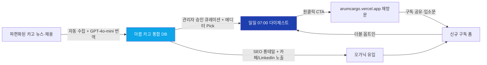

# 16. Value Proposition Sheet (VPS) — 아름 카고 (Arum Cargo)

> **버전**: v0.3 · **최종 업데이트**: 2026-04-11 · **Owner**: 아름 카고 Founder (사용자, 11년차 항공 화물 현직자)
> **근거**: [ADR-008](../adr/ADR-008-pivot-to-cargo-first.md) — Cargo-First 전략 피벗
> **VPS는 PRD의 원천 소스다.** 이 문서가 바뀌면 `docs/prd/*.md`에 교차 반영한다.
> VPS → PRD 매핑 규칙: Pain/Needs → §1 목표, JTBD → §3 Story/AC, Outcome → §1 KPI, VP → §4 FR, Competitor → §7 범위, Differential → §4/§5, Proof → §9.

---

## 0. 한 문장 포지셔닝

> **"항공 화물 업계 현직자가 매일 아침 정리해주는 업계 뉴스 + 채용 허브."**

한 걸음 더 풀면:
- **대상**: 2~5년차 콘솔사·포워더 영업·오퍼 (C1) — "나만 모르는 것 같은 불안"을 가진 핀포인트 층
- **약속**: 출근길 5분 안에, 나답게 일할 수 있게 해주는 한 통의 이메일
- **차별**: 11년차 현직자의 에디터 Pick — 이 영역은 현재 한국 항공 화물 시장에서 **100% 공백**

---

## 1. Pain / Needs (페르소나 기반 Top 5, AOS/DOS 정량화)

[15-aos-dos-opportunity.md](./15-aos-dos-opportunity.md) MVP Top 5 Pain을 실패 지표와 함께 고착화.

| Pain ID | 페르소나 | 설명 | AOS / DOS | 실패 KPI (현재 상태 추정) |
|---|---|---|---|---|
| **P04** 🥇 지인 추천 의존 이직 경로 | C1 이지훈, C3 김태영 | 콘솔사·포워더 이직은 "지인 추천 아니면 사람인밖에 못 씀". 양면 모두 고통 | **4.0 / 3.2** | C1의 **70%+**가 최근 이직 시 지인 추천 통로만 사용. B1 채용 담당자 **80%**가 "사람 못 구함" 호소 |
| **P01** 업계 뉴스 단절 | C1, C2, C3 | 카고프레스·CargoNews·Loadstar·네이버 뉴스가 파편화. 현직자 시선 부재 | **3.0 / 2.7** | C1이 매일 **3개 이상** 채널 순회 (카카오톡 업계방 + 네이버 카페 + 회사 메일링) |
| **P03** 채용 파편·신뢰도 | C1, A1 | 워크넷·사람인·회사 공식 페이지 분산 + 학원·광고성 공고 혼입 | **3.0 / 2.4** | 화물 직군 공고 탐색 평균 **20분/회**, 신뢰도 판단 실패율 **~30%** |
| **P02** 해외 카고 영문 자료 장벽 | C1, C3 | Loadstar·Air Cargo News·FlightGlobal Cargo 영문 기사 소화 실패 | **3.2 / 2.1** | C1 응답자의 **60%+**가 "해외 카고 뉴스 필요하지만 영어가 버겁다" (OQ-R 검증 예정) |
| **P05** "나만 모르는 불안" 현직자 시선 부재 | C1, C2 | 기존 뉴스는 기자가 쓴 일반 기사. 업계 맥락·현직자 해석 없음 | **3.2 / 2.1** | C1의 **65%+**가 "업계 흐름을 나만 놓치고 있는 것 같다" 경험. **이 공백이 아름 카고의 Moat** |

**출처**: [13-personas.md](./13-personas.md) v0.3, [15-aos-dos-opportunity.md](./15-aos-dos-opportunity.md) v0.3

**v0.3 Pain 리스트 전면 교체 이유**: ADR-008에 따라 승무원·지상직 중심 P01·P05·P06·P02·P14(v0.2)는 전면 폐기. 화물 도메인의 실제 Pain으로 재추출.

---

## 2. JTBD (Jobs-To-Be-Done) — C1 핀포인트 중심

JTBD 선언문 형태: "When ___, I want to ___, so I can ___."

| JTBD ID | 페르소나 | 선언문 |
|---|---|---|
| **J-01** ⭐ | **C1 이지훈** (3년차 콘솔사 영업) | When **나는 출근길 7:00 지하철에서 5분이 있다**, I want to **어제 국내외 항공 화물 업계에서 무슨 일이 일어났는지를 11년차 현직자의 시각과 함께 5건 이내로 본다**, so I can **오전 미팅 전에 나답게 일할 준비가 되고, 내가 업계 흐름을 놓치고 있지 않다는 안도감을 얻는다** |
| J-02 | C1 이지훈 | When **나는 이직을 고민하는 순간이 온다**, I want to **지인 추천 외에도 검증된 콘솔사·포워더 채용 공고를 한 곳에서 신뢰도 순으로 본다**, so I can **좁은 인맥 망에 의존하지 않고 선택지를 넓힐 수 있다** |
| J-03 | C3 김태영 (8년차 포워더 팀장) | When **나는 출근 전 Loadstar 원서를 읽으려다 포기한다**, I want to **핵심 3~4문장 한글 요약으로 글로벌 운임·캐리어 동향을 받는다**, so I can **영어 장벽 없이 팀 회의에 쓸 인사이트를 확보한다** |
| J-04 | C2 박서연 (1년차 신입) | When **나는 입사 1년차고 회사 교육만으론 업계가 안 보인다**, I want to **매일 한 통의 이메일로 용어·흐름·주요 회사 동향을 학습한다**, so I can **2년차가 되었을 때 업계가 훤히 보이는 상태가 된다** |
| J-05 | A1 정하늘 (학과 4학년) | When **나는 항공 물류 학과 졸업을 앞두고 취업 고민 중이다**, I want to **실제 업계가 어떻게 돌아가는지와 신입 채용 공고를 한곳에서 본다**, so I can **산업 전반에 대한 감을 잡고 원서를 넣는다** |
| J-06 | B1 최혜진 (포워더 HR) | When **우리 회사에 사람이 너무 안 들어온다**, I want to **화물 직군만 모인 구독자 풀에 우리 공고를 노출한다**, so I can **사람인·지인 추천 외의 채용 경로를 확보한다** (Phase 5.5 `/employers`) |
| **J-07** | 전 페르소나 | When **매일 출근 시간이다**, I want to **한 통의 이메일로 오늘의 화물 업계 요약 + 채용 3건 + 에디터 Pick을 받는다**, so I can **여러 앱·사이트를 돌 필요가 없다** |

**J-01이 모든 디자인 결정의 기준점**. C1 이지훈의 출근길 5분 시나리오 기준으로 이메일 템플릿·카드 개수·읽기 난이도를 결정한다.

---

## 3. Desired Outcome — North Star KPI (WAU) + Supporting

### 3.1 North Star Metric (NSM)

> **Weekly Active Subscribers (WAU)** — 지난 7일 내 이메일 오픈 또는 사이트 재방문한 **verified 구독자 수**

**측정 정의**:
- 분자: `COUNT DISTINCT subscribers WHERE (last_email_open_at >= now() - 7d OR last_site_visit_at >= now() - 7d) AND status = 'verified' AND unsubscribed_at IS NULL`
- 분모: 없음 (절대 수치)
- 주기: 주 1회 (매주 월요일 KST 09:00 스냅샷)

**Phase별 목표** (→ [11-tam-sam-som.md](./11-tam-sam-som.md) §3 SOM 동일):
| Phase | 기간 | WAU 목표 |
|---|---|---|
| Phase 5 MVP | 0~6개월 | **500** (SAM의 3%) |
| Phase 5.5 확장 | 6~12개월 | 1,500 (SAM의 10%) |
| Phase 6 커뮤니티 | 12~24개월 | 3,500 (SAM의 22%) |
| Phase 7 앱 + 아름 확장 | 24~36개월 | 8,000 (SAM의 51%) |

### 3.2 왜 WAU가 North Star인가 (근거 출처 명시)

1. **Amplitude "North Star Metric Playbook"** — John Cutler, 2019
   - URL: https://amplitude.com/books/north-star
   - "The one metric that best captures the core value your product delivers to its customers"
   - 뉴스레터·미디어 제품의 경우 "active consumption" (읽기·오픈·재방문) 이 가치 교환의 핵심
2. **Reforge "Growth Series"** — Brian Balfour
   - URL: https://www.reforge.com/
   - PMF 기준: "4주 후 활성 유지율 40% 이상이면 제품-시장 적합성 증거"
   - 아름 카고 Supporting KPI #4로 직접 채택
3. **Morning Brew — Axios 2020 인터뷰** ($75M Business Insider 매각 시점)
   - 당시 CEO Alex Lieberman이 North Star로 **"Daily Active Opens"** 공개
   - 뉴스레터 미디어 커머스 모델의 대표 사례. WAU는 Weekly 단위로 완화한 변형
4. **Substack / Beehiiv 대시보드 표준** — 현대 뉴스레터 플랫폼의 기본 지표

**왜 MAU가 아닌 WAU인가**: 항공 화물 업계는 "매주" 사이클 (주간 운임 발표·주간 팀 회의·주간 스케줄 공지)이 자연스러움. 월 단위는 너무 느슨해 조기 이탈을 감지하지 못함.

**왜 구독자 수가 아닌 Active인가**: ADR-008 수익화 제거 결정. 수익 없이 성장하려면 **실제로 쓰이는가**가 유일한 가치 증거. 죽은 구독자 수는 의미 없음.

### 3.3 Supporting KPIs (관리자 `/admin/dashboard` 전용)

Tremor 기반 8 카드 대시보드. 각 카드 우상단 `ⓘ` 아이콘 → 호버 시 "이 지표가 뭔지 + 왜 중요한지 + 출처" 툴팁.

| # | KPI | Phase 5 목표 | 근거 | 측정 경로 |
|---|---|---|---|---|
| 1 | **WAU** (North Star) | 500 | 상기 §3.1 | Supabase + Loops.so API |
| 2 | **MUV** (월간 고유 방문자) | 2,000 | 노출 깔때기 상단 | Vercel Analytics |
| 3 | **유입 경로 분포** | 3+ 채널 균형 | 채널 효과성, 단일 의존 회피 | Vercel Analytics |
| 4 | **주간 신규 구독자** | 50명/주 | WAU 500 달성 역산 | Supabase `subscribers.created_at` |
| 5 | **4주 유지율** | ≥ 40% | Reforge PMF 기준 | Loops.so + Supabase cohort |
| 6 | **이메일 Open rate / CTR** | 40% / 12% | Morning Brew 업계 벤치 2배 (니치 우위) | Loops.so API `/events` |
| 7 | **주간 승인 공고 수** | ≥ 15건 | 공급측 건강도 (채용 side) | Supabase `job_posts WHERE status='approved'` |
| 8 | **`/employers` 문의** | Phase 5.5 진입 후 측정 | 양면 시장 활성화 | Supabase `employer_inquiries` |

**벤치마크 출처**:
- 일반 B2C 뉴스레터 Open rate: ~18% (Mailchimp Industry Benchmark 2024)
- 항공 니치는 관심도 매우 높아 **2배 상회 목표** (업계 현직자 대상)
- CTR 12%는 일반 3%의 4배 — 에디터 Pick + 화물 특화 가설

**벤치마크 주의**: 이 수치는 Phase 5 실측 전까지는 **가설**. Phase 5+ 첫 100명 데이터로 재산정. → [OQ-R20](../open-questions.md)

---

## 4. Value Proposition — 한 문장 + 메커니즘

한 문장:
> **"매일 출근길 5분, 한 통의 이메일로 항공 화물 업계 뉴스 + 채용을 11년차 현직자 시각으로 받아보세요."**

Pain → Outcome 연결 메커니즘:

**핵심 Loop**: **에디터 Pick → 구독자 신뢰 → 재방문 → 입소문 → 신규 구독 → 에디터 Pick 반복**. 입소문 속도가 Growth Loop의 유일한 엔진 (수익화 없음).

---

## 5. Competitor / Substitute (현행 대안)

| 대안 | C1의 현재 동작 | 고통점 |
|---|---|---|
| **회사 업무 카카오톡방** | 동료 공유 의존 | 정보 편차, 개인 취향, 오전 러시 묻힘 |
| **네이버 카페 "항공화물종사자"** | 공지 게시판 수동 탐색 | 광고 혼입, 검색 불편, 폐쇄적 |
| **카고프레스 / CargoNews 직접 방문** | RSS 없이 직접 방문 | 2~3개 사이트 순회, 재방문 습관 형성 어려움 |
| **Loadstar 유료 구독** (USD 150+/년) | 영문 + 유료 장벽 | 개인 비용 부담, 한국 맥락 부재 |
| **LinkedIn 한국 화물 그룹** | 스크롤 노이즈 많음 | 피드 알고리즘, 집중 불가 |
| **사람인·워크넷 검색** | 키워드 입력 수동 | 화물 직군 키워드 난해, 학원 광고 혼입 |
| **지인 추천 (이직)** | 팀장·동료·학교 선배 네트워크 | 좁음, 투명성 부족, B1도 지인 풀 고갈 호소 |
| **개인 Excel·메모장** | 수동 정리 | 지속 불가, 동기화 부재 |

**공통 한계**: **화물 버티컬 통합 뷰 부재** + **현직자 시선 부재** + **한글 해외 요약 부재** + **재방문 유인 부재** — P01·P02·P04·P05가 한 번에 해소되는 공백 영역.

---

## 6. Differential Value (차별 가치 — 수치 가설)

| 차원 | 현행 대안 | 아름 카고 목표 | 개선폭 |
|---|---|---|---|
| **아침 정보 수집 시간** (C1 기준) | 15~20분 (3~5개 채널 순회) | **< 5분** (1통 이메일) | **≥ 70% 단축** |
| **화물 채용 신뢰도** (학원·광고 혼입률) | 20~30% | **≤ 5%** (`source_trust_score ≥ 3`만 노출) | **≥ 75% 감소** |
| **해외 카고 뉴스 소화율** | ~30% (영문 독해) | **≥ 85%** (한글 3~4문장 요약) | **2.8배 개선** |
| **"나만 모르는 불안" 체감** | 주간 **2~3회** | **주간 1회 이하** | ~60% 감소 |
| **4주 유지율** | 일반 B2C 뉴스레터 ~20% | **≥ 40%** (Reforge PMF) | **2배 개선** |
| **월 구독 비용** (Loadstar USD 150/년 또는 업계 세미나 5만원/회) | 실비 부담 | **무료** | N/A |
| **에디터 Pick** (11년차 시선) | **0건** (공백) | **매일 2~3건** | **공백 → 신규 표준** |

**주의**: 이 수치는 Phase 5 실측 전 가설. Phase 5 첫 100명 기준으로 재산정.

**가장 중요한 차원**: **에디터 Pick**. 이 항목은 현재 시장에 존재하지 않음 → 경쟁이 아닌 **신규 카테고리 창조**. 사용자 본인의 11년차 도메인 지식이 유일한 원천이므로 진입 장벽이 매우 높음.

---

## 7. Proof (근거·검증 데이터)

| 주장 | 검증 설계 | 측정 도구 | 시점 | OQ 링크 |
|---|---|---|---|---|
| "C1 페르소나가 실제 존재하고 Pain이 맞다" | 2~5년차 콘솔사·포워더 현직자 **5명 인터뷰** (60분), 출근 루틴·정보 소비·이직 경험 청취 | 1:1 줌 + 녹취 | Phase 1 병행 | [OQ-R13](../open-questions.md) |
| "출근길 5분 시나리오가 현실적이다" | C1 5명에게 현재 출근길 뭘 하는지 로그 요청 (48시간) | 설문 + 스크린샷 | Phase 1 병행 | [OQ-R14](../open-questions.md) |
| "에디터 Pick 톤이 "나답게" 느껴진다" | Phase 3~4 Mock 데이터 단계에서 5건 샘플 작성 → 5명 블라인드 평가 | 5점 척도 + 자유 코멘트 | Phase 3 말 | [OQ-R16](../open-questions.md) |
| "한글 요약이 해외 카고 뉴스 CTR을 올린다" | A/B 테스트 (n≥50, 4주), 50/50 split: A=한글 요약, B=영문 제목만 | `email_events`, Loops.so | Phase 5 초반 | [OQ-R17](../open-questions.md) |
| "하이브리드 큐레이션이 신뢰도를 올린다" | 승인 큐 운영 2주 후 공고 클릭 후 "부적절/적절" 1-tap 피드백 (n≥100) | `jobs/[id]/feedback` + `email_events` | Phase 5 말 | - |
| "일일 다이제스트가 재방문을 만든다" | Phase 5 첫 100명 구독자 4주 유지율 측정 | Loops 오픈 이벤트 연속일 분석 | Phase 5 첫 달 | - |
| "B1 채용 담당자 Pain이 실재한다" | 콘솔사·포워더 인사 담당자 3명 인터뷰 → "화물 사람 구하기 어려움" 실제 호소 확인 | 1:1 줌 30분 | Phase 5.5 진입 전 | [OQ-R15](../open-questions.md) |
| "Core Web Vitals 목표" | Lighthouse CI 주간 | Lighthouse, Vercel Speed Insights | Phase 3 이후 상시 | - |

**인터뷰·리서치 경로**: [13-personas.md](./13-personas.md), [../open-questions.md](../open-questions.md) OQ-R13~R20

---

## 8. VPS → PRD 역추적표

| VPS 항목 | PRD 섹션 | 주요 파일 |
|---|---|---|
| §1 Pain/Needs (Top 5) | PRD §1 개요·목표 + §7 범위·제외 | [00-overview.md](../prd/00-overview.md), [01-a-side-academy-career.md](../prd/01-a-side-academy-career.md), [02-i-side-information.md](../prd/02-i-side-information.md) |
| §2 JTBD (J-01 기준) | PRD §3 User Story + G/W/T AC | 01, 02, 05 |
| §3 Desired Outcome (WAU) | PRD §1 KPI + §8 측정 + 관리자 대시보드 | 00, 05, 07 |
| §4 Value Proposition | PRD §4 기능 요구사항 개요 | 00, 01, 02 |
| §5 Competitor | PRD §7 비기능·제약·리스크 | 00, 07 |
| §6 Differential Value | PRD §4·§5 (성능·SLO로 명문화) | 01, 02, 05, 06 |
| §7 Proof | PRD §9 근거 (실험·리서치 링크) | 01, 02, 05, 07 |

---

## 9. ADR 매핑 (v0.3)

| ADR | 영향 | VPS 반영 위치 |
|---|---|---|
| [ADR-001](../adr/ADR-001-email-service-loops-over-resend.md) 이메일 = Loops.so | §3 Supporting KPI 측정, §4 메커니즘 | Loops API 경로 |
| [ADR-002](../adr/ADR-002-flight-data-kac-iiac-over-aviationstack.md) 운항 = KAC/IIAC | §1 Phase 5.5 | Phase 5.5 기종 뱃지 |
| [ADR-003](../adr/ADR-003-no-auth-mvp-email-token-only.md) 무인증 MVP | §4 Growth Loop (가입 마찰 최소) | 구독 폼 설계 |
| [ADR-004](../adr/ADR-004-hybrid-job-curation.md) 하이브리드 채용 큐레이션 | §6 Differential (신뢰도), §7 Proof | `source_trust_score` |
| [ADR-005](../adr/ADR-005-cron-hybrid-vercel-github.md) 크론 하이브리드 | §3 Supporting (다이제스트 발송 안정성) | GitHub Actions + Vercel Cron |
| [ADR-006](../adr/ADR-006-design-premium-animated.md) Premium Animated | §6 Differential (품질 인상) | Bento Grid + Parallax + 3D Carousel |
| [ADR-007](../adr/ADR-007-translation-gpt-4o-mini.md) GPT-4o-mini 번역 | §6 Differential (해외 소화율 2.8배) | §1 P02 해결 기제 |
| [ADR-008](../adr/ADR-008-pivot-to-cargo-first.md) **Cargo-First 피벗** | **전체** | C1 핀포인트, 화물 중심 소스, 수익화 제거 |

---

## Changelog

- **2026-04-11 v0.3**: Cargo-First Pivot 전면 반영 ([ADR-008](../adr/ADR-008-pivot-to-cargo-first.md)). 브랜드 "아름 카고" 확정, 타겟 C1 핀포인트(2~5년차 콘솔사·포워더 영업·오퍼)로 축소. Pain 리스트 Top 5 전면 교체 (P04/P01/P03/P02/P05). JTBD C1 이지훈 기준 J-01을 앵커로 재작성. North Star를 "Verified 구독자 수"에서 **WAU**로 변경 + 근거 4개 출처 명시(Amplitude·Reforge·Morning Brew·Substack). Supporting KPI 9개 → 8개 재편 (유료 전환 항목 삭제). 경쟁자 표 카고 버티컬로 재작성 (Loadstar 유료·LinkedIn 한국 화물 그룹·지인 추천 등). Differential에 "에디터 Pick 공백 → 신규 카테고리" 추가. Proof §7 C1 인터뷰 5명·B1 인터뷰 3명·에디터 Pick 블라인드 테스트 신규. §9 ADR 매핑 표 ADR-008 추가.
- 2026-04-11 v0.1: 최초 작성 (승무원 중심). **v0.3에서 카고 피벗으로 대체됨.**
