# Software Requirements Specification (SRS)
Document ID: SRS-001
Revision: 1.1 (Amendment 1 — ADR-009 타겟 재정렬 반영)
Date: 2026-04-18
Standard: ISO/IEC/IEEE 29148:2018

> **Product**: 아름 카고 (Arum Cargo, 구 RAION Aviation DX Hub) — Phase 5 MVP
> **Primary PRD Source**: [docs/prd/00~07, 99](../prd/) v0.3 (단일 Source of Truth)
> **Pivot Background**: Cargo-First 전략은 PRD 00 §1·§2에 이미 반영되어 있으며, 본 SRS는 해당 PRD 내용만을 원천으로 사용한다.
> **Owner**: Arum Cargo Founder (11년차 항공 화물 현직자)
>
> **Rev 1.1 Amendment Triggers (→ Rev 1.2)**:
> - ✅ ~~타겟 재정렬~~ — **ADR-009 로 2026-04-19 해소** (Rev 1.1 으로 반영 완료)
> - [ ] OQ-M6 Loops §50 실발송 검증 (Phase 5 진입 직전) — 실패 시 Resend + 자체 도메인 전환 Amendment
> - [ ] OQ-R17 번역 Provider A/B 실측 (Phase 4) — `openai` / `anthropic` 어댑터 추가 Amendment
> - [ ] Supabase 500MB 근접 시 Phase 5.5 스키마 조정 Amendment
> - [ ] Loops 1,500 contacts 도달 시 Resend 전환 준비 Amendment

---

## 1. Introduction

### 1.1 Purpose

본 시스템은 **카고 취업 준비생(A1 정하늘 Primary, ADR-009 재정렬)** 및 **2~5년차 항공 화물 콘솔사·포워더 영업·오퍼 실무자(C1 이지훈 Secondary)** 가 (a) 공식 카고 채용 정보를 파편화 없이 접근하고 (b) 11년차 현직자 시선의 뉴스 큐레이션을 매일 아침 5분 안에 소화하도록 지원하는 웹 허브 + 이메일 다이제스트 시스템이다. 본 SRS는 **Phase 5 MVP**가 해결해야 할 5대 Pain을 정량 목표와 함께 명시한다.

| Pain ID | 설명 | AOS / DOS | 현 실패 KPI | 시스템 개선 목표 |
|---|---|---|---|---|
| **P04** | 지인 추천 의존 이직 경로 (C1·C3 양면) | 4.0 / 3.2 | C1의 70%+ 지인 통로 의존 | 구독자 25%+ "이직 경로로 유용" NPS ≥ 50 |
| **P01** | 업계 뉴스 파편·큐레이션 부재 | 3.0 / 2.7 | C1 3~5개 채널 순회, 누락 체감 50%+ | 1개 채널, 누락 ≤ 15%, 5분 내 소화 |
| **P03** | 채용 파편·신뢰도 부재 | 3.0 / 2.4 | 탐색 20분/회, 혼입률 20~30% | 탐색 < 5분, 혼입률 ≤ 5% |
| **P02** | 해외 카고 뉴스 영문 장벽 | 3.2 / 2.1 | 소화율 ~30% | 소화율 ≥ 85%, 한글 3문장 요약 |
| **P05** | 현직자 시선·맥락 부재 (Moat) | 3.2 / 2.1 | 공백 100% | 에디터 Pick 카드 ≥ 60% 커버 |

**Business Desired Outcome**: Phase 5 종료 시 **WAU (Weekly Active Subscribers) 500** 및 **4주 활성 유지율 ≥ 40%** (Reforge PMF 기준) 달성. 이 두 지표는 본 시스템이 제공해야 할 품질 수준으로 §4.2 NFR에 전이된다.

### 1.2 Scope

#### 1.2.1 In-Scope (Phase 5 MVP)

본 시스템은 다음 기능을 제공해야 한다:

1. **I-Side 카고 뉴스 대시보드** (`/news`, `/news/[slug]`): 국내·해외 카고 뉴스 통합 피드, 에디터 Pick 카드, Gemini 1.5 Flash 기반 해외 영문 기사 한글 요약 (Provider 교체 가능, C-TEC-015), 항공·카고 용어 인라인 툴팁
2. **A-Side 카고 채용 허브** (`/jobs`, `/jobs/[slug]`): 워크넷·사람인 카고 직군 공고 통합, 하이브리드 큐레이션(pending→approved), 신뢰도 점수 기반 정렬, 카고 기업 공식 채용 딥링크 카드
3. **Email Growth Loop**: 더블 옵트인 구독(`/api/subscribe`) → 07:00 KST 일일 다이제스트 → 원클릭 수신거부 → 설정 관리 → 공유 루프
4. **관리자 대시보드** (`/admin/dashboard`, `/admin/news`, `/admin/jobs`): Supabase Magic Link + `admin_users` 화이트리스트 인증, shadcn/ui charts 기반 8 KPI 카드, 뉴스·채용 승인 큐, 에디터 Pick 인라인 에디터
5. **법정 페이지**: `/privacy`, `/terms`, `/about` (개인 식별정보 비노출)
6. **Data Ingestion**: GitHub Actions + Vercel Cron 하이브리드 크론으로 네이버 뉴스·국내외 카고 RSS·워크넷·사람인 자동 수집

#### 1.2.2 Out-of-Scope

| 영역 | 근거 |
|---|---|
| 유료 구독, B2B SaaS, 프리미엄 티어, 인앱 결제, API 상용화, 커미션 매칭 | [ADR-008](../adr/ADR-008-pivot-to-cargo-first.md) 수익화 축 전면 제거 |
| 승무원·조종사·객실·정비사·지상직·부기장·기장 관련 공고·콘텐츠 | v0.3 카고 스코프 |
| 인스타그램 크롤링 | Meta ToS 위반 리스크 |
| 일반 사용자 Auth (로그인/회원가입) | [ADR-003](../adr/ADR-003-no-auth-mvp-email-token-only.md) — 관리자만 Magic Link |
| 운항 대시보드 `/flights`, 기종 capacity, `/employers`, `/contribute` | Phase 5.5로 분리 |
| 다국어(EN 역번역), 실시간 운항맵 (Three.js·WebGL), 모바일 네이티브 앱, Remember 벤치마크 커뮤니티 | Phase 6~7 |
| 뉴스 원문 본문 저장·재배포 | 저작권 — 제목 + 2~3문장 요약 + 링크만 |

#### 1.2.3 Assumptions and Constraints

| ID | 제약 / 가정 | 근거 |
|---|---|---|
| CON-01 | 이메일 엔진은 Loops.so 무료 티어(2,000 contacts)를 사용한다. **1,500 contacts 도달 시 Resend 전환 준비(DNS 인증 72h 여유) 착수**. 한국 정보통신망법 §50 필드 주입이 불가능할 경우 OQ-M6 실패로 간주하고 Phase 5 후반 또는 Phase 6에서 Resend로 전환한다 | [ADR-001](../adr/ADR-001-email-service-loops-over-resend.md) |
| CON-02 | 모든 이메일 발송은 07:00 KST 고정. 21:00~08:00 KST 야간 발송은 금지 | 정보통신망법 §50 |
| CON-03 | 이메일 제목에는 `(광고)` 접두어, 본문 footer에는 원클릭 수신거부 + 발신자 정보를 포함해야 한다 | 정보통신망법 §50 |
| CON-04 | 수신 동의 시각·IP·User-Agent를 `subscribers.consented_at/ip/user_agent`에 기록하고 13개월 이상 보존한다 | 정보통신망법 |
| CON-05 | 채용 DB에 `승무원|객실|조종사|부기장|항공정비|정비사|기장` 제목 공고는 `approved` 상태로 전이될 수 없다 (`block_non_cargo_titles` 트리거) | [PRD 03 §4.5](../prd/03-data-model.md), [ADR-008](../adr/ADR-008-pivot-to-cargo-first.md) |
| CON-06 | **MVP 기본 번역 Provider는 Gemini 1.5 Flash 무료 티어 (분당 15 req, 일 1,500 req)**. `TRANSLATION_PROVIDER=openai` 선택 시에만 월 $5 cap(`OPENAI_MONTHLY_BUDGET_CAP_USD`) 재활성화. 어느 Provider든 일일 사용량/예산 초과 시 번역 skip + `is_translated=false` fallback | [ADR-007](../adr/ADR-007-translation-gpt-4o-mini.md) |
| CON-07 | 뉴스 원문 본문은 DB에 저장하지 않는다. `summary`는 20~500자, 에디터 Pick은 최대 140자 | 저작권·법적 리스크 |
| CON-08 | 외부 API(Naver, Worknet, Saramin, OpenAI, Loops)는 서버 사이드(API Route / GitHub Actions)에서만 호출한다. 클라이언트 직접 fetch 금지 | 키 노출 방지 |
| CON-09 | About 페이지 및 모든 공개 콘텐츠에서 Founder의 실명·회사명·학교명·직책은 노출하지 않는다. 허용되는 정보는 "11년차 항공 화물 현직자"뿐 | [CLAUDE.md §2.3](../../CLAUDE.md) |
| CON-10 | Tailwind 토큰은 `arum.*` 네임스페이스만 사용한다. `raion.*` 잔재는 신규 코드에 금지 | [PRD 06 §2](../prd/06-ui-ux-spec.md) |
| CON-11 | Supabase 무료 티어 DB 용량 ≤ 500 MB (Phase 5 기준) | Supabase 무료 제약 |
| CON-12 | 도메인은 Phase 5 종료까지 `arumcargo.vercel.app` (무료 서브도메인) 사용. 커스텀 도메인은 WAU 500 또는 첫 제휴 문의 시 재검토 | [PRD 00](../prd/00-overview.md) §3.1 |

#### 1.2.4 Technical Constraints (C-TEC — Agentic 개발 Rule 기반)

Agentic 프로그래밍(Claude Code)이 참조할 **기술 스택 고정 규약**. 본 프로젝트는 "풀스택 통합형"과 "엔터프라이즈 분리형" 예제 중 어느 한쪽에 귀속되지 않고, **각 레이어별로 해당 문제에 최적화된 도구를 조합한 단일 하이브리드 스택**을 채택한다. 아래 C-TEC-*는 SRS Rev 0.9의 불변 규약이며, 변경 시 본 문서의 새 Revision이 선행되어야 한다.

| ID | 제약 | 구현체 | 선택 근거 |
|---|---|---|---|
| **[Frontend]** | | | |
| C-TEC-001 | UI 프레임워크는 **Next.js 14 (App Router) + TypeScript (strict)** 를 사용하며, Pages Router·SSR-only·SPA 구조로 역행 금지 | `next@14.x`, `typescript@5.x` | SEO(카고 롱테일 키워드)·Server Actions·ISR·Vercel 1급 지원 |
| C-TEC-002 | 스타일은 **Tailwind CSS + shadcn/ui + lucide-react** 만 허용. styled-components·emotion·Chakra 금지 | `tailwindcss@3.x`, `shadcn/ui` CLI, `lucide-react` | AI 코드 일관성 + 디자인 토큰 `arum.*` 네임스페이스 강제 |
| C-TEC-003 | 애니메이션은 **Framer Motion (motion) + tailwindcss-animate + react-intersection-observer** 조합만. GSAP·Lenis·Lottie·상시 WebGL 금지. 특정 3D 카루셀처럼 꼭 필요한 국소 영역에 한해 `motion/three` 또는 CSS 3D transform만 예외 허용 | `framer-motion@11.x` (or `motion`), `tailwindcss-animate`, `react-intersection-observer` | 선언적 API·Tailwind·shadcn과 결이 일치 + AI 코드 생성 친화 + `useReducedMotion()` 한 줄로 reduced-motion 대응. Lenis의 부드러운 스크롤은 CSS `scroll-behavior: smooth` + iOS Safari 기본으로 충분. Rev 0.9 편집에서 GSAP ScrollTrigger 교체 |
| C-TEC-004 | 폰트는 **Pretendard Variable + Space Grotesk + JetBrains Mono** 3종 고정. Google Fonts 임의 추가 금지 | `next/font/google` 또는 self-host | 한영 혼용 가독성·모바일 페이로드 ≤ 100KB |
| C-TEC-005 | 아이콘은 **lucide-react** 만 사용. Heroicons·Material Icons 혼용 금지 | `lucide-react` | shadcn/ui 기본 아이콘 라이브러리 |
| C-TEC-006 | 차트는 **shadcn/ui charts (Recharts 래퍼) 단일화**. 관리자 대시보드(8 KPI 카드)와 사용자 화면 모두 동일 라이브러리 사용. Tremor·Chart.js·Victory·ECharts 금지 | shadcn chart CLI (내부 `recharts`) | 관리자 8 카드는 Metric Card + 스파크라인 수준이라 Tremor 도입 ROI 낮음. 단일화로 번들·의존성·`arum.*` 토큰 매핑 일관성 확보. Rev 0.9 편집에서 Tremor 제거 |
| **[Backend / API Layer]** | | | |
| C-TEC-007 | 백엔드는 **Next.js Route Handlers (`src/app/api/*`) 전용**. 별도 Node 서버·NestJS·Express 분리 금지 | Next.js Route Handlers | 단일 배포 단위로 배포·운영 복잡도 최소화 |
| C-TEC-008 | 외부 API 호출은 **서버 사이드(Route Handler · GitHub Actions) 전용**. 클라이언트 직접 fetch 금지 | — | 키 노출 방지 (CON-08) |
| C-TEC-009 | 외부 API 클라이언트는 **`web/src/lib/api/{service}-client.ts`** 네이밍 규칙. 모든 응답은 **zod parse** 필수 | `zod@3.x` | 런타임 타입 안전·환각/손상 데이터 방어 |
| **[Database]** | | | |
| C-TEC-010 | DB는 **Supabase (PostgreSQL 15+) 단일** 사용. MySQL·MongoDB·SQLite 혼용 금지. 로컬은 `supabase start`, 프로덕션은 `supabase db push` | `@supabase/supabase-js`, Supabase CLI | RLS·Auth·Realtime 통합 + Postgres 표준 |
| C-TEC-011 | 스키마 변경은 **`supabase/migrations/YYYYMMDDHHMMSS_*.sql`** 파일 버전 관리. ORM 자동 마이그레이션 금지 | Supabase CLI | SQL-first, 트리거·RLS 명시적 기록 |
| C-TEC-012 | 모든 테이블은 **RLS 활성화 필수** + Service Role Key는 서버 전용 | Supabase RLS | REQ-NF-040~044 이행 |
| **[Auth]** | | | |
| C-TEC-013 | 일반 구독자 Auth는 **없음** (email + settings_token). 관리자만 **Supabase Magic Link + `admin_users` 화이트리스트** | Supabase Auth OTP | [PRD 00 §3.5](../prd/00-overview.md), [PRD 05 §9](../prd/05-email-growth-loop.md) |
| **[Email]** | | | |
| C-TEC-014 | 이메일 엔진은 **Loops.so (Transactional 전용)**. Sendgrid·Mailgun·AWS SES·Campaign 빌더 사용 금지. OQ-M6(§50 검증) 실패 시 Phase 6에서 **Resend + 자체 도메인** 으로 전환 | `loops` NPM client or REST | 2,000 contacts 무료·§50 필드 주입 가능성 검증 중 |
| **[AI / Translation]** | | | |
| C-TEC-015 | 번역 엔진은 **Provider-Agnostic facade 구조** (`src/lib/api/translation/index.ts`) 위에 **MVP는 Gemini 어댑터 1종만 구현** (`gemini.ts`). Phase 5 MVP 기본값 `TRANSLATION_PROVIDER=gemini` (Gemini 1.5 Flash 무료 티어). 공통 파라미터 `temperature=0.2`, `max_tokens=500`, 동일 system prompt. `openai` / `anthropic` 어댑터는 **Phase 5.5+ OQ-R17 실측 결과에 따라 도입** (MVP에서는 미구현 · env 값 지정 시 런타임 에러 반환). Vercel AI SDK 없이 각 Provider SDK 직접 사용 | `@google/generative-ai@^0.21` | 벤더 lock-in 회피 · Gemini 무료 티어로 C-COST-002 $5 cap 모순 해소 · facade 구조로 Phase 5.5+ provider 추가 시 코드 변경 최소화 |
| C-TEC-016 | **뉴스 번역 파이프라인의 LLM 호출은 카고 원문 요약 한 가지 용도만 허용**. 챗봇·사용자-facing 자동 콘텐츠 생성 금지. **에디터 Pick 은 Gemini 초안 생성 허용되나 Founder (11년차 현직자) 톤 편집 · 승인 후에만 게시** (자동 무편집 게시 금지). Pick 편집 흔적은 `editor_pick_history` 트리거(T-DB-015) 로 자동 기록. 관리자 전용 내부 리서치 도구(C-TEC-025)는 예외 | — | 에디터 Pick의 "현직자 voice" Moat 보호 (P05). Rev 1.1 에서 "Gemini 초안 + 사람 편집" 하이브리드 명시 |
| **[Scheduling / Cron]** | | | |
| C-TEC-017 | Cron은 **Vercel Cron (일 1회 digest) + GitHub Actions (ingest 3종)** 하이브리드. 제3의 외부 스케줄러(EventBridge·cron-job.org) 도입 금지 | `vercel.json`, `.github/workflows/*.yml` | Vercel Hobby 일 2회 한도 보완 |
| C-TEC-018 | 모든 cron API는 `Authorization: Bearer ${CRON_SECRET}` 검증. 검증 실패 시 401 반환 | — | REQ-NF-048 |
| **[Deployment / Infra]** | | | |
| C-TEC-019 | 호스팅은 **Vercel Hobby** 단일. AWS·Cloudflare Workers·Netlify 혼용 금지. 배포는 `git push` → Vercel 자동 배포 | Vercel | CI/CD 복잡도 0, 도메인 `arumcargo.vercel.app` |
| C-TEC-020 | Analytics는 **Vercel Analytics 무료 티어** 단일. GA4·Amplitude·Mixpanel 별도 도입 금지 (Phase 5 한정) | Vercel Analytics | MUV·유입 경로만 필요, 비용·PII 최소화 |
| C-TEC-021 | 모니터링·에러 트래킹은 Phase 5 초기 **미도입**. 필요 시 Sentry Free tier 후보(ADR 선행 필요) | — | REQ-NF-020~021 측정은 Vercel 기본 제공으로 충분 |
| **[Dev Tooling]** | | | |
| C-TEC-022 | 패키지 매니저 **pnpm 고정**, Node.js **v20 LTS** | `pnpm@9.x`, `node@20` | 빠른 설치·lockfile 일관성 |
| C-TEC-023 | 린터는 **ESLint + Prettier + TypeScript strict**. CI(`npm run typecheck`, `npm run lint`) 통과가 PR 머지 전제 | — | 에이전틱 코드 품질 게이트 |
| C-TEC-024 | Secret scan은 **gitleaks** CI로 실행 (REQ-NF-050) | `gitleaks` | `.env`·API 키 커밋 차단 |
| **[Future — Research & Enrichment · Phase 5.5+ 스코프 예약]** | | | |
| C-TEC-025 | **Admin Research Copilot** (Phase 5 Out-of-Scope · 구현 예약): 관리자 전용 `/admin/research` 도구로 4종 LLM provider를 **서로 보완적 역할**로 호출할 수 있어야 한다. Phase 5 MVP에서는 구현하지 않고 **추상화 레이어(`src/lib/research/`) 구조만 준비**. 역할 분할: **(a) OpenAI** — 범용 요약·톤 정리, **(b) Gemini** — Google Search grounding + YouTube 캡션 검색 (Google 생태계 기반 소스 확장), **(c) Perplexity** — inline citation 기반 정확도 확보·논문/기관 문서 인용, **(d) Grok** — X(Twitter) 실시간 카고 업계 발화·속보성 파악. 산출물은 **에디터 Pick 작성 시 참고 자료**로만 사용되며 **가공 없이 그대로 사용자 화면에 게시 금지** (C-TEC-016). 관리자 전용 화면이며 `admin_users` 세션 필수 | (향후) `openai`, `@google/generative-ai`, Perplexity REST API, Grok/xAI REST API | 4종 LLM의 **소스 커버리지·정확도·최신성**을 상호 보완 — 일반 웹(OpenAI/Gemini) + YouTube(Gemini) + 인용 가능 자료(Perplexity) + X 실시간(Grok). Moat(C-TEC-016) 침해 없이 11년차 현직자의 리서치 시간 단축. 저작권·§50·C-COST-001(월 ₩10만) 내 운영 — Perplexity Pro(월 $20)·Grok API 요금제 진입 시 C-COST-001 대부분을 이 한 기능이 소비하므로 **Phase 5.5 진입 전 별도 ADR + 비용 실측 필수** |

#### 1.2.5 Cost Constraints (C-COST)

| ID | 제약 | 상한 | 근거 |
|---|---|---|---|
| C-COST-001 | **MVP 전체 월 인프라 비용 상한** | ≤ **₩100,000 / 월** (약 US$75, 2026 환율) | 사용자 개인 부담 한도 |
| C-COST-002 | 번역 Provider 월 비용 | **기본 `gemini` = $0 (무료 티어)**. `TRANSLATION_PROVIDER=openai` 선택 시 ≤ US$5 (`OPENAI_MONTHLY_BUDGET_CAP_USD`) 재적용 | REQ-NF-120 |
| C-COST-003 | Supabase 요금제 | 무료 티어 (≤ 500 MB DB·2GB egress·50K MAU) | REQ-NF-121 |
| C-COST-004 | Loops.so 요금제 | 무료 티어 (≤ 2,000 contacts) | REQ-NF-122, C-TEC-014 |
| C-COST-005 | Vercel 요금제 | Hobby 무료 티어 | C-TEC-019 |
| C-COST-006 | 도메인 비용 | Phase 5 = ₩0 (`arumcargo.vercel.app`). WAU 500 또는 제휴 문의 수신 시 `arumcargo.com` 구매 재검토 (연 ₩20,000 내외) | CON-12 |
| C-COST-007 | GitHub Actions 분 사용량 | 무료 티어 (≤ 2,000 min/월). 현재 설계 4 워크플로 × 2 min × 30일 = 240 min/월 → 12% 사용 예상 | C-TEC-017 |
| C-COST-008 | OQ-M6 실패 시 Phase 6 Resend 전환 비용 | Resend 무료 티어 (3,000 emails/월) + 도메인 발신자 인증 필요 — 여전히 C-COST-001 상한 내 | C-TEC-014 |

**월 인프라 비용 실측 예상 (Phase 5)**: OpenAI ≤ $5 (≈₩7,500) + 기타 전부 무료 = **₩7,500 / 월**. C-COST-001 상한(₩100,000)의 7.5%로 안전 영역.

### 1.3 Definitions, Acronyms, Abbreviations

| 용어 | 정의 |
|---|---|
| **AWB** | Air Waybill, 항공화물운송장 |
| **HAWB / MAWB** | House / Master AWB |
| **ULD** | Unit Load Device, 단위 적재 용기 (AKE/LD-3, PMC, PAG 등) |
| **TAC Index** | Baltic Air Freight Index에서 발간하는 항공화물 요율 지수 |
| **BAI** | Baltic Air Freight Index |
| **Freighter** | 순수 화물기 (main deck 적재) |
| **Belly Cargo** | 여객기 하부 화물칸 적재 |
| **Combi** | 여객·화물 혼재 기종 |
| **Consolidator** | 콘솔사. 화물을 집화·통합하는 업체 |
| **Forwarder** | 포워더. 국제 물류 주선업체 |
| **C1 이지훈** | Primary 페르소나 — 3년차 콘솔사 영업·오퍼 (MVP 타겟 핀포인트) |
| **C2 박서연** | 1년차 신입 |
| **C3 김태영** | 8년차 포워더 팀장 |
| **A1 정하늘** | 한서대 항공물류 4학년 (Adjacent) |
| **B1 최혜진** | 포워더 HR 6년차 (Phase 5.5 `/employers`) |
| **JTBD** | Jobs-To-Be-Done — 사용자가 해결하려는 과업 |
| **AOS** | Adjusted Opportunity Score — Pain의 중요도·빈도·해결 불만족도 복합 점수 |
| **DOS** | Discovered Opportunity Score — AOS의 하위 세트 |
| **WAU** | Weekly Active Subscribers — 지난 7일 내 이메일 오픈·클릭 또는 사이트 재방문한 verified 구독자 수. 본 시스템의 North Star KPI |
| **MUV** | Monthly Unique Visitors |
| **PMF** | Product-Market Fit. Reforge 기준 "4주 활성 유지율 ≥ 40%" |
| **에디터 Pick** | 11년차 현직자 1인칭 voice로 작성한 1~2 문장 평론 (최대 140자). 뉴스 카드의 Moat 차별화 요소 |
| **editor_pick_tone** | `OBSERVATION` (관찰) / `ACTION_ITEM` (체크 포인트) / `CONTEXT` (맥락) 중 하나 |
| **Validator** | 외부 자문가(항공 화물 업계 전문가, HR 전문가 등) |
| **Magic Link** | Supabase Auth의 이메일 OTP 링크. 관리자 로그인 전용 |
| **admin_users 화이트리스트** | `/admin/*` 접근 허용 이메일을 담은 테이블 |
| **settings_token** | 일반 구독자의 설정 관리·수신거부용 32 byte hex 토큰 (Auth 없음 대체) |
| **verification_token** | 더블 옵트인 인증 링크 토큰 (24h 유효) |
| **hybrid curation** | 자동 수집(pending) + 관리자 승인(approved) 조합 ([ADR-004](../adr/ADR-004-hybrid-job-curation.md)) |
| **source_trust_score** | 채용 공고 신뢰도 1~5점. 공식 콘솔사/포워더 5, 학원 1 |
| **KAC / IIAC** | 한국공항공사 / 인천공항공사 API (Phase 5.5) |
| **ISR** | Incremental Static Regeneration (Next.js) |
| **RLS** | Row Level Security (Supabase Postgres) |

### 1.4 References

> **Rev 0.9 개정 원칙 (Iteration 지시 #4 반영)**: 본 SRS는 **PRD 문서(`docs/prd/*`)만을 내부 Source of Truth**로 사용한다. 이전 Rev 1.0 초안에서 참조하던 ADR(`docs/adr/*`) 및 references(`docs/references/*`)의 내용은 **SRS 본문 내부로 직접 흡수**되었다 — 특히 ADR에 담겨 있던 기술 스택 결정은 §1.2.4 C-TEC Constraints에, 페르소나·AOS/DOS·VPS 서술은 §1.1 Purpose 표와 §2 Stakeholders 표에 이식되었다. 아래 REF 목록은 PRD 9개와 **외부에서 대체 불가능한 외부 표준·공개 레퍼런스**만 보존한다.

| REF ID | 문서 / 자료 | 유형 | 비고 |
|---|---|---|---|
| REF-01 | [docs/prd/00-overview.md](../prd/00-overview.md) | 내부 PRD (v0.3) | 앵커 — 비전·스코프·Phase·MoSCoW·ADR 인덱스 포함 |
| REF-02 | [docs/prd/01-a-side-academy-career.md](../prd/01-a-side-academy-career.md) | 내부 PRD (v0.3) | A-Side 카고 채용·큐레이션·`source_trust_score`·`/employers` (Phase 5.5) |
| REF-03 | [docs/prd/02-i-side-information.md](../prd/02-i-side-information.md) | 내부 PRD (v0.3) | I-Side 카고 뉴스·에디터 Pick·번역 파이프·`<AviationTerm>` |
| REF-04 | [docs/prd/03-data-model.md](../prd/03-data-model.md) | 내부 PRD (v0.3) | Supabase 스키마·enum·RLS·트리거·시드 |
| REF-05 | [docs/prd/04-api-integration.md](../prd/04-api-integration.md) | 내부 PRD (v0.3) | 외부 API 연동·Cron·에러 처리·환경변수 |
| REF-06 | [docs/prd/05-email-growth-loop.md](../prd/05-email-growth-loop.md) | 내부 PRD (v0.3) | Loops·다이제스트·공유 루프·관리자 대시보드 |
| REF-07 | [docs/prd/06-ui-ux-spec.md](../prd/06-ui-ux-spec.md) | 내부 PRD (v0.3) | `arum.*` 토큰·Bento·Parallax·타이포 |
| REF-08 | [docs/prd/07-roadmap-milestones.md](../prd/07-roadmap-milestones.md) | 내부 PRD (v0.3) | Phase 0~7 DoD·검증 게이트 |
| REF-09 | [docs/prd/99-quality-review.md](../prd/99-quality-review.md) | 내부 PRD (v0.3) | 품질 검증 리포트 |
| REF-10 | [CLAUDE.md](../../CLAUDE.md) | 프로젝트 규칙 | §4 기술 스택·§5 법/보안·§6 env · C-TEC와 1:1 대응 |
| REF-11 | ISO/IEC/IEEE 29148:2018 | 외부 표준 | 본 SRS 작성 표준 |
| REF-12 | 정보통신망 이용촉진 및 정보보호 등에 관한 법률 제50조 | 외부 법령 | `(광고)` 접두, 수신거부, 야간 발송 금지의 법적 근거 — 외부 법령이므로 SRS 내부로 흡수 불가 |
| REF-13 | Amplitude "North Star Metric Playbook" (John Cutler, 2019) — https://amplitude.com/books/north-star | 외부 레퍼런스 | WAU North Star 채택 근거 (REQ-NF-100) |
| REF-14 | Reforge Growth Series — https://www.reforge.com | 외부 레퍼런스 | 4주 활성 유지율 ≥ 40% PMF 기준 (REQ-NF-101) |
| REF-15 | Morning Brew Axios 2020 인터뷰 ($75M 매각 시 Daily Active Opens 공개) | 외부 레퍼런스 | 뉴스레터 Daily Active 지표 |
| REF-16 | IATA ULD Technical Manual | 외부 표준 | ULD 코드(AKE/LD-3·PMC·PAG·ALF·LD-6·ALP·LD-11) 기준 — Phase 5.5 `aircraft_capacity` |
| REF-17 | Boeing APM / Airbus APM (제조사 발행) | 외부 자료 | 기종 페이로드 시드 근거 (Phase 5.5) |

**ADR·references/* 흡수 매핑 (Rev 1.0 → Rev 0.9 이관 기록)**:

| 이전 REF (Rev 1.0) | Rev 0.9 반영 위치 |
|---|---|
| ADR-001 Loops.so | C-TEC-014 |
| ADR-002 KAC+IIAC | §6.1.b Phase 5.5 행 |
| ADR-003 No-Auth MVP | C-TEC-013 |
| ADR-004 하이브리드 큐레이션 | REQ-FUNC-106·114·115·117 |
| ADR-005 Cron 하이브리드 | C-TEC-017 |
| ADR-006 Premium Animated | REQ-FUNC-301~304 |
| ADR-007 GPT-4o-mini | C-TEC-015·C-COST-002 |
| ADR-008 Cargo-First Pivot | §1.1 Purpose (Pain 5개 표), §1.2.2 Out-of-Scope, CON-05, REQ-FUNC-103 |
| references/13-personas | §2 Stakeholders |
| references/15-aos-dos-opportunity | §1.1 Purpose (Pain 표의 AOS/DOS 수치) |
| references/16-vps | §1.1 Desired Outcome + §4.2.f NSM SLO |
| references/09-news-sources | §6.1.b 외부 의존 API 표 |
| references/10-aviation-glossary | §1.3 Definitions + REQ-FUNC-030 |
| references/17-srs-methodology | §5.3 PRD→SRS 매핑 |
| open-questions.md OQ-* | 각 REQ-FUNC Acceptance Criteria 및 §6.4 Validation Plan |

---

## 2. Stakeholders

| Role | Type | Responsibility | Interest / Concern |
|---|---|---|---|
| **End User — C1 (이지훈 페르소나)** | Primary User | 일일 다이제스트 수신, `/news`·`/jobs` 재방문, 에디터 Pick 소비, 공고 클릭 | 출근길 5분 내 정보 소화, 현직자 시선 제공, 이직 경로 확보 |
| **End User — C2 (박서연)** | Secondary User | 전체 카테고리 수신, 용어 툴팁 활용 | 업계 입문 학습, 용어 장벽 해소 |
| **End User — C3 (김태영)** | Secondary User | 주 3~4회 오픈, 해외 한글 요약 소비 | 글로벌 운임·캐리어 동향 |
| **End User — A1 (정하늘)** | Adjacent | 신입 공고 확인, 업계 용어 학습 | 취업 준비 |
| **Employer — B1 (최혜진)** | Phase 5.5 User | `/employers` 문의 제출 | 화물 직군 인재풀 확보 (Phase 5.5 Out-of-Scope for MVP) |
| **Admin (Founder)** | System Owner / Content Editor | `/admin/dashboard` 모니터링, 뉴스·채용 승인, 에디터 Pick 작성, Loops·Supabase·Vercel 계정 운영 | WAU·4주 유지율 달성, 작성 부담 관리 |
| **External — Naver News API** | External System | 국내 카고 뉴스 원문 제공 | 25,000 req/일 쿼터 준수 |
| **External — Naver RSS (카고프레스·CargoNews 등)** | External System | 국내 카고 매체 RSS | 호스트 ToS 준수, 본문 저장 금지 |
| **External — Loadstar / Air Cargo News UK / FlightGlobal Cargo RSS** | External System | 해외 카고 뉴스 영문 원문 | 공정 이용 범위(제목+3문장 요약+링크) |
| **External — Gemini 1.5 Flash** (MVP 기본 Provider, C-TEC-015) | External System | 해외 영문 기사 한글 요약 | 무료 티어 (분당 15 req / 일 1,500 req), Google Generative AI API |
| **External — Worknet OpenAPI** | External System | 카고 채용 공고 primary | 1,000 req/일, `항공화물`·`국제물류` 등 10개 키워드 |
| **External — Saramin OpenAPI** | External System | 카고 채용 공고 secondary (dedupe) | 500 req/일 |
| **External — Loops.so** | External System | 이메일 발송 + 웹훅 | 2,000 contacts 무료 한도, 10 req/s, §50 필드 주입 검증(OQ-M6) |
| **External — Supabase** | External System | Postgres DB, Magic Link 인증, RLS | 무료 500 MB, Service Role Key 서버 전용 |
| **External — Vercel** | Platform / External System | 호스팅, Cron, Analytics | Hobby 일 2회 cron 제한, Analytics API 토큰 |
| **External — GitHub Actions** | External System | 뉴스·채용 ingest cron 실행 (Vercel Cron 한도 보완) | repo secrets 보호 |
| **Regulator — KCC (방송통신위원회)** | Legal Authority | 정보통신망법 §50 준수 감독 | 동의 기록, 광고 표기, 수신거부 |
| **External (Phase 5.5) — KAC / IIAC** | External System | 공항 운항 데이터 | Phase 5 Out-of-Scope |

---

## 3. System Context and Interfaces

### 3.1 External Systems

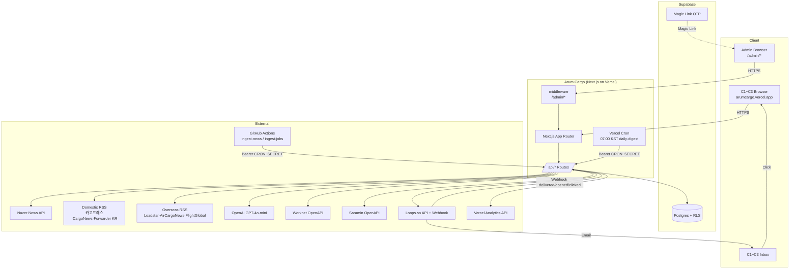

#### 3.1.a Fallback & Degradation Strategy (외부 시스템 가용 불가 시)

Iteration 지시 #2·#3·#5 반영. 각 외부 의존성이 (a) 일시 장애, (b) 정책 변경(ToS·요금제 철회), (c) 무기한 중단된 경우의 대응 규약.

| 외부 시스템 | 일시 장애 (≤ 24h) | 정책 변경 (ToS·요금제 철회) | 무기한 중단 / 대체 필요 |
|---|---|---|---|
| **Naver News API** | 3회 지수 백오프 후 `ingest_logs.status='partial'` + 직전 성공분 유지 → `/news`는 이전 스냅샷 렌더 | 쿼터 축소: 14 키워드를 상위 8개로 압축 (`항공화물·TAC Index·대한항공카고·아시아나카고·포워더·콘솔사·국제물류·인천공항`) | **1차 대체**: 구글 뉴스 RSS (`https://news.google.com/rss/search?q=항공화물&hl=ko`) — 무료·공식. **2차**: 개별 카고 매체 RSS 개수 확장 (§4.1.a REQ-FUNC-011의 피드 목록을 8개까지 증설) |
| **국내 카고 RSS (카고프레스·CargoNews·Forwarder KR)** | skip + 다음 배치 재시도. 피드별 연속 3회 실패 시 `ingest_logs.notes='rss_dead:<source>'` | RSS 중단 시 HTML 파싱(Readability) 전환 — 단, `robots.txt`·저작권 준수 확인 필요 | **최후 수단**: 관리자 수동 카드 작성 모드(`/admin/news/manual`). 현업 11년차 지식 직접 큐레이션. 에디터 Pick이 Moat이므로 자동 수집이 0이어도 제품은 동작 |
| **해외 카고 RSS (Loadstar·ACN·FlightGlobal)** | 피드별 skip | 전문(full-text) 금지 시 제목 + 3문장 요약 + 원문 링크 유지 (공정이용). 저작권 분쟁 시 해당 매체 즉시 제외 | **대체 후보**: Air Cargo Week (UK), STAT Media Group, Cargolux Newsroom RSS. Phase 5.5 이후 재평가 |
| **OpenAI GPT-4o-mini** | 2회 지수 재시도 → 실패 시 `is_translated=false` + 제목만 저장 (REQ-FUNC-015) | 모델 퇴출 시 **Claude Haiku 4.5 (`claude-haiku-4-5`)** 로 교체 (비용·품질 유사, 동일 system prompt 재사용 가능). 폴백은 C-TEC-015의 예외로 **새 ADR + SRS 새 Revision 선행 필요** | **금액 초과 / API 중단**: 번역 기능 off, 해외 기사는 제목만 노출 + "번역 준비 중" 뱃지. C1 핀포인트 가치(P02)는 일시 손상되나 P01·P05는 유지 |
| **Worknet OpenAPI** | 3회 재시도 → 실패 시 `ingest_logs.status='failed'` + 관리자 이메일 알림. 24h 내 수동 fallback 준비 | 쿼터 축소 시 키워드 10 → 6종 압축 (`항공화물·국제물류·포워딩·통관·수출입·공항 상주`) | **1차 대체**: 공공데이터포털(`data.go.kr`) 고용노동부 일자리 데이터 CSV 수동 업로드 → `admin_users`만 사용 가능한 임시 import 도구. **2차**: `cargo_career_links` 14개 공식 채용 페이지 딥링크를 `/jobs` 상단 hero 섹션으로 승격 → 자동 수집 0건이어도 사용자 가치 확보 |
| **Saramin OpenAPI** | skip (워크넷 단독 운영 허용). 전체 공고 15~25% 감소 예상 | 워크넷과 동일 | 완전 제외 — `cargo_career_links` 강화로 대응 |
| **Loops.so** | 2회 재시도, `/api/subscribe` 실패 시 트랜잭션 롤백 후 사용자 "잠시 후 재시도" (REQ-FUNC-205). daily-digest는 `partial` 상태로 종료 후 익일 보충 | **§50 필드 주입 불가 판정(OQ-M6)** 시: Phase 6에서 **Resend + 자체 도메인** 전환. C-TEC-014 예외 | 무기한 중단: Resend (C-TEC-014 폴백) 또는 AWS SES. 구독자 email 목록은 Supabase `subscribers`에 이미 자체 보관 → lock-in 없음 |
| **Supabase** | Supabase Status 페이지 모니터링. 장애 동안 `/news`·`/jobs`는 Next.js ISR 캐시(300s) 덕에 일정 부분 동작 | 무료 티어 500MB 임박 시: `flights_snapshots.raw` jsonb 압축 + `ingest_logs` 90일 retention 강화. 유료 전환은 C-COST-001 상한 초과 검토 후 승인 | 무기한 중단: Neon·PlanetScale Postgres 마이그레이션. SQL-first 설계(C-TEC-011) 덕에 이식 가능. 다만 RLS·Magic Link는 재구현 필요 |
| **Vercel** | Vercel Status 모니터링 | 무료 티어 제약 확장 시 Cloudflare Pages 이전 검토 | Next.js Standalone 빌드 → 셀프 호스팅 가능 |
| **Vercel Analytics API** | `/admin/dashboard` MUV 카드만 영향. 5분 캐시 TTL 내에서는 정상 렌더, 이후 "데이터 로딩 지연" 뱃지 | 유료화 시 Plausible Self-host 대체 후보 | Phase 5 한정 무료 보장됨 |
| **GitHub Actions** | workflow_dispatch 수동 실행 가능. 24h 내 복구 보통 | 무료 분 2,000/월 내 사용 (C-COST-007) | **폴백**: Vercel Cron만으로 일 2회 한도 내에서 digest + 긴급 ingest 1종 유지. ingest 3종 중 우선순위(뉴스 국내·뉴스 해외·채용) 선택 |
| **Supabase Magic Link** | Supabase Auth 장애 시 관리자 로그인 불가 → `/admin/*` 접근 차단 | — | **비상 관리 모드**: `.env` `ADMIN_EMERGENCY_TOKEN` (Phase 6 이후 도입 검토, MVP 불필요) |

#### 3.1.b 내부 Fallback 우회 전략 (더미 데이터·미리 확보된 DB)

사용자 측 체감 가치를 보존하기 위한 **내부 자산**. 외부 API 0건 상태에서도 `/news`·`/jobs`가 "빈 화면"이 되지 않도록 보장.

| 자산 | 위치 | 내용 | 활용 시나리오 |
|---|---|---|---|
| **에디터 Pick 시드 카드 30건** | Supabase `news_articles` 시드 마이그레이션 `20260xxxxxxxxx_seed_editor_picks.sql` | 사용자(11년차 현직자) 직접 작성한 카드 30건. `is_published=true`, `source_name='편집부'`, `source_url=/about`, `category ∈ cargo-*` | 외부 뉴스 수집이 48h 이상 중단되어도 `/news` 30건 렌더 보장. 신규 방문자·SEO 유입에도 콘텐츠 공백 없음 |
| **`cargo_career_links` 14개 시드** | REF-04 §6.1 | 대한항공카고·아시아나카고·판토스·CJ대한통운·한진·코스모항운·우정항공·트리플크라운·에어인천·세방·동방·스위스포트·KAS·서울항공 공식 채용 페이지 딥링크 | 워크넷/사람인 0건 상태에서도 `/jobs` 상단 공식 딥링크 그리드로 사용자 이탈 방지 |
| **`aviation_glossary` 50개 시드** | REF-04 §6.2 | AWB·HAWB·MAWB·ULD·AKE·PMC·PAG·TAC Index·BAI·Freighter·Combi·Belly Cargo·Consolidator·Forwarder 등 | 외부 의존성 없는 순수 내부 자산. `<AviationTerm>` 툴팁은 100% 가용 |
| **직전 스냅샷 유지 원칙** | Supabase `news_articles` / `job_posts` | ingest 실패 시 신규 insert만 멈춤. 기존 `is_published=true` / `status='approved'` 행은 보존 | 외부 API 전체 다운 상태에서도 어제·그저께 카드 계속 노출. UI에는 "마지막 업데이트 HH:MM KST" 배너로 신선도 고지 (REQ-FUNC-033) |
| **일일 다이제스트 이력 `daily_digests`** | REF-04 §4.9 | 최근 7일 발송 본문 HTML jsonb로 보존 | Loops 장애 시 다음날 "어제 못 보낸 다이제스트" 재발송 근거 |
| **관리자 수동 카드 작성 모드** | `/admin/news/manual` (REQ-FUNC-407 확장) | 외부 수집 없이 관리자가 title+summary+source_url+category+editor_pick 수동 입력 후 `is_published=true` 즉시 게시 | 에디터 Pick의 Moat 특성상 자동 수집 ZERO여도 제품 가치 유지 — "11년차 시선"이 핵심이므로 |

**요약 보증**: 위 3.1.a + 3.1.b 조합에 따라, **외부 API가 모두 다운된 최악 시나리오에서도** (1) `/news`는 시드 30건 + 직전 스냅샷 렌더, (2) `/jobs`는 14개 공식 딥링크 + 직전 approved 공고 렌더, (3) `<AviationTerm>` 툴팁 작동, (4) 구독·수신거부·관리자 대시보드의 DB 기반 카드는 전부 가용. 오직 **신규 자동 수집**과 **해외 기사 번역**만 정지한다.

### 3.2 Client Applications

| Application | URL / Path | Authentication | Primary Users |
|---|---|---|---|
| **Public Web** | `arumcargo.vercel.app/`, `/news`, `/news/[slug]`, `/jobs`, `/jobs/[slug]`, `/about`, `/privacy`, `/terms` | None | C1·C2·C3·A1 |
| **Subscription Web** | `/subscribe/verify`, `/subscribe/settings/[token]`, `/unsubscribe/[token]` | settings_token / verification_token | Verified subscribers |
| **Admin Web** | `/admin/dashboard`, `/admin/news`, `/admin/jobs` | Supabase Magic Link + `admin_users` whitelist | Founder |
| **Email Client (Inbox)** | Subscriber inbox (외부) | Loops.so 전송 | Verified subscribers |

### 3.3 API Overview (내부 Next.js API Routes)

본 절은 개요만 제공하며, 상세 엔드포인트 목록은 §6.1을 참조한다.

| 카테고리 | 엔드포인트 그룹 | 호출자 | 인증 |
|---|---|---|---|
| Subscribe | `/api/subscribe`, `/api/subscribe/verify`, `/api/subscribe/settings/[token]`, `/api/unsubscribe/[token]` | 브라우저 | settings_token / verification_token |
| Click Tracking | `/api/news/click/[id]`, `/api/jobs/click/[id]` | 브라우저 beacon | 없음 (익명 집계) |
| Cron (Ingest) | `/api/cron/ingest-news-domestic`, `/api/cron/ingest-news-overseas`, `/api/cron/ingest-jobs`, `/api/cron/archive-expired-jobs` | GitHub Actions | `Bearer CRON_SECRET` |
| Cron (Digest) | `/api/cron/daily-digest` | Vercel Cron | `Bearer CRON_SECRET` |
| Webhooks | `/api/webhooks/loops` | Loops.so | HMAC (`LOOPS_WEBHOOK_SECRET`) |
| Admin | `/api/admin/metrics`, `/api/admin/news/[id]/review`, `/api/admin/news/[id]/editor-pick`, `/api/admin/jobs/[id]/review` | Admin 브라우저 | Supabase 세션 + `admin_users` 체크 |
| Phase 5.5 (Out-of-Scope for MVP) | `/api/capacity-feedback`, `/api/employers/inquiry` | 브라우저 | honeypot + rate limit |

### 3.4 Interaction Sequences (Core)

본 절은 Phase 5 MVP의 핵심 5개 시나리오를 다이어그램으로 명세한다. 확장된 상세 버전은 §6.3에 있다.

#### 3.4.1 더블 옵트인 구독 (§50 준수)

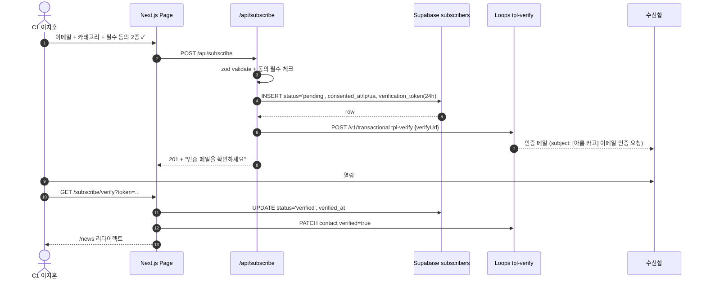

#### 3.4.2 일일 카고 뉴스 Ingest 파이프라인 (해외 번역 포함)

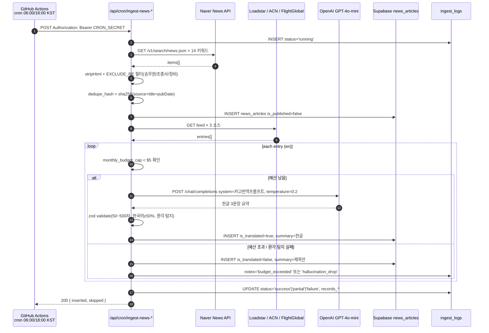

#### 3.4.3 07:00 KST 일일 다이제스트 발송

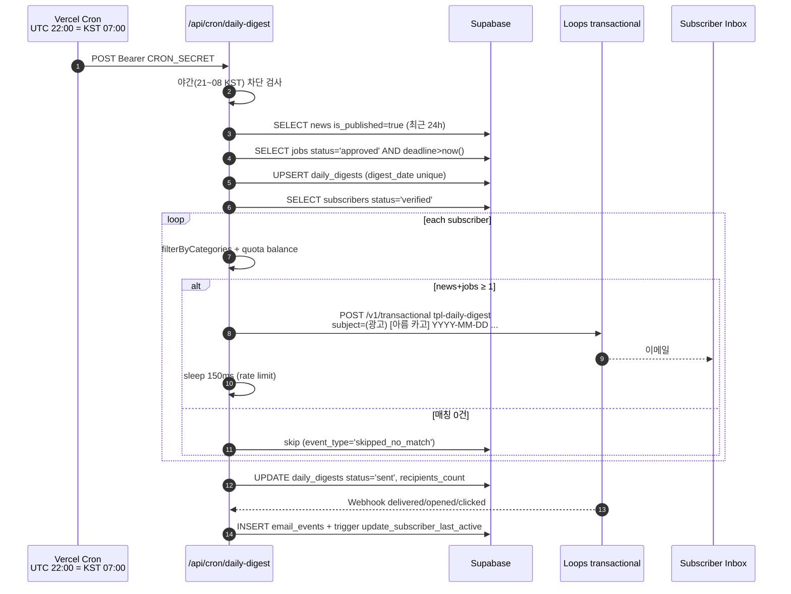

#### 3.4.4 관리자 Magic Link 로그인 + `admin_users` 화이트리스트

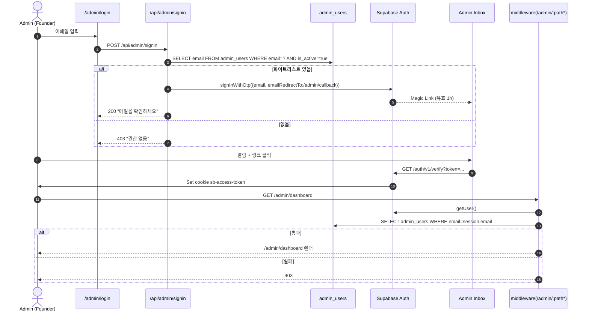

#### 3.4.5 비카고 공고 차단 (DB 트리거)

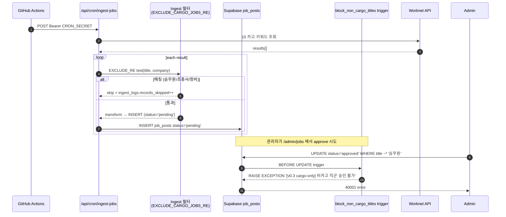

#### 3.4.6 구독자 설정 관리 (settings_token, Auth 없음 대체)

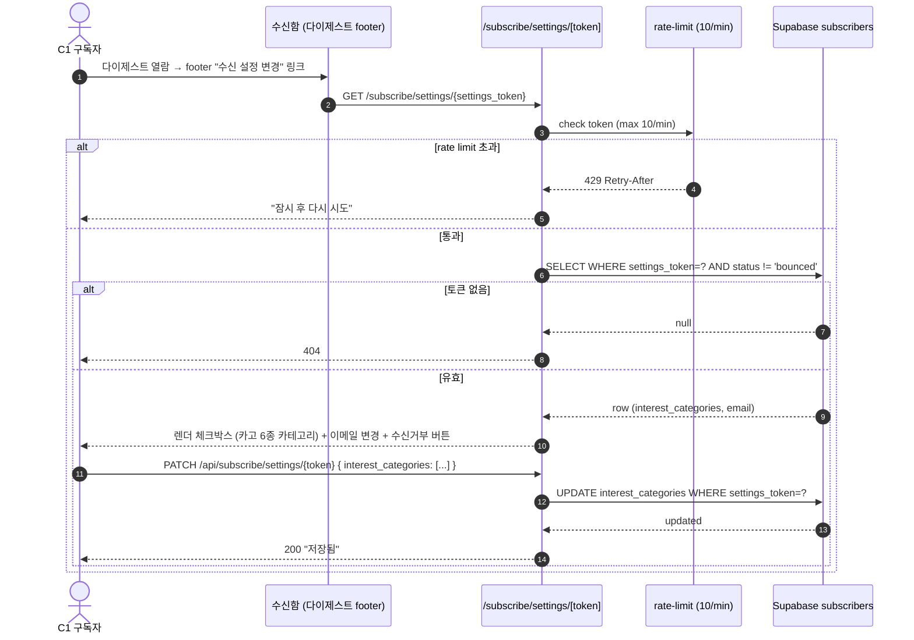

#### 3.4.7 공유 루프 (referrer → 신규 구독 → 가점)

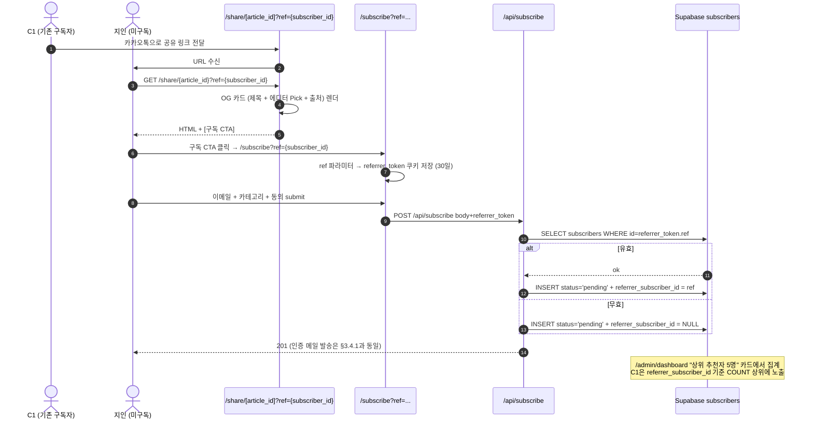

---

## 4. Specific Requirements

### 4.1 Functional Requirements

> **구성**: ID(`REQ-FUNC-XXX`) / Title / Source(PRD 앵커) / Priority(MSCW) / Type / Acceptance Criteria(요약 Given-When-Then) / Verification / Status
> **Status 초기값**: 전부 `Proposed`. 사용자 승인 시 `Approved`.
> **Type 약어**: F=Functional, I=Interface, D=Data, C=Constraint
> **Owner**: Solo (Founder) 기본, 별도 명시 시 해당 값

#### 4.1.a 카고 뉴스 I-Side (REQ-FUNC-0XX)

| ID | Title | Source | Priority | Type | Acceptance Criteria | Verification |
|---|---|---|---|---|---|---|
| REQ-FUNC-010 | 네이버 뉴스 14 카고 키워드 ingest | REF-03 §3.1, REF-05 §3 / F1 / US-I1 | Must | F | Given 14 키워드 config, When GitHub Actions cron 06:00/18:00 KST 트리거, Then 각 쿼리 호출 후 items 수집 ≥ 0. 실패 시 3회 backoff 재시도 후 `ingest_logs.status='partial'` | unit(쿼리 파서), integration(Naver mock), E2E(실제 cron 1회) |
| REQ-FUNC-011 | 국내 카고 뉴스 보조 ingest (Rev 1.1 실측 후 축소) | REF-03 §3.1, REF-05 §4.1 / F1 | Should | F | Given 국내 뉴스 primary 는 REQ-FUNC-010 Naver News API. 실측(2026-04-19): 카고프레스 RSS 미제공·카고뉴스 월간·포워더케이알 커뮤니티 사이트. When 카고프레스 HTML parse 가능성 검토 (Best Effort, CON-07 준수 범위 내 제목+링크만), Then 성공 시 news_articles insert. 실패 시 Naver API 만으로 운영 | integration (Best Effort) |
| REQ-FUNC-012 | 해외 카고 RSS 3종 ingest (Loadstar·ACN UK·FlightGlobal) | REF-03 §3.1, REF-05 §4.1 / F1 | Must | F | Given 3개 영문 피드, When cron 실행, Then 각 item의 `content:encoded` 또는 Readability 파싱 후 번역 파이프 전달 | integration, E2E |
| REQ-FUNC-013 | 뉴스 exclude 키워드 필터 (승무원·조종사·정비 등 8종) | REF-03 §3.1, REF-05 §3.4 / CON-05 | Must | F | Given ingest 된 title/description, When `EXCLUDE_RE=/승무원\|객실\|지상직\|조종사\|부기장\|정비사\|기장\|항공정비/` 매칭, Then skip + `ingest_logs.records_skipped++` | unit(정규식 테스트 20 케이스), E2E |
| REQ-FUNC-014 | dedupe_hash 중복 차단 | REF-04 §4.3 / F1 | Must | F | Given `sha256(source_name + title + pubDate)` hash, When DB unique 위반, Then `on conflict do nothing` + `records_skipped++` | integration(동일 item 2회 insert) |
| REQ-FUNC-015 | 해외 기사 LLM 한글 요약 (Gemini MVP · Provider-Agnostic facade) | PRD 02 §4, PRD 04 §4.2, C-TEC-015 | Must | F | Given 영문 title+body, When MVP 기본 `TRANSLATION_PROVIDER=gemini` (Gemini 1.5 Flash, temperature=0.2, max_tokens=500) adapter 호출, Then 50~500자 한국어 요약 생성 (한국어 비율 ≥ 50%, 카고 용어 괄호 병기). Phase 5.5+ `openai` / `anthropic` 어댑터 추가 시 동일 zod 출력 스키마 · 동일 system prompt로 env 변경만으로 교체 가능 | unit(gemini adapter zod schema), integration(gemini mock), manual 10건 오역 검수 |
| REQ-FUNC-016 | GPT 환각 탐지 drop | REF-03 §4, REF-05 §4.3 | Must | F | Given 요약 내 숫자 토큰, When 원문에 없는 2자리 이상 숫자 발견, Then 결과 drop + `ingest_logs.notes='hallucination_drop'` + `is_translated=false` fallback | unit(환각 탐지 함수) |
| REQ-FUNC-017 | 번역 Provider 예산/쿼터 상한 enforcement | REF-03 §4, CON-06 | Must | F | Given `TRANSLATION_PROVIDER` 값, When 번역 호출 직전 해당 Provider 한도 체크 (기본 `gemini`: 일 1,500 req / `openai` 선택 시: 월 $5 누적 `OPENAI_MONTHLY_BUDGET_CAP_USD`), Then 초과 시 skip + `notes='quota_exceeded'` + 제목만 저장 | unit(한도 체크 함수), E2E(mock 초과) |
| REQ-FUNC-018 | 뉴스 카테고리 분류 (6종 enum) | REF-04 §3 | Must | D | Given config 키워드→카테고리 매핑, When insert, Then `category ∈ {cargo-market, cargo-ops, cargo-company, cargo-policy, airport-cargo, big-aviation}` | unit(매핑 함수), DB constraint |
| REQ-FUNC-019 | 카테고리 quota soft 배분 (big-aviation 30%) | REF-03 §3.1, REF-05 §3.6 | Should | F | Given 금일 수집된 카드, When 카테고리별 집계, Then 관리자 승인 단계에서 ±10%p 초과 시 UI 경고 뱃지 | integration(mock 카드셋) |
| REQ-FUNC-020 | `/news` 공개 피드 렌더 | REF-03 §2 US-I1, REF-07 | Must | F | Given `is_published=true` 카드 ≥ 5건, When `/news` 진입, Then 최신순 5장 카드 + LCP ≤ 2.5s | Lighthouse CI, Playwright E2E |
| REQ-FUNC-021 | `/news` 카테고리 탭 필터 | REF-03 §3.3, US-I1-2 | Must | F | Given URL `?cat=cargo-market`, When 진입, Then 해당 카테고리만 서버 렌더 + URL 쿼리 동기화 | unit(zod validation), Playwright |
| REQ-FUNC-022 | `/news` 보조 태그 chip 다중 필터 | REF-03 §3.3 | Should | F | Given `?tags=TAC,대한항공카고`, When 진입, Then `tags @> ARRAY[...]` 쿼리 | integration |
| REQ-FUNC-023 | `/news/[slug]` 상세 + NewsArticle schema | REF-03 §7 | Should | F+I | Given 카드 클릭, When 상세 진입, Then summary + 에디터 Pick + 원문 링크 + `<script type="application/ld+json">` 주입 | Playwright, Rich Results Test |
| REQ-FUNC-024 | 외부 원문 클릭 추적 (beacon) | REF-03 US-I1-3, REF-04 `news_clicks` | Must | F | Given 카드 클릭, When `/api/news/click/[id]` beacon, Then `news_clicks` INSERT + `_blank noopener noreferrer` 이동 | Playwright |
| REQ-FUNC-025 | 에디터 Pick 필드 (140자, tone enum) | REF-03 §5, REF-04 §4.3, CON-07 | Must | D | Given news_articles 컬럼, When insert/update, Then `editor_pick` 길이 ≤ 140 체크 + `tone ∈ {OBSERVATION, ACTION_ITEM, CONTEXT}` | DB constraint, unit |
| REQ-FUNC-026 | 에디터 Pick 수정 이력 자동 기록 | REF-04 §5.3 | Must | F | Given `UPDATE news_articles SET editor_pick=...`, When trigger fire, Then `editor_pick_history` jsonb 배열에 이전 값·tone·작성자·시각 append | DB trigger test |
| REQ-FUNC-027 | 에디터 Pick 카드 내 시각 분리 (좌측 바 + 배경) | REF-03 §5.4, REF-07 §4.2 | Must | F+I | Given Pick 존재, When 카드 렌더, Then `border-l-[3px] border-arum-pick bg-arum-sky-50` + `✏️ 에디터 Pick` 뱃지 + tone 라벨 | visual regression, Playwright |
| REQ-FUNC-028 | 에디터 Pick 이메일 HTML 블록 | REF-06 §4.5 | Must | F | Given Pick 있는 뉴스 포함 다이제스트, When HTML builder 호출, Then 뉴스 카드 내부에 `<div border-left:3px solid #0ea5e9>` 블록 삽입 | unit(HTML builder) |
| REQ-FUNC-029 | `<AviationTerm term="AWB">` 툴팁 컴포넌트 | REF-03 §6 | Must | F+I | Given 용어 등장, When desktop hover / mobile tap, Then 영문 풀네임 + 한글 정의 + 1줄 예시 툴팁 (shadcn Tooltip/Popover) | Playwright, axe DevTools 키보드 포커스 |
| REQ-FUNC-030 | `aviation_glossary` 50개 카고 용어 시드 | PRD 03 §6.2 + §1.3 Definitions | Must | D | Given 마이그레이션 스크립트, When 실행, Then AWB·HAWB·MAWB·ULD·AKE·PMC·PAG·TAC Index·BAI·Freighter·Combi·Belly Cargo·Consolidator·Forwarder 등 50개 ROW 존재 | SQL 행 카운트 |
| REQ-FUNC-031 | 뉴스 본문 자동 용어 래핑 (서버측) | REF-03 §6.2 | Should | F | Given summary 텍스트, When SSR 렌더, Then glossary term 매칭 시 `<AviationTerm>` 자동 래핑 (이스케이프 주의) | unit(래퍼 함수) |
| REQ-FUNC-032 | 기사 thumbnail 외부 직접 링크 (캐싱 금지) | REF-03 §3.4 | Should | F | Given `next.config.js remotePatterns`, When 이미지 렌더, Then 원본 서버 URL 직접 로드 | Playwright |
| REQ-FUNC-033 | 뉴스 ingest 실패 시 직전 스냅샷 유지 | REF-03 US-I1-F1 | Must | F | Given ingest 전체 실패, When 사용자 `/news` 진입, Then 빈 화면 금지, 이전 성공분 + "마지막 업데이트 HH:MM KST" 배너 | chaos test |

#### 4.1.b 카고 채용 A-Side (REQ-FUNC-1XX)

| ID | Title | Source | Priority | Type | Acceptance Criteria | Verification |
|---|---|---|---|---|---|---|
| REQ-FUNC-100 | 워크넷 10 카고 키워드 ingest | REF-02 §3.1, REF-05 §5 / US-A1 | Must | F | Given 10 키워드(`항공화물` 등), When GitHub Actions cron KST 24:00, Then XML parse 후 `job_posts` insert status='pending' | integration, E2E |
| REQ-FUNC-101 | 사람인 secondary ingest + dedupe | REF-02 §3.1, REF-05 §6 | Should | F | Given 워크넷 결과 dedupe_hash 해시, When 사람인 호출 시 동일 hash 있으면 skip | integration(동일 공고 2회) |
| REQ-FUNC-102 | 채용 exclude 키워드 필터 (ingest 레벨) | REF-02 §3.1, REF-05 §5.3, CON-05 | Must | F | Given title 또는 companyName, When `/승무원\|객실\|지상직\|조종사\|부기장\|항공정비\|정비사\|기장\|캐빈/` 매칭, Then skip + `ingest_logs.records_skipped++` | unit(30 케이스), E2E |
| REQ-FUNC-103 | DB 트리거 `block_non_cargo_titles` | REF-04 §4.5, CON-05 | Must | C | Given `UPDATE/INSERT job_posts SET status='approved'`, When title `~* '(승무원\|객실\|조종사\|부기장\|항공정비\|정비사\|기장)'`, Then RAISE EXCEPTION | DB trigger test (negative) |
| REQ-FUNC-104 | `source_trust_score` 자동 계산 | REF-02 §5.2, REF-05 §5.5 | Should | F | Given company_name, description, When ingest, Then `cargo_career_links` 매칭 → 5.0 / `수강\|학원` → 2.0 / 카고 키워드 `+0.5` | unit(룰 매트릭스) |
| REQ-FUNC-105 | `job_posts` 카테고리 enum 7종 | REF-04 §3 | Must | D | Given 키워드 → 카테고리 매핑, When insert, Then `cargo_category ∈ {sales, ops, customs, imex, intl_logistics, airport_ground, other_cargo}` | DB enum |
| REQ-FUNC-106 | `job_posts.status` enum 4종 | REF-04 §3 | Must | D | Given status 전이, When UPDATE, Then `∈ {pending, approved, rejected, archived}` | DB enum |
| REQ-FUNC-107 | `/jobs` 카드 피드 + 6종 필터 | REF-02 §4, US-A1-1 | Must | F | Given approved 카드 ≥ 10, When `/jobs?category=cargo_sales&sort=trust_desc` 진입, Then 신뢰도 DESC 렌더 LCP ≤ 2.5s | Lighthouse, Playwright |
| REQ-FUNC-108 | 필터 URL 쿼리 동기화 | REF-02 §4.1 | Must | F | Given 필터 변경, When `useReducer` dispatch, Then `router.replace` URL 반영 (공유 가능) | Playwright |
| REQ-FUNC-109 | 정렬 3종 (신뢰도·마감·최신) | REF-02 §4.2 | Must | F | Given `sort` param, When 쿼리, Then ORDER BY 적용 | integration |
| REQ-FUNC-110 | D-3 이하 `arum.urgent` 배지 | REF-02 §3.2, US-A1-1 | Must | F+I | Given `deadline ≤ now() + 3 days`, When 카드 렌더, Then 빨강 urgent 배지 표시 | Playwright, visual regression |
| REQ-FUNC-111 | 신뢰도 별 아이콘 1~5 (lucide Star) | REF-02 §5.3 | Must | F+I | Given `source_trust_score` 1.0~5.0, When 카드 렌더, Then Star 아이콘 개수 표시 (소수점 반올림) | Playwright |
| REQ-FUNC-112 | 카고 기업 공식 딥링크 카드 (`cargo_career_links`) | REF-02 §3.3, REF-04 §6.1 | Must | F+D | Given 14개 시드(대한항공카고·아시아나카고·판토스·CJ대한통운·한진·코스모항운·우정항공·트리플크라운·에어인천·세방·동방·스위스포트·KAS·서울항공), When `/jobs` 진입, Then 딥링크 그리드 렌더 + 외부 이동 `target=_blank` | integration, Playwright |
| REQ-FUNC-113 | `/jobs/[slug]` 상세 + JobPosting schema | REF-02 §7 | Should | F+I | Given 카드 클릭, When 상세 진입, Then summary 2~3문장 + 원문 CTA + JSON-LD 주입 | Rich Results Test |
| REQ-FUNC-114 | `/admin/jobs` 승인 큐 | REF-02 §6.3 | Must | F | Given `status='pending'` 공고, When 관리자 UI 진입, Then 좌측 리스트 + 우측 상세 + 승인/거부(이유 선택) 버튼 | Playwright |
| REQ-FUNC-115 | 거부 이유 선택 enum | REF-02 §6.3 | Must | D | Given reject 시, When 사유 선택, Then 화물 무관/학원 광고/신뢰도 불명/중복/기타 중 하나 저장 | DB check |
| ~~REQ-FUNC-116~~ | ~~관리자 일괄 승인 단축키~~ — **Rev 1.1 제거** (ADR-009 타겟 재정렬 · 1인 운영 편의 기능 · Could priority 가치 낮음) | — | — | — | — | — |
| REQ-FUNC-117 | 마감 7일 후 `archived` 자동 전이 | REF-04 §5.2 | Must | F | Given `status='approved' AND deadline < now() - 7d`, When 일 cron 실행, Then status='archived' | DB function test |
| REQ-FUNC-118 | `/jobs` 빈 상태 메시지 + 구독 CTA | REF-02 US-A1-F1 | Must | F+I | Given approved = 0, When 진입, Then "관리자 검수 중" + 구독 CTA | Playwright |
| REQ-FUNC-119 | 공고 클릭 beacon + 원문 이동 | REF-02 §3.2, US-A1-3 | Must | F | Given 카드 CTA 클릭, When beacon 전송, Then `job_clicks` INSERT + `_blank noopener noreferrer` | Playwright |
| ~~REQ-FUNC-120~~ | ~~years_experience 하이라이트 (C1 2~5년)~~ — **Rev 1.1 제거** (ADR-009 Primary = A1 취준생 전환 · 2~5년차 강조는 Secondary C1 대상, MVP 에서 불필요) | — | — | — | — | — |

#### 4.1.c Email Growth Loop (REQ-FUNC-2XX)

| ID | Title | Source | Priority | Type | Acceptance Criteria | Verification |
|---|---|---|---|---|---|---|
| REQ-FUNC-200 | `/api/subscribe` 더블 옵트인 (zod) | REF-06 §3, US-E1-1 | Must | F | Given POST body {email, interest_categories, consents[2]=true}, When handler, Then zod pass + subscribers insert status='pending' + consented_at/ip/ua 기록 + Loops tpl-verify 발송 | unit(zod), integration(mock Loops) |
| REQ-FUNC-201 | `verification_token` 24h 만료 | REF-06 US-E1-F4 | Must | F | Given 발급 후 24h 경과, When `/subscribe/verify?token` 진입, Then 410 + "재발송" CTA | unit(시간 비교), Playwright |
| REQ-FUNC-202 | `/subscribe/verify` → verified 전환 | REF-06 US-E1-2 | Must | F | Given 유효 토큰, When GET, Then UPDATE status='verified', verified_at=now() + Loops contact verified=true + `/news` 리다이렉트 | integration |
| REQ-FUNC-203 | 중복 구독 시 409 + 재발송 허용 3회/h | REF-06 US-E1-F1 | Must | F | Given 동일 이메일 POST, When 2번째, Then 409 "이미 구독 중" + `verification_sent_at` 기반 rate limit | integration |
| REQ-FUNC-204 | 필수 동의 미체크 차단 (클라+서버) | REF-06 US-E1-F2 | Must | F | Given consents[] 빈 배열, When submit, Then 클라 차단 + 서버 zod 400 | Playwright, unit |
| REQ-FUNC-205 | Loops tpl-verify 실패 시 롤백 | REF-06 US-E1-F3 | Must | F | Given Loops 5xx, When subscribe 중 실패, Then subscribers insert 롤백 + 사용자 "잠시 후 재시도" | chaos test |
| REQ-FUNC-206 | `/api/cron/daily-digest` 07:00 KST 발송 | REF-06 §5, CON-02, US-E1-3 | Must | F | Given verified ≥ 1, 금일 뉴스 ≥ 4, When Vercel Cron 트리거, Then 60s 이내 tpl-daily-digest 발송 + status='sent' | E2E(실제 발송 본인 이메일) |
| REQ-FUNC-207 | 야간 발송 차단 (21~08 KST) | REF-06 US-E2-F3, CON-02 | Must | F | Given KST 시 < 6 또는 > 10, When daily-digest 트리거, Then 403 거부 | unit(시간 검사) |
| REQ-FUNC-208 | `(광고)` subject 접두어 + 발신자 footer | REF-06 §4.3, CON-03 | Must | F | Given tpl-daily-digest dataVariables, When 발송, Then subject startsWith `(광고) [아름 카고]` + footer includes senderInfo | unit(템플릿 검증), 발송 감사 |
| REQ-FUNC-209 | `/unsubscribe/[token]` 원클릭 수신거부 | REF-06 §7, CON-03, US-E1 | Must | F | Given settings_token, When GET, Then UPDATE status='unsubscribed' + unsubscribed_at + Loops subscribed=false + subscription_events insert | Playwright |
| REQ-FUNC-210 | `/subscribe/settings/[token]` 카테고리 수정 | REF-06 §10 | Should | F | Given 유효 토큰, When 카테고리 체크박스 변경 + PATCH, Then `interest_categories` 업데이트 | Playwright |
| REQ-FUNC-211 | settings_token rate limit 10 req/min | REF-06 US-E2-F2 | Should | F | Given 11번째 요청, When 1분 내, Then 429 + Retry-After | integration |
| REQ-FUNC-212 | `daily_digests.digest_date` unique idempotency | REF-06 §5.3 | Must | D | Given 같은 날 cron 재호출, When upsert, Then 신규 레코드 생성 안 됨 | DB unique |
| REQ-FUNC-213 | 카테고리 매칭 + quota balancing | REF-06 §6.1 | Must | F | Given 구독자 interest_categories, When filterByCategories, Then 매칭 카드 ≤ 5 + quota 기본 분포 (빈 선택 시 balanceByQuota) | unit(mock 카드셋) |
| REQ-FUNC-214 | 매칭 0건 skip + 주 1회 확장 안내 | REF-06 US-E2-F1 | Should | F | Given news+jobs 매칭 0, When digest loop, Then 해당 구독자 skip + 주 1회 "카테고리 확장 안내" 메일 | integration |
| REQ-FUNC-215 | Loops 발송 rate limit sleep(150ms) | REF-06 §5.2, REF-05 §7.4 | Must | F | Given 1,000 구독자 루프, When loopsClient.send 후, Then `await sleep(150)` 삽입 | unit(sleep 호출 검증) |
| REQ-FUNC-216 | `/api/webhooks/loops` 이벤트 수신 | REF-05 §7.6, REF-06 US-E1-4 | Must | F+I | Given Loops webhook POST + HMAC, When 검증 통과, Then email_events insert → trigger `update_subscriber_last_active` 발동 | integration(HMAC) |
| REQ-FUNC-217 | `subscribers.last_active_at` 자동 갱신 (trigger) | REF-04 §5.4 | Must | F | Given email_events `opened/clicked` insert, When trigger fire, Then subscribers.last_active_at = event.occurred_at | DB trigger test |
| ~~REQ-FUNC-218~~ | ~~공유 루프 `/share/[id]?ref=`~~ — **Rev 1.1 제거** (ADR-009 Primary = A1 취준생 · 공유가치 낮음 · 취업 후 이탈 구조) | — | — | — | — | — |
| ~~REQ-FUNC-219~~ | ~~공유 OG 카드~~ — **Rev 1.1 제거** (REQ-FUNC-218 공유 루프 제거에 따른 종속 삭제) | — | — | — | — | — |

#### 4.1.d UI/UX Spec (REQ-FUNC-3XX)

| ID | Title | Source | Priority | Type | Acceptance Criteria | Verification |
|---|---|---|---|---|---|---|
| REQ-FUNC-300 | Tailwind `arum.*` 토큰 네임스페이스 | REF-07 §2, CON-10 | Must | C | Given tailwind.config.ts, When theme.extend.colors, Then `arum.ink/navy/slate/sky/blue/blob/cloud/mist/fog/urgent/success/pick` 키 존재 + `raion.*` 키 부재 | lint rule (eslint-plugin-tailwindcss) |
| REQ-FUNC-301 | Bento Grid 랜딩 Hero (Framer Motion 스태거 리빌) — Rev 1.1 재배치 | PRD 06 §4.2, C-TEC-003, ADR-009 | Should | F+I | Given `/` 진입, When 렌더, Then `grid-cols-4 grid-rows-3` (데스크톱) 카드 5종 (**ADR-009 A1 Primary 반영: Job-Spotlight 확대 2x2 · Hero-Pick 2x2 · News-Stack 1x2 · Email-CTA 4x1 · 14사 공식채용 그리드 preview 4x1**). ~~Metric-Live 1x1 카드 제거 (Rev 1.1 · 취준생 대상 WAU 숫자 가치 없음)~~ + Framer Motion `staggerChildren`(0.08s) `whileInView` fade-in | Playwright, visual regression |
| REQ-FUNC-302 | Gradient Blob 배경 애니메이션 (CSS-first) | PRD 06 §4.3, C-TEC-003 | Should | F+I | Given Hero 섹션, When 렌더, Then radial-gradient 3겹 + `filter:blur(80px)` + CSS `@keyframes arum-blob-drift` 18s ease-in-out infinite alternate + `prefers-reduced-motion: reduce` 쿼리에서 animation off (blur만 유지) | Playwright(motion matcher), axe |
| REQ-FUNC-303 | Scroll Parallax Hero (Framer Motion `useScroll`) | PRD 06 §4.4, C-TEC-003 | Should | F+I | Given Hero 스크롤, When `useScroll` + `useTransform`, Then 3레이어 y축 `progress`를 각각 `{-20, -60, -120}px`에 매핑 (총 ≤ 120px) + `useReducedMotion()` true 시 transform bypass | Playwright |
| REQ-FUNC-304 | 3D Carousel `/about` 또는 `/showcase` 하단 | PRD 06 §1.2 | Could | F+I | Given `/about` 하단 섹션, When 스크롤 진입, Then CSS 3D `transform-style: preserve-3d` + Framer Motion `useMotionValue` 기반 회전. WebGL·GSAP 없음 | Playwright |
| REQ-FUNC-305 | Pretendard + Space Grotesk + JetBrains Mono 폰트 | REF-07 §3 | Must | I | Given 초기 로딩, When Network, Then 폰트 페이로드 ≤ 100KB + CLS ≤ 0.1 | Lighthouse |
| REQ-FUNC-306 | 한국어 본문 line-height 1.6 | REF-07 §3.3 | Must | I | Given 본문 텍스트, When CSS inspect, Then `line-height: 1.6` | visual regression |
| REQ-FUNC-307 | `<AviationTerm>` 키보드 포커스 가능 | REF-03 §6, REF-07 | Must | F+I | Given 툴팁 용어, When Tab 이동, Then 포커스 ring + Enter로 열림 | axe DevTools, keyboard nav |
| REQ-FUNC-308 | `prefers-reduced-motion` 전역 대응 | PRD 06 §4, C-TEC-003 | Must | F+I | Given OS 설정 reduced-motion, When 렌더, Then Framer Motion `useReducedMotion()` true 분기로 transform/opacity 전이 제거 + CSS `@media (prefers-reduced-motion: reduce)` 에서 blob drift animation 정지 + fade-in 즉시 표시 | Playwright media emulation |
| REQ-FUNC-309 | About 페이지 개인정보 비노출 | REF-07 §5.10, CON-09 | Must | C | Given `/about` 본문, When 검색, Then 실명·회사명·학교명·직책 문자열 부재. "11년차 항공 화물 현직자" 만 허용 | lint + manual review |
| REQ-FUNC-310 | `/privacy`, `/terms` 법정 페이지 | REF-06 §3.2, REF-07 | Must | F | Given URL 접근, When 렌더, Then 개인정보처리방침·이용약관 본문 + 사업자 정보 | Playwright, 법률 리뷰 |
| REQ-FUNC-311 | 썸네일 `next/image remotePatterns` | REF-03 §3.4 | Should | F+I | Given Next.js config, When 이미지 렌더, Then 허용 도메인만 로드 + CLS ≤ 0.1 | Lighthouse |

#### 4.1.e Admin / Operations (REQ-FUNC-4XX)

| ID | Title | Source | Priority | Type | Acceptance Criteria | Verification |
|---|---|---|---|---|---|---|
| REQ-FUNC-400 | `admin_users` 화이트리스트 테이블 | REF-04 §4.12, REF-05 §9 | Must | D | Given 테이블 마이그레이션, When 삽입, Then email unique + role ∈ {admin, editor} + is_active bool | DB schema |
| REQ-FUNC-401 | `/admin/login` Magic Link 발송 | REF-05 §9 | Must | F | Given 이메일 입력, When POST /api/admin/signin, Then admin_users 존재 시 Supabase signInWithOtp 호출 / 없으면 403 | integration |
| REQ-FUNC-402 | middleware `/admin/:path*` 보호 | REF-05 §9.2 | Must | F | Given 세션 없음, When /admin/* 진입, Then /admin/login 리다이렉트 | Playwright |
| REQ-FUNC-403 | Magic Link 유효기간 1h | REF-06 §14 보안 | Must | C | Given Supabase Auth 설정, When `auth.otp_expiry`, Then ≤ 3600초 | Supabase 설정 스크린샷 |
| REQ-FUNC-404 | `/admin/dashboard` 8 KPI 카드 (shadcn/ui charts) | PRD 05 §9.1, §9.2, C-TEC-006 | Must | F+I | Given 세션 활성, When `/admin/dashboard` 진입, Then WAU·MUV·유입경로·신규구독자·4주유지율·Open/CTR·승인공고·Employers문의(Phase 5.5) 카드 렌더. 차트는 shadcn/ui charts(Recharts 래퍼)만 사용, Tremor 의존성 금지 | Playwright |
| REQ-FUNC-405 | 각 KPI 카드 ⓘ 툴팁 (의미·출처·근거) | REF-06 §9.3 | Must | I | Given 카드 hover/tap, When Popover 열림, Then 지표 정의 + 출처(Amplitude NSM·Reforge) 표시 | axe, Playwright |
| REQ-FUNC-406 | `/api/admin/metrics` 집계 | REF-06 §9.4 | Must | F | Given GET 요청, When 관리자 세션 통과, Then Supabase + Loops API + Vercel Analytics 3소스 집계 후 JSON | integration |
| REQ-FUNC-407 | `/admin/news` 인라인 에디터 Pick 작성 | REF-03 §5.3 | Must | F | Given pending 카드 리스트, When Pick 입력 + 승인, Then `editor_pick` + `editor_pick_tone` + `editor_pick_at` 저장 + `is_published=true` | Playwright |
| REQ-FUNC-408 | WAU 계산 쿼리 (`last_active_at ≥ now()-7d`) | REF-06 §11 | Must | F | Given verified 구독자, When 쿼리 실행, Then count(*) 반환 ≤ 100ms | SQL EXPLAIN ANALYZE |
| REQ-FUNC-409 | 4주 유지율 코호트 쿼리 | REF-06 §11 | Must | F | Given 4주 전 가입자, When 지난 7일 활성 집계, Then 비율 ≥ 40% 목표 | SQL |
| REQ-FUNC-410 | 에디터 Pick 작성률 경고 (< 60%) | REF-06 §12 | Should | F | Given 주간 승인 카드 중 Pick 비율 < 60%, When daily-digest 실행, Then `ingest_logs warning` + 대시보드 노출 | integration |
| REQ-FUNC-411 | `tpl-admin-alert` 관리자 알림 메일 | REF-05 §7.2, REF-06 §4.2 | Must | F | Given ingest 실패 또는 OpenAI 예산 초과 또는 B1 문의(Phase 5.5), When 이벤트 발생, Then Loops transactional 관리자 이메일 | integration |

#### 4.1.f Data / System (REQ-FUNC-5XX)

| ID | Title | Source | Priority | Type | Acceptance Criteria | Verification |
|---|---|---|---|---|---|---|
| REQ-FUNC-500 | Supabase 모든 테이블 RLS 활성화 | REF-04 §1 | Must | C | Given Supabase, When `\dt+` inspect, Then 모든 테이블 `rls: true` | SQL 점검 |
| REQ-FUNC-501 | `news_articles` anon SELECT `is_published=true`만 | REF-04 §4.3 | Must | C | Given anon key, When SELECT, Then `is_published=false` rows 0건 | RLS negative test |
| REQ-FUNC-502 | `job_posts` anon SELECT `status='approved'`만 | REF-04 §4.5 | Must | C | Given anon key, When SELECT, Then 다른 status rows 0건 | RLS negative test |
| REQ-FUNC-503 | `subscribers` anon SELECT 차단 (INSERT만) | REF-04 §4.1 | Must | C | Given anon key, When SELECT subscribers, Then 0 rows | RLS negative test |
| REQ-FUNC-504 | `admin_users` service_role only | REF-04 §4.12 | Must | C | Given anon key, When 어떤 CRUD도, Then denied | RLS negative test |
| REQ-FUNC-505 | `settings_token` 256bit 엔트로피 | REF-04 §4.1, REF-06 §10.3 | Must | C | Given INSERT subscribers, When default, Then `encode(gen_random_bytes(32), 'hex')` 생성 (64자 hex) | DB inspect |
| REQ-FUNC-506 | `CRON_SECRET` bearer 검증 | REF-05 §11.3 | Must | C | Given 모든 /api/cron/* POST, When header 없음 또는 불일치, Then 401 | integration |
| REQ-FUNC-507 | Supabase Service Role Key 클라이언트 미노출 | REF-04 §1, CON-08 | Must | C | Given bundle analyze, When 검색, Then `SUPABASE_SERVICE_ROLE_KEY` 문자열 클라 번들 부재 | webpack-bundle-analyzer |
| REQ-FUNC-508 | `ingest_logs` 전 cron 실행 기록 | REF-04 §4.11, REF-05 §13.1 | Must | F | Given cron 시작, When 로직 실행 전, Then INSERT status='running'; 종료 시 UPDATE status/records/notes | integration |
| REQ-FUNC-509 | `subscription_events` 13개월 보존 | REF-04 §9, CON-04 | Must | C | Given retention cron 없음, When 13개월 경과 행, Then 여전히 존재 | manual |
| REQ-FUNC-510 | GitHub Actions 워크플로 3종 (news-dom, news-ov, jobs) | REF-05 §11.2 | Must | F | Given `.github/workflows/*.yml`, When schedule trigger, Then curl → /api/cron/* 성공 | workflow_dispatch 수동 테스트 |
| REQ-FUNC-511 | Vercel Cron `daily-digest` 22:00 UTC (=07:00 KST) | REF-05 §11.1 | Must | C | Given vercel.json, When deploy, Then crons[0].schedule="0 22 * * *" | Vercel dashboard |

### 4.2 Non-Functional Requirements

> **구성**: ID(`REQ-NF-XXX`) / 영역 / 지표 / 목표 (SLO) / 측정 방법 / Source / Priority
> **Priority**: Must (법적/재무 위험) / Should (UX) / Could (운영 편의)

#### 4.2.a 성능 (Performance)

| ID | 지표 | 목표 (SLO) | 측정 | Source | Priority |
|---|---|---|---|---|---|
| REQ-NF-001 | `/news` p95 LCP | ≤ 2.5 s | Lighthouse CI, Vercel Speed Insights | REF-03 §11 | Must |
| REQ-NF-002 | `/news` p95 TTFB | ≤ 600 ms | Vercel Speed Insights | REF-03 §11 | Must |
| REQ-NF-003 | `/news` CLS | ≤ 0.1 | Lighthouse | REF-03 §11 | Must |
| REQ-NF-004 | `/news` INP | ≤ 200 ms | Lighthouse | REF-03 §13 | Should |
| REQ-NF-005 | `/jobs` p95 LCP | ≤ 2.5 s | Lighthouse | REF-02 §11 | Must |
| REQ-NF-006 | `/jobs` p95 TTFB | ≤ 600 ms | Vercel | REF-02 §11 | Must |
| REQ-NF-007 | `/admin/dashboard` p95 응답 | ≤ 2 s | SSR + unstable_cache 5분 | REF-06 §14 | Must |
| REQ-NF-008 | 뉴스 목록 SQL p95 (1만 건 기준) | ≤ 200 ms | `idx_news_articles_is_published` | REF-04 §8 | Must |
| REQ-NF-009 | 채용 필터 SQL p95 (10만 건) | ≤ 300 ms | `idx_job_posts_approved` | REF-04 §8 | Must |
| REQ-NF-010 | WAU 쿼리 p95 | ≤ 100 ms | `idx_subscribers_last_active_at` | REF-04 §8 | Must |
| REQ-NF-011 | daily-digest cron 완료 시간 | ≤ 55 s per invocation (Vercel Hobby 60s 한도 이내). **구현 방식: Loops List Send API 위임 (단일 호출, Loops 내부 큐). 위임 실패 시 폴백: 100명 chunk × 5분 간격 5회 분할 cron** | `ingest_logs.finished_at - started_at` | REF-06 §14 | Must |
| REQ-NF-012 | `/api/cron/ingest-*` 완료 시간 | ≤ 50 s | ingest_logs | REF-05 §16 | Must |
| REQ-NF-013 | `/api/subscribe` p95 응답 | ≤ 500 ms | Vercel Analytics | REF-05 §16 | Must |
| REQ-NF-014 | 번역 Provider p95 응답 (MVP 기본 Gemini 1.5 Flash) | ≤ 4 s per article | ingest_logs | REF-05 §16 | Should |
| REQ-NF-015 | Loops webhook 응답 | ≤ 300 ms | Vercel | REF-05 §16 | Must |

#### 4.2.b 가용성 / 신뢰성 (Availability & Reliability)

| ID | 지표 | 목표 (SLO) | 측정 | Source | Priority |
|---|---|---|---|---|---|
| REQ-NF-020 | `/news` 5xx 에러율 | ≤ 0.5% / 28일 | Vercel Analytics + Sentry | REF-03 §11 | Must |
| REQ-NF-021 | `/jobs` 5xx 에러율 | ≤ 0.5% | Vercel + Sentry | REF-02 §11 | Must |
| REQ-NF-022 | `/api/subscribe` 성공률 | ≥ 99.5% | Vercel | REF-06 §14 | Must |
| REQ-NF-023 | 다이제스트 발송 성공률 | ≥ 98% | `email_events` 집계 | REF-06 §14 | Must |
| REQ-NF-024 | 이메일 webhook 지연 | ≤ 5 분 | webhook 수신 시각 − delivered 시각 | REF-06 §14 | Should |
| REQ-NF-025 | 뉴스 수집 신선도 lag | ≤ 6 h (원문 발행 ~ 공개) | `published_at vs created_at` | REF-03 §11 | Must |
| REQ-NF-026 | 채용 수집 lag | ≤ 26 h | `ingest_logs.finished_at` | REF-02 §11 | Must |
| REQ-NF-027 | Naver API 재시도 | 3회 backoff, 최대 지연 30s | exponential backoff log | REF-05 §16 | Must |
| REQ-NF-028 | 외부 API 전체 실패 시 직전 스냅샷 유지 | 빈 응답 / null 0건 | chaos test | REF-03 §11 | Must |
| REQ-NF-029 | RPO (복구 지점 목표) | ≤ 24 h | 일 1회 pg_dump | REF-04 §8 | Should |
| REQ-NF-030 | RTO (복구 시간 목표) | ≤ 4 h | 복원 스크립트 드라이런 | REF-04 §8 | Should |

#### 4.2.c 보안 (Security)

| ID | 지표 | 목표 (SLO) | 측정 | Source | Priority |
|---|---|---|---|---|---|
| REQ-NF-040 | anon 역할로 `news_articles is_published=false` 유출 | 0 건 | RLS negative test | REF-04 §8 | Must |
| REQ-NF-041 | anon 역할로 `job_posts status!=approved` 유출 | 0 건 | RLS test | REF-04 §8 | Must |
| REQ-NF-042 | anon 역할로 `subscribers` 이메일 유출 | 0 건 | RLS test | REF-04 §8 | Must |
| REQ-NF-043 | Service Role Key 클라이언트 번들 노출 | 0 건 | webpack-bundle-analyzer | REF-04 §1 | Must |
| REQ-NF-044 | `/admin/*` 미인증 접근 성공 | 0 건 | middleware 로그 | REF-06 §14 | Must |
| REQ-NF-045 | Magic Link 유효기간 | ≤ 1 h | Supabase Auth 설정 | REF-06 §14 | Must |
| REQ-NF-046 | `verification_token` 유효기간 | ≤ 24 h | DB check | REF-06 §14 | Must |
| REQ-NF-047 | `settings_token` rate limit | ≤ 10 req/min per token | middleware | REF-06 §14 | Must |
| REQ-NF-048 | `/api/cron/*` CRON_SECRET 검증 실패 | 401 반환 100% | integration | REF-05 §11 | Must |
| REQ-NF-049 | `/api/webhooks/loops` HMAC 검증 실패 | 401 반환 100% | integration | REF-05 §7.6 | Must |
| REQ-NF-050 | 외부 API 키 .env 외 노출 | 0 건 | gitleaks CI scan | CLAUDE.md §5.1 | Must |
| REQ-NF-051 | 데이터 전송 TLS | TLS 1.2+ 전 구간 | Vercel/Supabase 설정 | general security | Must |

#### 4.2.d 법적 준수 (Legal / Compliance)

| ID | 지표 | 목표 (SLO) | 측정 | Source | Priority |
|---|---|---|---|---|---|
| REQ-NF-060 | 이메일 subject `(광고)` 접두어 누락 | 0 건 | 템플릿 사전 검증 (CI) + 발송 후 감사 | REF-06 §14, REF-12 | Must |
| REQ-NF-061 | 이메일 footer 원클릭 수신거부 링크 누락 | 0 건 | 템플릿 CI | REF-12 | Must |
| REQ-NF-062 | 이메일 footer 발신자 정보(이름·연락·주소) 누락 | 0 건 | 템플릿 CI | REF-12 | Must |
| REQ-NF-063 | 야간(21~08 KST) 발송 | 0 건 | cron 스케줄 + 수동 트리거 403 차단 | REF-06 §14, REF-12 | Must |
| REQ-NF-064 | 수신 동의 증빙 (`subscription_events`) 보존 | ≥ 13 개월 | retention cron 금지 | REF-04 §9, REF-12 | Must |
| REQ-NF-065 | 수신거부 클릭 → 차단 반영 | ≤ 10 s | `/unsubscribe` response time | REF-06 §14 | Must |
| REQ-NF-066 | 더블 옵트인 (인증 메일 클릭 전) 발송 시도 | 0 건 | daily-digest loop 필터 | REF-12 | Must |
| REQ-NF-067 | 비카고 직군 공고 `approved` 전이 | 0 건 | DB trigger `block_non_cargo_titles` | PRD 03 §4.5, CON-05 | Must |
| REQ-NF-068 | 뉴스 원문 본문 DB 저장 | 0 건 | schema 점검 (summary 500자 상한) | REF-03 §3.4 | Must |
| REQ-NF-069 | 개인정보 식별자(실명·회사명·학교명) 공개 노출 | 0 건 | 정적 lint + 수동 검토 | CON-09, REF-07 §5.10 | Must |

#### 4.2.e 품질 / UX (Content Quality)

| ID | 지표 | 목표 (SLO) | 측정 | Source | Priority |
|---|---|---|---|---|---|
| REQ-NF-080 | 에디터 Pick 작성률 (주간 승인 카드 중 Pick 비율) | ≥ 60 % | `news_articles` 집계 | REF-03 §11 | Must |
| REQ-NF-081 | 에디터 Pick lag (수집 ~ Pick 작성) | P90 ≤ 12 h | `editor_pick_at - collected_at` | REF-03 §11 | Should |
| REQ-NF-082 | 카테고리 quota 편차 | ≤ ±10 %p (일 기준) | 일 집계 | REF-03 §11 | Should |
| REQ-NF-083 | GPT 번역 zod 검증 통과율 | ≥ 95 % | ingest_logs | REF-03 §11 | Must |
| REQ-NF-084 | GPT 번역 오역 (수동 검수 10건) | ≤ 1 건 (Phase 4) | 관리자 검수 로그 | REF-03 §11 | Should |
| REQ-NF-085 | 채용 광고 혼입률 (학원·대행) | ≤ 5 % / 주간 n=20 스폿 | 수동 라벨링 | REF-02 §11 | Must |
| REQ-NF-086 | 승인 공고 중 화물 무관 비율 | ≤ 3 % / 주간 스폿 | 수동 라벨링 | REF-02 §11 | Must |
| REQ-NF-087 | 자동 `trust_score` vs 관리자 최종 일치율 | ≥ 70 % (200건 후) | 라벨링 로그 | REF-02 §11 | Should |
| REQ-NF-088 | dedupe 실패율 | ≤ 1 % | unique 위반 시도 | REF-02 §11 | Must |
| REQ-NF-089 | 관리자 큐 일일 pending 백로그 | ≤ 30 건 | `/admin/jobs` 대시보드 | REF-02 §11 | Should |

#### 4.2.f Growth 지표 / North Star (Business SLO)

| ID | 지표 | 목표 (SLO) | 측정 | Source | Priority |
|---|---|---|---|---|---|
| REQ-NF-100 | **WAU (North Star)** — 지난 7일 verified 구독자 중 활성 | Phase 5 종료 시 ≥ 500 | Supabase `last_active_at` | REF-01 §6.1, REF-13 | Must |
| REQ-NF-101 | **4주 활성 유지율 (Reforge PMF)** | ≥ 40 % | cohort SQL | REF-01 §6.1, REF-14 | Must |
| REQ-NF-102 | 폼 제출 → verified 전환율 | ≥ 60 % | Supabase funnel | REF-06 §11 | Should |
| REQ-NF-103 | 이메일 Open rate | ≥ 35 % | Loops API | REF-06 §11 | Should |
| REQ-NF-104 | 이메일 CTR | ≥ 8 % | Loops API | REF-06 §11 | Should |
| REQ-NF-105 | 수신거부율 | ≤ 2 % | Loops + Supabase | REF-06 §11 | Must |
| REQ-NF-106 | 주간 신규 구독자 | ≥ 50 / 주 | Supabase | REF-01 §6.3 | Should |
| REQ-NF-107 | 주간 승인 공고 수 | ≥ 15 건 | Supabase | REF-01 §6.3 | Should |
| REQ-NF-108 | 공유 루프 전환 (`referrer_subscriber_id` 포함 신규) | ≥ 15 % | Supabase | REF-06 §11 | Could |
| REQ-NF-109 | MUV | ≥ 2,000 | Vercel Analytics | REF-01 §6.3 | Could |

#### 4.2.g 비용 / 용량 (Cost & Capacity)

| ID | 지표 | 목표 (SLO) | 측정 | Source | Priority |
|---|---|---|---|---|---|
| REQ-NF-120 | 번역 Provider 월 비용 | **MVP 기본 `gemini` = $0** / `openai` 선택 시 ≤ $ 5 / 월 | Provider usage + 해당 Provider 예산 env | PRD 02 §11, C-TEC-015 | Must |
| REQ-NF-121 | Supabase DB 용량 | ≤ 500 MB (Phase 5) | Supabase 대시보드 주간 | REF-04 §8 | Should |
| REQ-NF-122 | Loops contacts 수 | **알림 임계: 1,500 (75%) → Resend 전환 준비 착수 · 하드 상한: 1,800 (90%) → Resend 전환 완료** | Loops API | REF-05 §16 | Must |
| REQ-NF-123 | Naver API 일 사용량 | ≤ 0.5 % (125 / 25,000) | Naver 콘솔 | REF-05 §16 | Should |
| REQ-NF-124 | Worknet API 일 사용량 | ≤ 1 % (10 / 1,000) | Worknet 콘솔 | REF-05 §16 | Should |
| REQ-NF-125 | `flights_snapshots.raw` jsonb 평균 (Phase 5.5) | ≤ 4 KB/row | 통계 쿼리 | REF-04 §8 | Could |

#### 4.2.h 접근성 / 반응형 (Accessibility & Responsiveness)

| ID | 지표 | 목표 (SLO) | 측정 | Source | Priority |
|---|---|---|---|---|---|
| REQ-NF-140 | WCAG 2.1 AA 준수 (대비, 키보드) | 통과 | axe DevTools + Lighthouse | REF-02 §11, REF-07 | Must |
| REQ-NF-141 | 키보드 전용 네비게이션 | 전 인터랙티브 요소 도달 가능 | manual + axe | REF-07 | Must |
| REQ-NF-142 | `prefers-reduced-motion` 대응 | Parallax/blob/transition 비활성 | Playwright motion emulation | REF-07 §4 | Must |
| REQ-NF-143 | 모바일 (360px) 레이아웃 깨짐 없음 | 0 건 | Playwright viewport | REF-07 | Must |
| REQ-NF-144 | 초기 폰트 페이로드 | ≤ 100 KB (모바일) | Network tab | REF-07 §3.2 | Should |

#### 4.2.i 운영 / Scalability / Maintainability

| ID | 지표 | 목표 (SLO) | 측정 | Source | Priority |
|---|---|---|---|---|---|
| REQ-NF-160 | GitHub Actions + Vercel Cron 이중 인프라 운영 | 장애 시 한쪽 fallback 가능 | C-TEC-017, PRD 04 §11 | Should |
| REQ-NF-161 | 모든 외부 API 클라이언트 zod schema parse | 100 % | 코드 리뷰 | REF-05 §1 | Must |
| REQ-NF-162 | `src/lib/api/` 모듈 분리 원칙 | 클라이언트 직접 fetch 0 건 | ESLint rule | REF-05 §1 | Must |
| REQ-NF-163 | 마이그레이션 파일 `YYYYMMDDHHMMSS_*.sql` 네이밍 | 일관 | 디렉토리 검사 | REF-04 §7 | Should |
| REQ-NF-164 | CI에서 `(광고)` subject / unsubscribe link 템플릿 검증 | 통과 | GitHub Actions 템플릿 lint | REF-06 §14 | Must |
| REQ-NF-165 | `ingest_logs` 보존 | 90일 | 주간 삭제 cron | REF-04 §9 | Could |
| REQ-NF-166 | Scalability: verified 구독자 1,800→ 2,000 전 알림 | ≤ 1,800 도달 시 관리자 메일 | 주간 점검 | REF-06 §12 | Must |
| REQ-NF-167 | Maintainability: 테이블·enum 단일 소스는 PRD 03 | PRD ↔ migration diff 0 | 코드 리뷰 | REF-04 | Should |

---

## 5. Traceability Matrix

> **형식**: PRD Story ID → REQ-FUNC / REQ-NF ID → Test Case ID (TC-XXX)
> **테스트 케이스 ID 규칙**: `TC-{모듈}-{번호}` (UNIT / INT / E2E / SEC / A11Y / PERF / LEGAL)

### 5.1 Story → Functional Requirement → Test Case

| Story (PRD) | 관련 Pain | REQ-FUNC | Test Cases |
|---|---|---|---|
| US-I1 C1 `/news` 출근길 5분 (REF-03) | P01, P05 | REQ-FUNC-010, 013, 018, 019, 020, 021, 024, 025, 027, 033 | TC-NEWS-E2E-01 (5분 시나리오), TC-NEWS-UNIT-13 (EXCLUDE_RE), TC-NEWS-PERF-20 (LCP ≤ 2.5s), TC-NEWS-UNIT-25 (140자 제약) |
| US-I1-F1 ingest 실패 직전 스냅샷 | P01 | REQ-FUNC-033 | TC-NEWS-CHAOS-33 (RSS 전체 실패 시 이전 스냅샷 유지) |
| US-I1-F4 승무원 기사 자동 제외 | CON-05 | REQ-FUNC-013 | TC-NEWS-UNIT-13 (정규식 30 케이스) |
| US-I2 C2 `<AviationTerm>` 툴팁 | P05 보조 | REQ-FUNC-029, 030, 031 | TC-TERM-E2E-29 (AWB hover), TC-TERM-A11Y-29 (키보드 포커스) |
| US-I3 C3 해외 기사 한글 요약 | P02 | REQ-FUNC-012, 015, 016, 017 | TC-GPT-INT-15 (요약 품질), TC-GPT-UNIT-16 (환각 탐지), TC-GPT-UNIT-17 (월 예산 cap) |
| US-I3-F1 OpenAI timeout fallback | P02 | REQ-FUNC-015, 033 | TC-GPT-CHAOS-15 (500 응답 → is_translated=false) |
| US-A1 C1 `/jobs` 이직 탐색 | P04, P03 | REQ-FUNC-100, 103, 104, 107, 108, 110, 111, 119, 120 | TC-JOBS-E2E-107 (C1 3년차 필터 시나리오), TC-JOBS-LEGAL-103 (비카고 승인 차단), TC-JOBS-PERF-107 (LCP ≤ 2.5s) |
| US-A1-F1 모두 pending 빈 상태 | P04 | REQ-FUNC-118 | TC-JOBS-E2E-118 (빈 상태 + 구독 CTA) |
| US-A1-F2 워크넷 5xx | 가용성 | REQ-FUNC-100, REQ-NF-027, 028 | TC-JOBS-CHAOS-100 (Naver/Worknet mock 5xx) |
| US-A2 C3 신뢰도 ≥4 필터 | P03 | REQ-FUNC-104, 111 | TC-JOBS-UNIT-104 (trust score 매트릭스), TC-JOBS-E2E-111 |
| US-A2-F1 자동 점수 오류 → 관리자 재분류 | P03 | REQ-FUNC-114, 115 | TC-ADMIN-E2E-114 (승인 큐 reject) |
| US-E1 C1 더블 옵트인 + 07:00 다이제스트 | P01, §50 | REQ-FUNC-200, 201, 202, 203, 204, 206, 207, 208, 209, 212, 215, 216, 217 | TC-SUB-E2E-200 (풀 루프), TC-SUB-LEGAL-208 (광고 접두어 CI), TC-SUB-LEGAL-207 (야간 차단), TC-SUB-SEC-201 (24h 만료) |
| US-E1-F3 Loops 5xx 롤백 | 신뢰성 | REQ-FUNC-205 | TC-SUB-CHAOS-205 |
| US-E1-F5 발송 실패 재시도 | 신뢰성 | REQ-FUNC-215, REQ-NF-023 | TC-DIGEST-CHAOS-215 |
| US-E2 C2 빈 카테고리 전체 수신 | P01 | REQ-FUNC-213 | TC-DIGEST-UNIT-213 (매칭 로직) |
| US-E2-F2 settings rate limit | 보안 | REQ-FUNC-211 | TC-SUB-SEC-211 |
| US-E3 C3 WAU 활성 계산 | NSM | REQ-FUNC-216, 217, 408 | TC-WAU-DB-217 (trigger), TC-ADMIN-INT-408 (쿼리) |
| A3 B1 `/employers` (Phase 5.5) | P04 | (Out-of-Scope for MVP) | — |

### 5.2 NFR → 관련 REQ-FUNC → Test Case

| REQ-NF | 관련 REQ-FUNC | Test Case |
|---|---|---|
| REQ-NF-001 (LCP ≤ 2.5s `/news`) | REQ-FUNC-020, 032 | TC-NEWS-PERF-20 (Lighthouse CI 4주 연속) |
| REQ-NF-011 (daily-digest ≤ 55s) | REQ-FUNC-206, 213, 215 | TC-DIGEST-PERF-11 (1,000 구독자 부하 시뮬) |
| REQ-NF-023 (발송 성공률 ≥ 98%) | REQ-FUNC-206, 215, 216 | TC-DIGEST-INT-23 (30일 관찰) |
| REQ-NF-040~044 (RLS 네거티브) | REQ-FUNC-500~504 | TC-RLS-SEC-40 ~ TC-RLS-SEC-44 (anon 쿼리 시도) |
| REQ-NF-060~063 (§50 준수) | REQ-FUNC-204, 207, 208, 209 | TC-LEGAL-CI-60 (템플릿 lint), TC-LEGAL-E2E-63 (야간 trigger 거부) |
| REQ-NF-067 (비카고 승인 차단) | REQ-FUNC-103 | TC-LEGAL-DB-67 (trigger negative) |
| REQ-NF-080 (에디터 Pick ≥ 60%) | REQ-FUNC-025, 026, 027, 407, 410 | TC-PICK-INT-80 (주간 집계 경고) |
| REQ-NF-083 (번역 zod ≥ 95%) | REQ-FUNC-015 | TC-GPT-INT-83 (30일 집계) |
| REQ-NF-100 (WAU 500) | REQ-FUNC-216, 217, 406, 408 | TC-WAU-BIZ-100 (Phase 5 종료 리포트) |
| REQ-NF-101 (4주 유지율 40%) | REQ-FUNC-409 | TC-COHORT-BIZ-101 |
| REQ-NF-120 (OpenAI $5 cap) | REQ-FUNC-017 | TC-GPT-UNIT-17 (mock 초과), TC-GPT-INT-120 (월별 감사) |
| REQ-NF-140~144 (접근성) | REQ-FUNC-307, 308 | TC-A11Y-PW-14 (axe 전 페이지) |

### 5.3 PRD Section → SRS Section 매핑 확인표

본 매핑 원칙은 본 SRS 내부 표(§5.3)에 자체 기술된다.

| PRD 섹션 | SRS 섹션 |
|---|---|
| PRD 1. 개요·목표 (Pain / Desired Outcome / NSM) | SRS 1.1 Purpose + 1.2 Scope + 4.2.f NSM SLO |
| PRD 2. 사용자·페르소나 (C1~C3, A1, B1) | SRS 2. Stakeholders + 1.3 Definitions |
| PRD 3. User Stories + AC | SRS 4.1 FR `Source` 컬럼 + Traceability §5.1 |
| PRD 4. 기능 명세 F1~F6 | SRS 4.1 FR (1:N 분해) |
| PRD 5. NFR (성능·가용성·보안·비용) | SRS 4.2 NFR |
| PRD 6. 데이터·API | SRS 3. System Context + §6.1 API List + §6.2 Data Model |
| PRD 7. 범위·리스크·가정·ADR | SRS 1.2 Scope + 1.2.3 Assumptions and Constraints |
| PRD 8. 실험·롤아웃·측정 (Proof) | SRS §6.4 Validation Plan (요약) |
| PRD 9. 근거 (references) | SRS 1.4 References (REF-XX) |

---

## 6. Appendix

### 6.1 API Endpoint List

#### 6.1.a 내부 Next.js API Routes

| 메서드 | 경로 | 목적 | 인증 | Primary REQ-FUNC |
|---|---|---|---|---|
| POST | `/api/subscribe` | 이메일 + 카테고리 구독 신청 (더블 옵트인 개시) | 없음 (honeypot + rate limit) | REQ-FUNC-200 |
| GET | `/api/subscribe/verify?token=...` | verification_token → verified 전환 | verification_token | REQ-FUNC-201, 202 |
| GET / PATCH | `/api/subscribe/settings/[token]` | 관심 카테고리·이메일 수정 | settings_token | REQ-FUNC-210, 211 |
| GET | `/api/unsubscribe/[token]` | 원클릭 수신거부 | settings_token | REQ-FUNC-209 |
| POST | `/api/news/click/[id]` | 뉴스 클릭 beacon | 없음 (익명) | REQ-FUNC-024 |
| POST | `/api/jobs/click/[id]` | 채용 클릭 beacon | 없음 (익명) | REQ-FUNC-119 |
| POST | `/api/cron/ingest-news-domestic` | 국내 카고 뉴스 수집 (Naver + RSS) | `Bearer CRON_SECRET` | REQ-FUNC-010, 011, 013 |
| POST | `/api/cron/ingest-news-overseas` | 해외 카고 RSS + GPT 번역 | `Bearer CRON_SECRET` | REQ-FUNC-012, 015~017 |
| POST | `/api/cron/ingest-jobs` | 워크넷 + 사람인 수집 | `Bearer CRON_SECRET` | REQ-FUNC-100~104 |
| POST | `/api/cron/daily-digest` | 07:00 KST 다이제스트 발송 | `Bearer CRON_SECRET` | REQ-FUNC-206~208, 213~215 |
| POST | `/api/cron/archive-expired-jobs` | 마감 7일 경과 공고 archived | `Bearer CRON_SECRET` | REQ-FUNC-117 |
| POST | `/api/webhooks/loops` | Loops 이벤트 수신 (delivered/opened/clicked/bounced/unsubscribed) | HMAC (`LOOPS_WEBHOOK_SECRET`) | REQ-FUNC-216, 217 |
| POST | `/api/admin/signin` | Magic Link 발송 요청 | `admin_users` 화이트리스트 | REQ-FUNC-401 |
| GET | `/api/admin/metrics?range=7d` | 8 KPI 카드 데이터 집계 | Supabase 세션 + whitelist | REQ-FUNC-406 |
| POST | `/api/admin/news/[id]/review` | 뉴스 approve/reject + 에디터 Pick 작성 | session + whitelist | REQ-FUNC-407 |
| PATCH | `/api/admin/news/[id]/editor-pick` | Pick 수정 (이력 자동 기록) | session + whitelist | REQ-FUNC-026, 407 |
| POST | `/api/admin/jobs/[id]/review` | 채용 approve/reject | session + whitelist | REQ-FUNC-114, 115 |
| POST (Phase 5.5) | `/api/capacity-feedback` | 기종 정보 제보 | honeypot + IP rate limit | (Phase 5.5 scope) |
| POST (Phase 5.5) | `/api/employers/inquiry` | B1 채용 문의 | honeypot + IP rate limit | (Phase 5.5 scope) |

#### 6.1.b 외부 의존 API

| 서비스 | 엔드포인트 | 목적 | 호출 빈도 | 할당량 | 재시도 정책 |
|---|---|---|---|---|---|
| Naver News | `GET openapi.naver.com/v1/search/news.json` | 국내 카고 뉴스 | 14 키워드 × 2회/일 = 28 req/day | 25,000/day | 3회 backoff (10s) |
| Loadstar | `GET theloadstar.com/feed/` | 해외 카고 primary | 2회/일 | — | 2회 |
| Air Cargo News UK | `GET www.aircargonews.net/feed/` | 해외 카고 primary | 2회/일 | — | 2회 |
| FlightGlobal Cargo | `GET www.flightglobal.com/cargo/rss` | 해외 카고 secondary | 2회/일 | — | 2회 |
| 카고프레스 / CargoNews / Forwarder KR RSS | (OQ-R3) | 국내 카고 보조 | 2회/일 | — | 2회 |
| Gemini (MVP 기본) | `POST generativelanguage.googleapis.com/v1beta/models/gemini-1.5-flash:generateContent` | 해외 기사 한글 요약 | per article | 일 1,500 req 무료 | 2회 지수 |
| Worknet | `GET openapi.work.go.kr/opi/opi/opia/wantedApi.do` | 카고 채용 primary | 10 키워드 × 1회/일 | 1,000/day | 3회 |
| Saramin | `GET oapi.saramin.co.kr/...` | 카고 채용 secondary | 10 키워드 × 1회/일 | 500/day | 2회 |
| Loops.so | `POST app.loops.so/api/v1/contacts/create`, `/contacts/update`, `/transactional` | 이메일 발송 + 구독자 관리 | 이벤트 기반 + 1일 1회 (digest) | 10 req/s, 2,000 contacts | 2회 |
| Supabase Auth | `POST <project>.supabase.co/auth/v1/otp` | 관리자 Magic Link | 로그인 시 | — | — |
| Vercel Analytics | `GET vercel.com/api/web/insights/views` | MUV·유입 경로 | 시간당 1회 | 무료 | 1회 |
| (Phase 5.5) KAC | `apis.data.go.kr/B551177/AirFlightDeOdp/...` | 지방공항 운항 | 7 공항 × 2회/일 | 10,000/day | 3회 |
| (Phase 5.5) IIAC | `apis.data.go.kr/B551177/StatusOfPassengerFlightsDeOdp/...` | ICN 운항 | 2회/일 | 10,000/day | 3회 |

### 6.2 Entity & Data Model

#### 6.2.a ER Diagram (Phase 5 MVP)

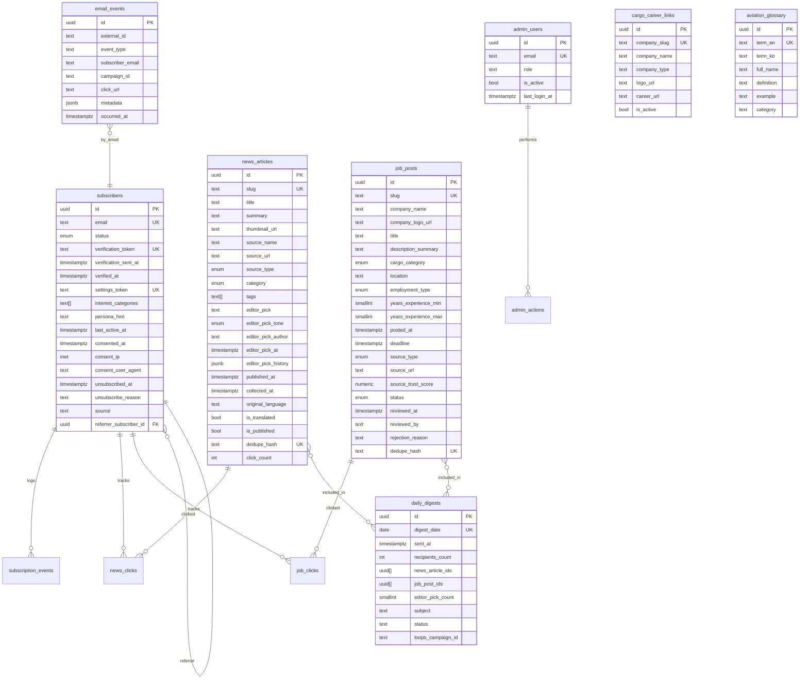

#### 6.2.b Enum 카탈로그

| Enum | 값 | 근거 |
|---|---|---|
| `subscription_status` | `pending`, `verified`, `unsubscribed`, `bounced` | REF-04 §3 |
| `news_category` | `cargo-market`, `cargo-ops`, `cargo-company`, `cargo-policy`, `airport-cargo`, `big-aviation` | PRD 03 §3, CON-05 |
| `editor_pick_tone` | `OBSERVATION`, `ACTION_ITEM`, `CONTEXT` | REF-03 §5.2 |
| `job_status` | `pending`, `approved`, `rejected`, `archived` | REF-04 §3 |
| `cargo_job_category` | `sales`, `ops`, `customs`, `imex`, `intl_logistics`, `airport_ground`, `other_cargo` | REF-02 §3.2, REF-04 §3 |
| `employment_type` | `full_time`, `contract`, `intern`, `temporary` | REF-04 §3 |
| `job_source_type` | `worknet`, `saramin`, `airline_cargo_official`, `forwarder_official`, `consolidator_official`, `public_institution`, `other` | REF-04 §3 |
| `news_source_type` | `naver_news`, `domestic_cargo_rss`, `overseas_cargo_rss`, `manual` | REF-04 §3 |
| (Phase 5.5) `flight_status` | `scheduled`, `departed`, `arrived`, `delayed`, `cancelled`, `diverted` | REF-04 §3 |
| (Phase 5.5) `aircraft_deck_type` | `passenger`, `freighter`, `combi` | REF-04 §3 |
| (Phase 5.5) `aircraft_role` | `PAX`, `CGO`, `COMBI` | REF-04 §3 |

#### 6.2.c DB 무결성 제약 (핵심)

| ID | 제약 | 정의 | 근거 REQ |
|---|---|---|---|
| CHK-01 | `chk_editor_pick_length` | `char_length(editor_pick) ≤ 140` | REQ-FUNC-025, REQ-NF-069 |
| CHK-02 | `chk_summary_length` | `char_length(summary) BETWEEN 20 AND 500` | REQ-FUNC-015 |
| TRG-01 | `block_non_cargo_titles` | BEFORE INS/UPD job_posts: title `~* '(승무원\|객실\|조종사\|부기장\|항공정비\|정비사\|기장)'` AND status='approved' → RAISE | REQ-FUNC-103, REQ-NF-067 |
| TRG-02 | `log_editor_pick_change` | BEFORE UPDATE news_articles: old.editor_pick ≠ new.editor_pick → jsonb append to `editor_pick_history` | REQ-FUNC-026 |
| TRG-03 | `update_subscriber_last_active` | AFTER INSERT email_events: `opened/clicked` → subscribers.last_active_at | REQ-FUNC-217 |
| TRG-04 | `set_updated_at` | BEFORE UPDATE (subscribers, news_articles, job_posts, cargo_career_links): `updated_at = now()` | REF-04 §5.1 |
| UNIQ-01 | `news_articles.dedupe_hash` unique | `sha256(source_name + title + published_at)` | REQ-FUNC-014 |
| UNIQ-02 | `job_posts.dedupe_hash` unique | `sha256(company_name + normalized_title + posted_at)` | REQ-FUNC-101 |
| UNIQ-03 | `daily_digests.digest_date` unique | cron idempotency | REQ-FUNC-212 |
| UNIQ-04 | `subscribers.email` unique | 중복 구독 차단 | REQ-FUNC-203 |

#### 6.2.d 데이터 보존 정책

| 테이블 | 보존 기간 | 근거 |
|---|---|---|
| `subscription_events` | ≥ 13 개월 | REQ-NF-064, REF-12 |
| `email_events` | ≥ 13 개월 | REQ-NF-064 |
| `subscribers` (unsubscribed 포함) | 무기한 (삭제 금지) | REQ-NF-064 |
| `news_articles` | 무기한 | REQ-FUNC-068 (원문 본문 미저장) |
| `job_posts` | archived 후 무기한 | REQ-FUNC-117 |
| `ingest_logs` | 90 일 | REQ-NF-165 |
| (Phase 5.5) `flights_snapshots` | 30 일 | REF-04 §9 |

### 6.3 Detailed Interaction Models (Extended)

#### 6.3.1 더블 옵트인 구독 — 확장 11단계 (실패 경로 포함)

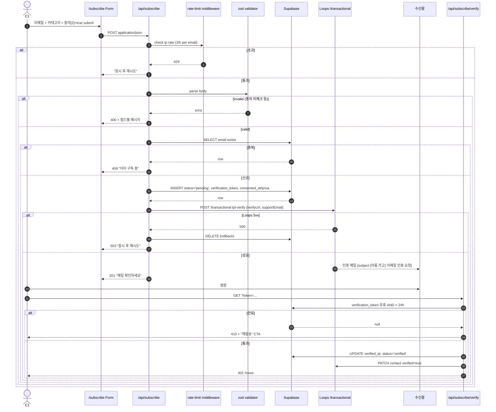

#### 6.3.2 해외 카고 뉴스 → GPT 번역 → DB 저장 (확장)

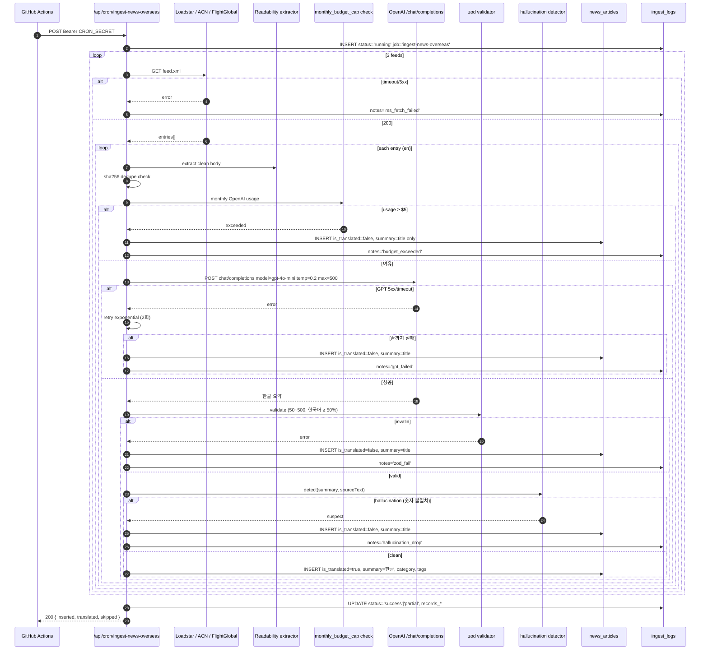

#### 6.3.3 관리자 뉴스 승인 + 에디터 Pick 작성 (확장)

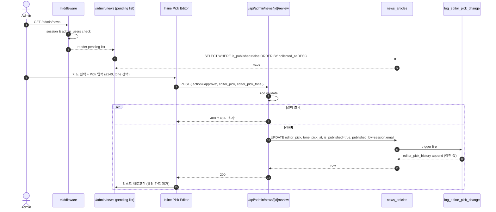

#### 6.3.4 WAU 집계 (email_events → trigger → last_active_at → /admin/metrics)

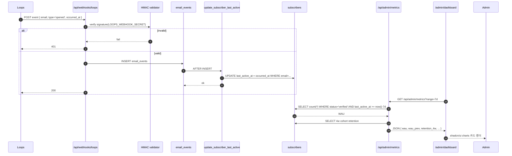

#### 6.3.5 비카고 공고 차단 (DB 트리거, 확장)

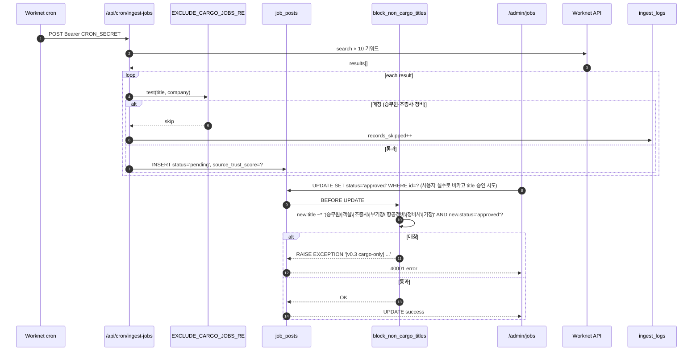

### 6.4 Validation Plan (요약)

본 SRS의 수용 기준은 [PRD 07 §4~§5](../prd/07-roadmap-milestones.md)의 Phase 검증 게이트 및 각 PRD의 "Proof" 섹션을 통합한다.

| 실험 | 대응 REQ-NF | 성공 기준 | 시점 | OQ |
|---|---|---|---|---|
| C1 5명 인터뷰 (페르소나 실재) | REQ-NF-100 | 70%+ 지인 통로 경험 | Phase 1 말 | OQ-R13 |
| 출근길 5분 시나리오 베타 5명 | REQ-NF-001, REQ-NF-100 | ≥ 70% 소화 시간 단축 | Phase 3 말 | OQ-R14 |
| 에디터 Pick A/B 50/50, 4주, n ≥ 100 | REQ-NF-080, REQ-NF-104 | A 그룹 CTR +15%p, 체류 +20%, 재방문 +25% | Phase 4 중반 | OQ-R16 |
| 번역 수동 검수 10건 | REQ-NF-083, REQ-NF-084 | 오역 ≤ 1건 | Phase 4 초반 | — |
| 하이브리드 큐레이션 2주 | REQ-NF-085, REQ-NF-086 | 부적절 ≤ 5% | Phase 5 말 | — |
| 자동 trust_score 200건 라벨 | REQ-NF-087 | 일치율 ≥ 70% | Phase 5 | — |
| 첫 100명 cohort 30일 관찰 | REQ-NF-101 | WAU/verified ≥ 70%, 4주 유지율 ≥ 40% | Phase 5 첫 2개월 | — |
| Loops §50 실발송 감사 10항목 | REQ-NF-060~066 | 10/10 통과 | Phase 5 진입 전 | OQ-M6 |
| Core Web Vitals 4주 연속 | REQ-NF-001, 003, 004, 005 | LCP ≤ 2.5s, CLS ≤ 0.1, INP ≤ 200ms | Phase 3~ | — |
| RLS 네거티브 테스트 스위트 | REQ-NF-040~044 | anon 유출 0건 | Phase 2~3 | — |

### 6.5 Use Case Diagram (액터 ↔ 기능)

```mermaid
graph TB
  C1((C1 이지훈<br>3년차 콘솔사)):::user
  C2((C2 박서연<br>1년차 신입)):::user
  C3((C3 김태영<br>8년차 팀장)):::user
  A1((A1 정하늘<br>학부 4학년)):::user
  Admin((Admin<br>Founder)):::admin
  Loops([Loops.so<br>webhook]):::ext
  GHA([GitHub Actions<br>cron]):::ext
  Cron([Vercel Cron]):::ext

  subgraph Arum["아름 카고 Phase 5 MVP"]
    UC1[뉴스 피드 열람 `/news`]
    UC2[뉴스 상세 열람 `/news/[slug]`]
    UC3[용어 툴팁 조회]
    UC4[채용 카드 필터·정렬 `/jobs`]
    UC5[채용 상세 + 원문 이동]
    UC6[구독 신청 더블 옵트인]
    UC7[일일 다이제스트 수신]
    UC8[설정 관리 `/subscribe/settings`]
    UC9[원클릭 수신거부]
    UC10[카드 공유 `/share`]
    UC11[뉴스 승인 + 에디터 Pick]
    UC12[채용 승인 큐]
    UC13[KPI 대시보드 조회]
    UC14[Magic Link 로그인]
    UC15[뉴스 Ingest 실행]
    UC16[채용 Ingest 실행]
    UC17[다이제스트 발송]
    UC18[Webhook 수신 → WAU]
  end

  C1 --> UC1
  C1 --> UC2
  C1 --> UC3
  C1 --> UC4
  C1 --> UC5
  C1 --> UC6
  C1 --> UC7
  C1 --> UC8
  C1 --> UC9
  C1 --> UC10
  C2 --> UC1
  C2 --> UC3
  C2 --> UC6
  C2 --> UC7
  C3 --> UC1
  C3 --> UC2
  C3 --> UC7
  A1 --> UC4
  A1 --> UC5
  A1 --> UC6

  Admin --> UC14
  Admin --> UC11
  Admin --> UC12
  Admin --> UC13

  GHA --> UC15
  GHA --> UC16
  Cron --> UC17
  Loops --> UC18

  classDef user fill:#e0f2fe,stroke:#0369a1,color:#0f172a
  classDef admin fill:#fce7f3,stroke:#be185d,color:#0f172a
  classDef ext fill:#f1f5f9,stroke:#64748b,color:#0f172a,stroke-dasharray: 4 2
```

### 6.6 Component Diagram (배치 관점)

```mermaid
graph TB
  subgraph Browser["Browser Tier"]
    Public[Public Pages<br>/ · /news · /jobs · /about]
    SubPages[Subscription Pages<br>/subscribe/verify · /settings · /unsubscribe]
    AdminUI[Admin SPA<br>/admin/dashboard · /news · /jobs]
    ShareOG[/share/[id]?ref=.../]
  end

  subgraph Vercel["Vercel Edge · Node Runtime (Next.js 14)"]
    MW[middleware.ts<br>/admin/* + rate limits]
    Pages[App Router Pages<br>SSR · ISR 300s]
    Routes[Route Handlers<br>/api/subscribe · /api/cron/* · /api/admin/* · /api/webhooks/loops]
    Lib[src/lib/<br>api/* clients · supabase · email · glossary]
    Cron1[Vercel Cron<br>0 22 * * * daily-digest]
  end

  subgraph Supabase["Supabase (Managed Postgres)"]
    Tables[(15 tables<br>+ RLS policies)]
    Triggers[[Triggers<br>block_non_cargo_titles<br>log_editor_pick_change<br>update_subscriber_last_active<br>set_updated_at]]
    AuthOTP[Auth · Magic Link OTP]
  end

  subgraph GitHub["GitHub Actions"]
    WF1[ingest-news-domestic<br>06:00 / 18:00 KST]
    WF2[ingest-news-overseas<br>05:00 / 17:00 KST]
    WF3[ingest-jobs<br>24:00 KST]
    WF4[archive-expired-jobs<br>daily]
  end

  subgraph External["External APIs"]
    NaverAPI[Naver News]
    RssKR[Domestic Cargo RSS]
    RssOV[Overseas Cargo RSS]
    Worknet[Worknet]
    Saramin[Saramin]
    OpenAI[OpenAI GPT-4o-mini]
    LoopsAPI[Loops.so API]
    VercelAna[Vercel Analytics API]
  end

  Public --> Pages
  SubPages --> Pages
  AdminUI --> MW --> Pages
  ShareOG --> Pages
  Pages --> Routes
  Routes --> Lib
  Lib --> Tables
  Lib --> AuthOTP
  Lib --> LoopsAPI
  Cron1 --> Routes

  WF1 -->|Bearer CRON_SECRET| Routes
  WF2 -->|Bearer CRON_SECRET| Routes
  WF3 -->|Bearer CRON_SECRET| Routes
  WF4 -->|Bearer CRON_SECRET| Routes

  Lib --> NaverAPI
  Lib --> RssKR
  Lib --> RssOV
  Lib --> Worknet
  Lib --> Saramin
  Lib --> OpenAI
  Lib --> VercelAna

  LoopsAPI -.webhook.-> Routes
  Tables --> Triggers
```

### 6.7 Class Diagram (핵심 도메인 서비스, 인터페이스 레벨)

본 다이어그램은 `web/src/lib/` 레이어의 핵심 서비스 클래스/모듈 시그니처를 기술한다. ERD(§6.2)는 DB 관점, 본 절은 **애플리케이션 도메인 관점**이다.

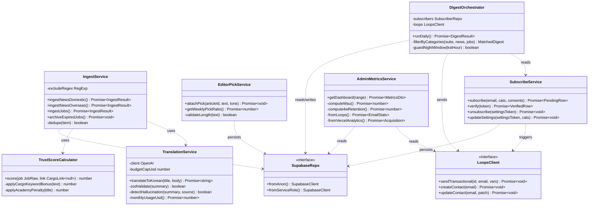

### 6.8 환경 변수 참조

| 변수 | 용도 | 관련 REQ |
|---|---|---|
| `NAVER_CLIENT_ID`, `NAVER_CLIENT_SECRET` | Naver News API | REQ-FUNC-010 |
| `TRANSLATION_PROVIDER` | 번역 Provider 선택 (`gemini` 기본 / `openai` `anthropic` Phase 5.5+) | C-TEC-015, REQ-FUNC-015 |
| `GOOGLE_GENERATIVE_AI_API_KEY` | Gemini 1.5 Flash 번역 (MVP 기본) | REQ-FUNC-015 |
| `OPENAI_API_KEY` | (Phase 5.5+ 옵션) `TRANSLATION_PROVIDER=openai` 선택 시 | REQ-FUNC-015 |
| `OPENAI_MONTHLY_BUDGET_CAP_USD` | `openai` 선택 시 월 $5 상한 | REQ-FUNC-017, REQ-NF-120 |
| `WORKNET_API_KEY` | 워크넷 채용 | REQ-FUNC-100 |
| `SARAMIN_API_KEY` | 사람인 채용 | REQ-FUNC-101 |
| `LOOPS_API_KEY` | Loops transactional | REQ-FUNC-200, 206 |
| `LOOPS_WEBHOOK_SECRET` | HMAC 검증 | REQ-FUNC-216, REQ-NF-049 |
| `NEXT_PUBLIC_SUPABASE_URL`, `NEXT_PUBLIC_SUPABASE_ANON_KEY` | 클라 + 서버 | REQ-FUNC-500~504 |
| `SUPABASE_SERVICE_ROLE_KEY` | 서버 전용 | REQ-NF-043, CON-08 |
| `CRON_SECRET` | cron API 보호 | REQ-FUNC-506, REQ-NF-048 |
| `VERCEL_API_TOKEN`, `VERCEL_TEAM_ID`, `VERCEL_PROJECT_ID` | Analytics API | REQ-FUNC-406 |
| `ADMIN_EMAIL_WHITELIST` | `admin_users` 초기 시드 | REQ-FUNC-400, 401 |
| (Phase 5.5) `KAC_SERVICE_KEY`, `IIAC_SERVICE_KEY` | 공항 운항 | — |

---

## Changelog

- **2026-04-19 Rev 1.1 (Amendment 1 — 타겟 재정렬 + 범위 정리)**: 2026-04-19 냉정 유용성 감사 + RSS/API 실측 + 사용자 범위 정리 결정 기반 [ADR-009](../adr/ADR-009-target-realignment-applicants-primary.md) 반영.
  1. **타겟 Primary 재정렬**: C1 이지훈 (2~5년차 현직자) → **A1 정하늘 (카고 취준생)** Primary 로 전환. C1 은 Secondary. §1.1 Purpose 문구 변경.
  2. **에디터 Pick 부담 경감 + 톤 규약**: 매일 3~4개 → **주 3회 배치 (월·수·금) + 주말 일괄 초안 5건**. REQ-NF-080 커버리지 목표 ≥60% → **≥40%** 하향. **C-TEC-016 에 "Gemini 초안 + Founder 톤 편집 · 승인 후 게시" 하이브리드 명시** (자동 무편집 게시 금지).
  3. **범위 축소 (사용자 결정 · 2026-04-19)**:
     - ~~REQ-FUNC-116~~ (관리자 일괄 승인 단축키) — 제거 (가치 낮음)
     - ~~REQ-FUNC-120~~ (2~5년차 하이라이트) — 제거 (Primary 재정렬로 불필요)
     - ~~REQ-FUNC-218·219~~ (공유 루프 + OG) — 제거 (취준생 공유가치 낮음)
     - Bento Grid: **Metric-Live 카드 제거** · Job-Spotlight 확대 · 14사 딥링크 preview 추가 (A1 우선순위 반영)
     - ~~FR-052 Gemini YouTube grounding~~ (Rev 1.1 추가했던 신규 Task) — **철회** · C-TEC-025 Phase 5.5+ 로 복귀. 리서치: 한국 전용 카고 유튜브 채널 미발견.
  4. **3D Carousel 유지**: `/about` 하단 REQ-FUNC-304 · ADR-006 premium animated 유지 (사용자 명시 결정).
  5. **국내 뉴스 소스 재정의 (RSS/API 실측 후)**: 2026-04-19 WebFetch 결과:
     - 카고프레스 · RSS 미제공 · HTML parsing 가능 (일 5~10 기사)
     - 카고뉴스 · **월간 간행물** · 일일 다이제스트 부적합
     - 포워더케이알 · **커뮤니티 사이트** (뉴스 X) · 제거
     - aircargonews.net = "Air Cargo News UK" 동일 (해외 RSS 3종에 이미 포함)
     - **결론**: REQ-FUNC-011 Must → Should · "국내 뉴스는 Naver News API (REQ-FUNC-010) primary · 카고프레스 HTML parse Best Effort" 로 축소.
     - OQ-R3 부분 해소 · OQ-R4 저작권 확인은 scrape 시 재점검.
  6. **Phase 5.5 소스 목록 확장** (문서 참조만, Task 추가 없음): WorldACD 운임 지수 · 항공사 7사 스케줄 (KE/OZ/DL/UA/AA/HA/에어제타) · Korean Air Cargo 월간 요금표 · 항공 통계 (공공데이터포털). **현 MVP 스코프 외**.
  7. **About 페이지 자기소개 1줄 추가**: CON-09 준수 (실명/회사/학교 비공개) + "11년차 항공사 화물 영업 + 지상 오퍼(loadmaster) 양측 관점" 1줄 명시. UI-009 범위 확장.
  8. **cargo_career_links `review_one_liner` 컬럼 추가**: 14사 한 줄 특징 · DB-012 범위 확장. 잡플래닛 부분 대체.
  9. **DASHBOARD KPI 재구성 (관리자 대시보드)**: 8 KPI → **4 KPI** (WAU · `/jobs` 클릭률 · 14 공식 딥링크 이탈률 · Pick 커버리지). FR-042·043·404·405 범위 축소.
  10. **Amendment Triggers 업데이트**: "타겟 재정렬" ✅ 체크. OQ-M6·OQ-R17·Supabase·Loops 4종 유지.
  11. **북극성(WAU 500) 유지** + 병행 관측 지표(채용 클릭률·14 딥링크 이탈률·`/jobs`→구독 전환율) 추가.
  - **근거**: 2026-04-19 세션 냉정 유용성 감사 + 사용자 범위 정리 · RSS/API 실측 5건
  - **관련 파일 업데이트**: TASKS.md 150 → 146 (4 Task 제거) · CHECKPOINTS.md · DASHBOARD.md · learning-keywords.md · PRD 01/02/04/06 추후 Rev 1.2 에서 세부 sync

- **2026-04-18 Rev 1.0 (Baseline — Phase 2 구현 착수)**: 교육자료 "SRS 검토 및 보강" 방법론(개발 난이도·기술 스택·운영 비용 3대 검토 기준 + PoC 3단 분류: 증명필요/증명불가/Dummy대체) 적용 후 Baseline 승격. 사용자 D1~D6 체크리스트 승인 완료 (2026-04-18). 주요 변경:
  1. **C-TEC-015 Gemini-only 단순화**: `openai | gemini | anthropic` 3-provider 추상화 → **Gemini 1.5 Flash 단일 어댑터**. facade 구조(`src/lib/api/translation/index.ts`)는 유지해 Phase 5.5+ OQ-R17 실측 결과에 따라 `openai` / `anthropic` 추가 가능. 미구현 provider를 env로 지정 시 런타임 에러 반환. 의존성: `@google/generative-ai@^0.21` 만 MVP 설치.
  2. **C-COST-002 / CON-06 / REQ-NF-120 비용 모순 해소**: OpenAI 월 $5 cap(500 WAU에서 실제 $6~7 소모 예상) → **Gemini 무료 티어 $0 기본**. `TRANSLATION_PROVIDER=openai` 선택 시에만 $5 cap 재활성화. 운영 예상 월 ₩7,500 → **₩0**. C-COST-001 월 ₩100,000 상한 대비 사용률 0%.
  3. **REQ-NF-011 daily-digest 구현 방식 명시**: Vercel Hobby 60s 타임아웃 vs 500 WAU 일괄 발송 구조 모순(수학적 불가) → **Loops List Send API 위임**(단일 호출, Loops 내부 큐). 위임 실패 시 폴백: 100명 chunk × 5분 간격 5회 분할 cron. 구조적 블로커 해소.
  4. **CON-01 / REQ-NF-122 Loops 전환 트리거 앞당김**: 1,800(90%) 하드 상한만 존재 → **1,500(75%) 알림 → Resend 전환 준비 착수 + 1,800 전환 완료**. DNS 인증 72h 여유 확보.
  5. **REQ-FUNC-015/017 업데이트**: Provider 레퍼런스를 Gemini 기본으로 변경, 한도 enforcement 로직을 provider-agnostic 구조로(비용 기반 vs 쿼터 기반 구분).
  6. **환경 변수 재구성**: `TRANSLATION_PROVIDER` + `GOOGLE_GENERATIVE_AI_API_KEY` 를 MVP 필수로 승격, `OPENAI_API_KEY` / `OPENAI_MONTHLY_BUDGET_CAP_USD` 는 Phase 5.5+ 옵션으로 강등.
  7. **Rev 1.0 Amendment Triggers (→ Rev 1.1) 선언**: OQ-M6 실증, OQ-R17 실측, Supabase 500MB 근접, Loops 1,500 도달. 실증/실측 전에 v0.9.x 에 머무는 대신 Rev 1.0 베이스라인 + Amendment 모델 채택(ISO/IEC/IEEE 29148:2018 governance).
  - **검토 보고서**: [`reviews/MVP-개발목표-적절성-종합-검토-보고서.md`](./reviews/MVP-개발목표-적절성-종합-검토-보고서.md)
  - **작업 계획 (AI 작업용)**: [`../../plans/srs-v1.0-finalization-plan.md`](../../plans/srs-v1.0-finalization-plan.md)
  - **차이 비교**: [`reviews/v0.9.2-vs-v1.0-diff.md`](./reviews/v0.9.2-vs-v1.0-diff.md)
  - **Known residue (Rev 1.0.1 / 1.1 cleanup 예정)**:
    - §3.1.a / §3.2 / §6.1 등 Mermaid 다이어그램 내 `OpenAI GPT-4o-mini` 라벨 일부 보존 (역사적 컨텍스트 · Phase 4 구현 시 실제 Provider 확정 후 전면 갱신).
    - REQ 카운트 드리프트: Rev 0.9.2 헤더 claim "69 REQ-FUNC · 67 REQ-NF" vs 실측 §4.1 101 row · §4.2 99 row(87 unique). Rev 1.1에서 정합 cleanup.
    - ADR-007 파일명 `ADR-007-translation-gpt-4o-mini.md` 은 파일 rename 없이 내부 내용만 Amendment 대상(Phase 4).

- **2026-04-18 Rev 0.9.2 (PRD·ADR·CLAUDE.md 역반영 완료 + 폰트 확정)**: Rev 0.9.1에서 확정된 C-TEC-003·C-TEC-006·C-TEC-015·C-TEC-025 기술 스택 개정을 **SRS → PRD 단방향 의존 원칙에 따라 하위 문서에 역반영**. 변경 파일:
  - **[CLAUDE.md §4](../../CLAUDE.md)**: 모션(Lenis+GSAP → Framer Motion + tailwindcss-animate), 차트(Tremor/shadcn 이원화 → shadcn 단일), 번역(OpenAI 고정 → Provider-Agnostic), §6 환경변수에 `TRANSLATION_PROVIDER` 추가. Phase 5 설명도 갱신.
  - **[ADR-006 Amendment](../adr/ADR-006-design-premium-animated.md)**: Status → Amended. Premium Animated 의도·레이어 구조 유지, 라이브러리만 Framer Motion + CSS 3D로 교체. 번들 ~50KB → ~20KB.
  - **[ADR-007 Amendment](../adr/ADR-007-translation-gpt-4o-mini.md)**: Status → Amended. `src/lib/api/translation/` facade + adapter 구조 명시. MVP 기본 Provider `openai` 유지.
  - **[ADR README](../adr/README.md)**: ADR-006·007 Status를 Amended로 표기.
  - **[PRD 00](../prd/00-overview.md)**: §3(MVP 스코프)·§6.3(KPI 카드)·§6bis(MoSCoW)·§7(기술 스택)에서 Tremor → shadcn·GPT 고정 → Provider-Agnostic 교체.
  - **[PRD 02](../prd/02-i-side-information.md)**: §4 제목·상단 주석에 Provider-Agnostic 전제 명시. 파이프라인 다이어그램에 `TRANSLATION_PROVIDER` 라우팅 단계 추가.
  - **[PRD 04](../prd/04-api-integration.md)**: §0 요약·§2 API 목록·§4 LLM 섹션·§8 대시보드·§12 API Route 트리·§14 환경변수·§16 NFR·§17 DoD 전반 갱신. `GOOGLE_GENERATIVE_AI_API_KEY` · `ANTHROPIC_API_KEY` env 추가.
  - **[PRD 05](../prd/05-email-growth-loop.md)**: §0·§9.1·§9.3·§13 MoSCoW·§17 DoD에서 Tremor → shadcn/ui charts. v0.3.1 Changelog 추가.
  - **[PRD 06](../prd/06-ui-ux-spec.md)**: §0·§1·§4.1~§4.4·§5·§10 관리자 섹션·§12 NFR·§16 DoD 등 14곳 모션·차트 라이브러리 전면 갱신. v0.3.1 Changelog 추가.
  - **[PRD 07](../prd/07-roadmap-milestones.md)**: Tremor 전역 → shadcn/ui charts, Lenis/GSAP 문구 → Framer Motion.
  - **[PRD 99](../prd/99-quality-review.md)**: 검증 리포트의 Tremor 참조 → shadcn/ui charts.
  - **폰트 (C-TEC-004)**: 사용자 결정 "Pretendard + Space Grotesk + JetBrains Mono 3개 유지, 필요 시 확장". 운임·AWB 숫자 차별화 중요도 반영. 변경 없음, 확정 기록만.
  - **역사적 기록 보존**: 각 PRD의 이전 Changelog 내 Tremor/GSAP/Lenis 표기는 수정하지 않음 (과거 결정의 snapshot).
  - **Rev 1.0 승격 블로커**: OQ-M6 Loops §50 실발송 검증 + OQ-R3/R4 RSS URL·저작권 확인. 둘 다 사용자 오프라인 작업. 이 외 모든 문서 정합성은 본 Rev 0.9.2로 확보됨.

- **2026-04-17 Rev 0.9.1 (기술 스택 효율성·가성비 재검토)**: 사용자 지시 "멋짐보다 효율성·가성비 + 구현 품질"에 따른 C-TEC 개정.
  1. **C-TEC-003 교체**: Lenis + GSAP ScrollTrigger → **Framer Motion + tailwindcss-animate + react-intersection-observer**. 번들 감소·선언적 API·AI 코드 생성 친화. 영향: REQ-FUNC-301(Bento 스태거), 302(Blob CSS-first), 303(Parallax `useScroll`), 304(CSS 3D), 308(`useReducedMotion`).
  2. **C-TEC-006 단일화**: 관리자 Tremor + 사용자 shadcn charts 이원화 → **shadcn/ui charts 단일**. 8 KPI 카드는 Metric + 스파크라인 수준이라 Tremor ROI 낮음. 영향: REQ-FUNC-404, §1.2.1 관리자 대시보드 설명, §6.3.4 WAU 시퀀스 다이어그램.
  3. **C-TEC-015 Provider-Agnostic 추상화**: OpenAI GPT-4o-mini 고정 → **`TRANSLATION_PROVIDER` 환경변수로 `openai | gemini | anthropic` 런타임 교체**. MVP 기본값 `openai`(=gpt-4o-mini) 유지. `src/lib/api/translation/{index.ts + adapters}` 구조. OQ-R17 A/B 실측 기반 교체 가능. 영향: REQ-FUNC-015 (adapter 교체 E2E 테스트 추가).
  4. **C-TEC-025 신설 (Phase 5.5+ 스코프 예약)**: **Admin Research Copilot** — 관리자 전용 `/admin/research`에서 4종 LLM을 상호 보완적 역할로 호출. (a) OpenAI 범용 요약, (b) Gemini Google Search grounding + YouTube 캡션, (c) Perplexity inline citation 정확도, (d) Grok X 실시간 속보. 산출물은 에디터 Pick 참고용만, 사용자 공개 게시 금지 (C-TEC-016). Phase 5.5 진입 전 별도 ADR + 비용 실측 필수 (Perplexity/Grok 유료 요금제가 C-COST-001 월 ₩10만 상한에 큰 영향).

- **2026-04-17 Rev 0.9 (Iteration 보완판)**: Iteration 지시 6개 전면 반영.
  1. **C-COST 신설** (§1.2.5): 월 인프라 비용 상한 ≤ ₩100,000 명시. 현재 실측 예상 ₩7,500/월(7.5%).
  2. **외부 API 대안·우회** (§3.1.a): Naver/RSS/OpenAI/Worknet/Saramin/Loops/Supabase/Vercel/GHA 각각 일시 장애·정책 변경·무기한 중단 3단계 대응 규약 추가. OpenAI 무기한 중단 시 Claude Haiku 4.5 폴백 명시 (C-TEC-015 예외 절차 포함).
  3. **정책 변경 우회 규약** (§3.1.a Loops 행): OQ-M6 §50 검증 실패 시 Phase 6 Resend + 자체 도메인 전환 조건·절차 고정.
  4. **PRD 외 참조 제거**: ADR-001~008(8개) + references/* 디렉토리(7개) 참조를 제거하고, 해당 결정 내용을 SRS 본문(§1.2.4 C-TEC, §1.1 Purpose, §2 Stakeholders, §6.1.b 외부 API 표, §1.3 Definitions 등)에 직접 흡수. §1.4 References는 PRD 9개 + 외부 표준/법령/공개 자료만 보존(REF-01~17).
  5. **내부 Fallback 자산** (§3.1.b): 에디터 Pick 시드 30건·`cargo_career_links` 14개·`aviation_glossary` 50개·직전 스냅샷 유지·`daily_digests` 7일 보존·관리자 수동 카드 모드로 외부 API 0건 시나리오에서도 제품 가용 보장.
  6. **Sequence Diagram 2개 추가**: §3.4.6 구독자 설정 관리(settings_token) + §3.4.7 공유 루프(referrer_subscriber_id). 총 Core 7개 + Extended 5개 = **12 Sequence Diagrams**.
  - **Technical Constraints (§1.2.4) 신설**: C-TEC-001~024 — Agentic 개발 Rule용 기술 스택 단일 조합 명시 (Next.js 14 + Supabase + Loops.so + GPT-4o-mini + Vercel + GitHub Actions + Tailwind + shadcn + Tremor + Lenis/GSAP). 풀스택 통합형·엔터프라이즈 분리형 예제에 얽매이지 않는 **하이브리드 단일 스택** 채택 근거 서술.
  - **DoD 다이어그램 보완**: §6.5 Use Case · §6.6 Component · §6.7 Class Diagram 신규 (ERD는 §6.2.a로 기존 유지). 이로써 UseCase/ERD/Class/Component/Sequence 5종 다이어그램 DoD 체크리스트 충족.
  - **Rev 1.0 승격 조건**: 사용자 본인이 본 Rev 0.9 검토 후 승인 의견 + REQ 전체 Status `Proposed → Approved` 일괄 전환 시 Rev 1.0 확정.

- **2026-04-17 Rev 1.0 (obsolete — Rev 0.9로 대체됨)**: 최초 작성. PRD 00~07, 99 v0.3 + ADR-001~008 + Reference 11~17 기반. Phase 5 MVP 완전 스코프 커버. ISO/IEC/IEEE 29148:2018 9섹션 구조, REQ-FUNC 총 69개, REQ-NF 총 67개, Traceability Matrix + 5 Sequence Diagrams. 본 Rev는 Iteration 지시에 따라 Rev 0.9로 롤백 후 재보완되었음 — Git 커밋 이력에서만 참고.

---

## Approval

| 역할 | 이름 | 날짜 | 서명 |
|---|---|---|---|
| Product Owner / Founder | (raion) | 2026-04-18 | ✅ Rev 1.0 승인 (D1~D6 체크리스트 완료) |
| Requirements Engineer | Claude (Anthropic) | 2026-04-18 | ✅ Rev 1.0 제출 (교육자료 "SRS 검토 및 보강" 방법론 반영) |
| Technical Lead | (동일 founder) | 2026-04-18 | ✅ 기술 스택 검토 완료 (Gemini-only 단순화 승인) |

**다음 단계**: Rev 1.0 승인 완료 → **Phase 2 (Next.js 프로젝트 셋업) 진입 가능**. 모든 REQ Status는 `Proposed` 에서 시작하여 Phase 2~5 동안 `Implemented → Verified` 로 개별 전이한다. Amendment Trigger(OQ-M6 / OQ-R17 / Supabase 500MB / Loops 1,500) 중 하나라도 도달하면 **Rev 1.1** 신규 발행 + `reviews/v1.0-vs-v1.1-diff.md` 작성. SRS 변경은 **PRD 원본을 먼저 수정**하고 본 SRS에 교차 반영한다 (SRS-PRD 단방향 의존 원칙 유지).
